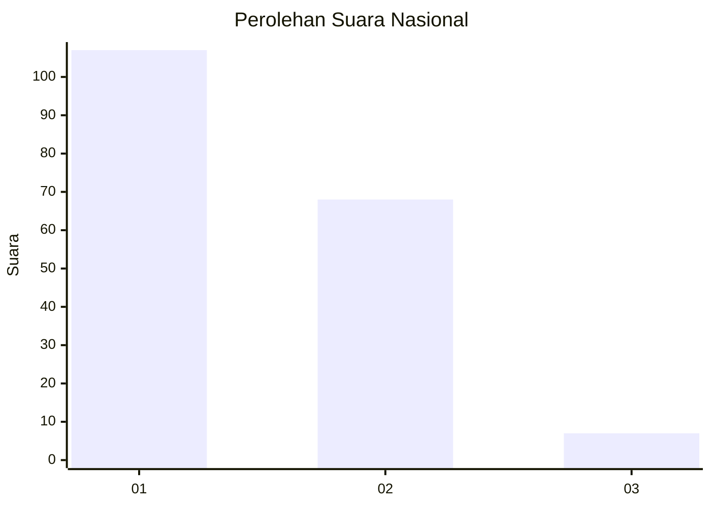
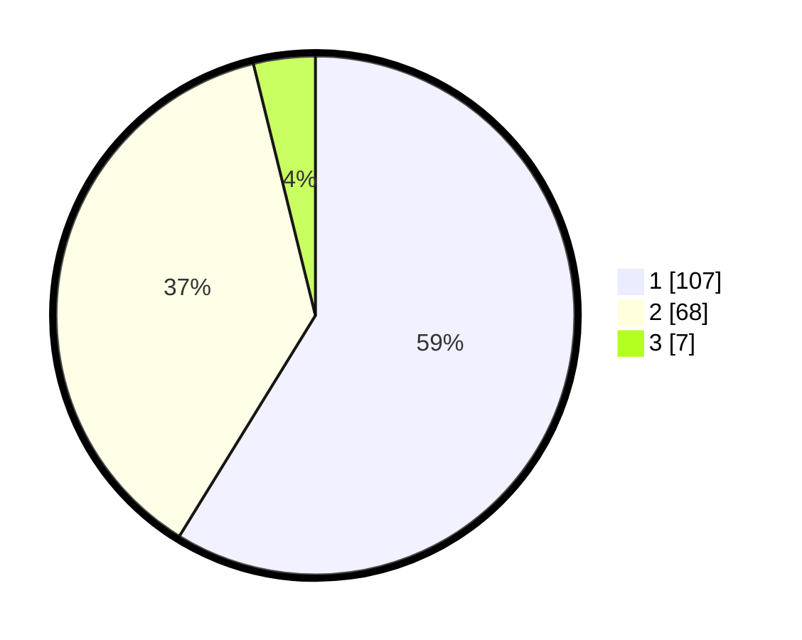

# Hasil

## Grafik

## Tabel

| No. | Nama Paslon    | Suara | Suara (raw) | Persentase |
|:--- |:-------------- | -----:| -----------:| ----------:|
| 1   | ANIES MUHAIMIN | 107   | [107][p-1]  | 58,79      |
| 2   | PRABOWO GIBRAN | 68    | [68][p-2]   | 37,36      |
| 3   | GANJAR MAHFUD  | 7     | [7][p-3]    | 3,85       |

[p-1]: https://github.com/gigit-pemilu/pemilu-2024/blob/main/pilpres/hitung-suara/sub/21-kepulauan-riau/sub/71-kota-batam/sub/08-galang/sub/1005-rempang-cate/sub/002-tps/sub/paslon-1.txt
[p-2]: https://github.com/gigit-pemilu/pemilu-2024/blob/main/pilpres/hitung-suara/sub/21-kepulauan-riau/sub/71-kota-batam/sub/08-galang/sub/1005-rempang-cate/sub/002-tps/sub/paslon-2.txt
[p-3]: https://github.com/gigit-pemilu/pemilu-2024/blob/main/pilpres/hitung-suara/sub/21-kepulauan-riau/sub/71-kota-batam/sub/08-galang/sub/1005-rempang-cate/sub/002-tps/sub/paslon-3.txt

## Foto C Plano

https://sirekap-obj-formc.kpu.go.id/6883/pemilu/ppwp/21/71/08/10/05/2171081005002-20240221-092011--d54edbb4-01ad-4a85-bddd-ddcbf38b4ce7.jpg

https://sirekap-obj-formc.kpu.go.id/6883/pemilu/ppwp/21/71/08/10/05/2171081005002-20240221-092030--abf0ac72-4fd6-4df5-b698-0c18f15e370f.jpg

https://sirekap-obj-formc.kpu.go.id/6883/pemilu/ppwp/21/71/08/10/05/2171081005002-20240221-092108--b61fb1ab-532d-46e6-be86-76930ce86225.jpg

## Metadata

| Key        | Value               |
| ---------- | ------------------- |
| Time Stamp | 2024-02-24 22:31:28 |

