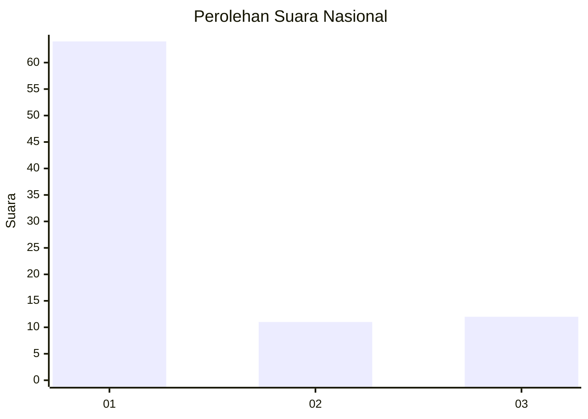
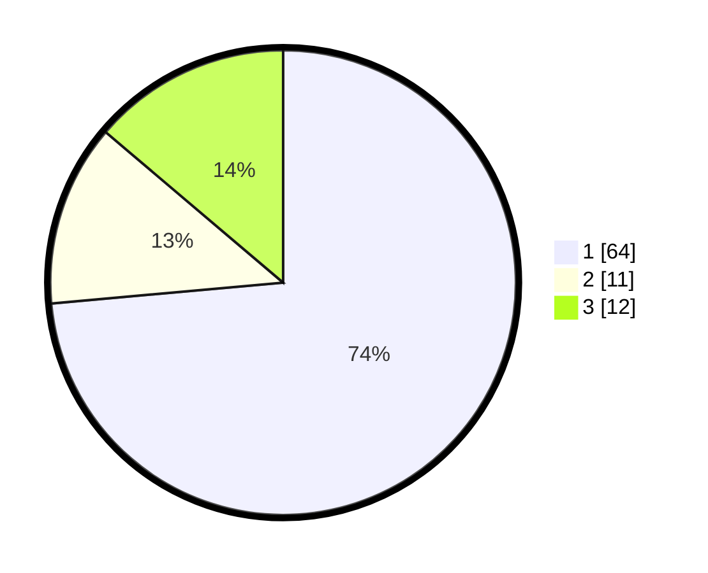

# Hasil

## Grafik

## Tabel

| No. | Nama Paslon    | Suara | Suara (raw) | Persentase |
|:--- |:-------------- | -----:| -----------:| ----------:|
| 1   | ANIES MUHAIMIN | 64    | [64][p-1]   | 73,56      |
| 2   | PRABOWO GIBRAN | 11    | [11][p-2]   | 12,64      |
| 3   | GANJAR MAHFUD  | 12    | [12][p-3]   | 13,79      |

[p-1]: https://github.com/gigit-pemilu/pemilu-2024/blob/main/pilpres/hitung-suara/sub/21-kepulauan-riau/sub/71-kota-batam/sub/08-galang/sub/1006-subang-mas/sub/003-tps/sub/paslon-1.txt
[p-2]: https://github.com/gigit-pemilu/pemilu-2024/blob/main/pilpres/hitung-suara/sub/21-kepulauan-riau/sub/71-kota-batam/sub/08-galang/sub/1006-subang-mas/sub/003-tps/sub/paslon-2.txt
[p-3]: https://github.com/gigit-pemilu/pemilu-2024/blob/main/pilpres/hitung-suara/sub/21-kepulauan-riau/sub/71-kota-batam/sub/08-galang/sub/1006-subang-mas/sub/003-tps/sub/paslon-3.txt

## Foto C Plano

https://sirekap-obj-formc.kpu.go.id/e064/pemilu/ppwp/21/71/08/10/06/2171081006003-20240217-145704--6e460b2d-9804-44df-8245-0c199f0dc7f4.jpg

https://sirekap-obj-formc.kpu.go.id/e064/pemilu/ppwp/21/71/08/10/06/2171081006003-20240217-145745--34b5a1de-dc0e-41e8-885b-624eb3a21ef8.jpg

https://sirekap-obj-formc.kpu.go.id/e064/pemilu/ppwp/21/71/08/10/06/2171081006003-20240217-145908--def9cc50-fa0e-4cb4-8409-b467c3753d31.jpg

## Metadata

| Key        | Value               |
| ---------- | ------------------- |
| Time Stamp | 2024-02-25 17:00:00 |

