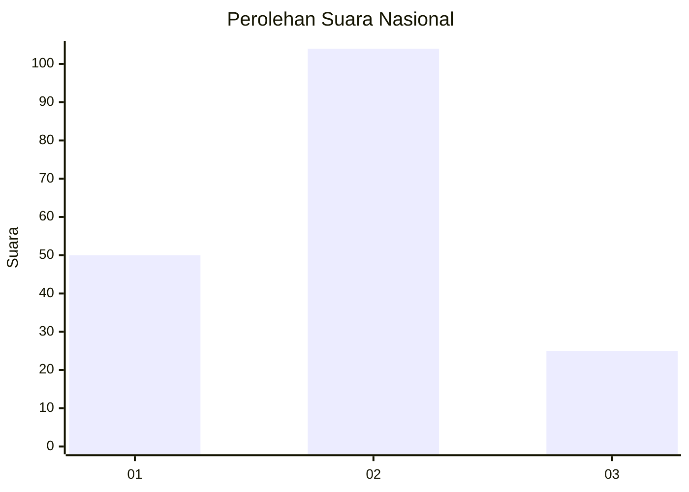
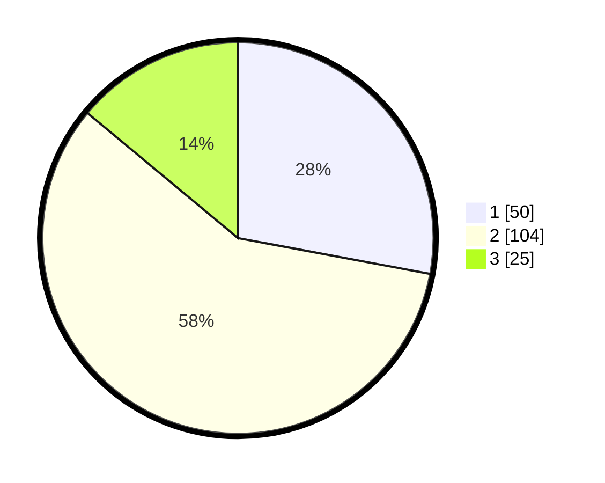

# Hasil

## Grafik

## Tabel

| No. | Nama Paslon    | Suara | Suara (raw) | Persentase |
|:--- |:-------------- | -----:| -----------:| ----------:|
| 1   | ANIES MUHAIMIN | 50    | [50][p-1]   | 27,93      |
| 2   | PRABOWO GIBRAN | 104   | [104][p-2]  | 58,10      |
| 3   | GANJAR MAHFUD  | 25    | [25][p-3]   | 13,97      |

[p-1]: https://github.com/gigit-pemilu/pemilu-2024/blob/main/pilpres/hitung-suara/sub/21-kepulauan-riau/sub/71-kota-batam/sub/09-bengkong/sub/1001-bengkong-indah/sub/001-tps/sub/paslon-1.txt
[p-2]: https://github.com/gigit-pemilu/pemilu-2024/blob/main/pilpres/hitung-suara/sub/21-kepulauan-riau/sub/71-kota-batam/sub/09-bengkong/sub/1001-bengkong-indah/sub/001-tps/sub/paslon-2.txt
[p-3]: https://github.com/gigit-pemilu/pemilu-2024/blob/main/pilpres/hitung-suara/sub/21-kepulauan-riau/sub/71-kota-batam/sub/09-bengkong/sub/1001-bengkong-indah/sub/001-tps/sub/paslon-3.txt

## Foto C Plano

https://sirekap-obj-formc.kpu.go.id/d166/pemilu/ppwp/21/71/09/10/01/2171091001001-20240214-232335--d732386a-5794-4a25-ade6-cb1646a70800.jpg

https://sirekap-obj-formc.kpu.go.id/d166/pemilu/ppwp/21/71/09/10/01/2171091001001-20240214-232432--dcb24dab-2405-4cb6-955a-41206204ae52.jpg

https://sirekap-obj-formc.kpu.go.id/d166/pemilu/ppwp/21/71/09/10/01/2171091001001-20240214-232631--0546e1cb-37d7-40a8-8d48-57aca1d39bd3.jpg

## Metadata

| Key        | Value               |
| ---------- | ------------------- |
| Time Stamp | 2024-02-19 15:00:00 |

