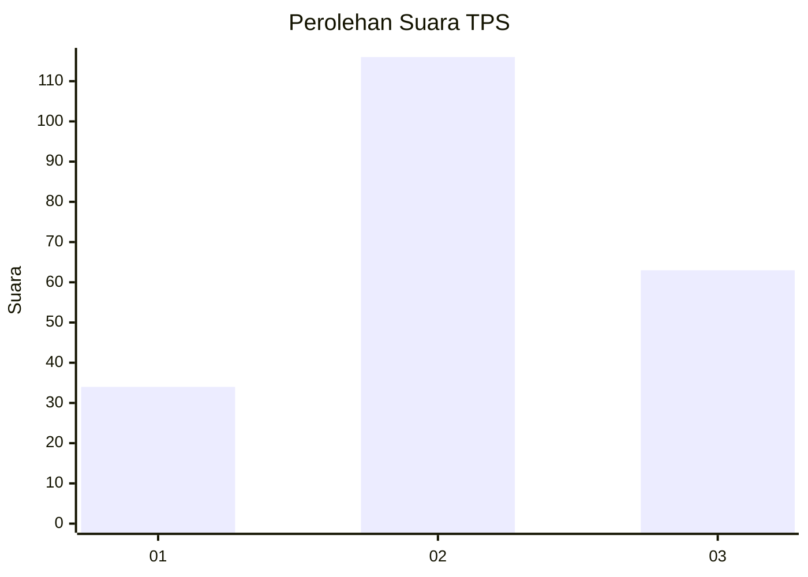
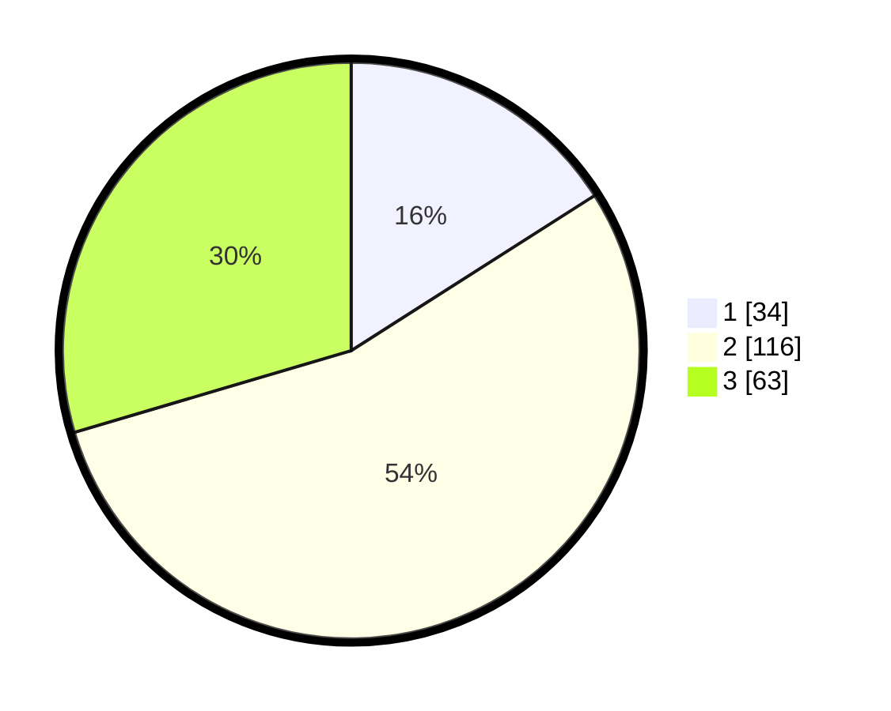

# Hasil

## Grafik

## Tabel

| No. | Nama Paslon    | Suara | Suara (raw) | Persentase |
|:--- |:-------------- | -----:| -----------:| ----------:|
| 1   | ANIES MUHAIMIN | 34    | [34][p-1]   | 15,96      |
| 2   | PRABOWO GIBRAN | 116   | [116][p-2]  | 54,46      |
| 3   | GANJAR MAHFUD  | 63    | [63][p-3]   | 29,58      |

[p-1]: https://github.com/gigit-pemilu/pemilu-2024-21-kepulauan-riau/blob/main/pilpres/hitung-suara/sub/21-kepulauan-riau/sub/71-kota-batam/sub/09-bengkong/sub/1001-bengkong-indah/sub/008-tps/sub/paslon-1.txt
[p-2]: https://github.com/gigit-pemilu/pemilu-2024-21-kepulauan-riau/blob/main/pilpres/hitung-suara/sub/21-kepulauan-riau/sub/71-kota-batam/sub/09-bengkong/sub/1001-bengkong-indah/sub/008-tps/sub/paslon-2.txt
[p-3]: https://github.com/gigit-pemilu/pemilu-2024-21-kepulauan-riau/blob/main/pilpres/hitung-suara/sub/21-kepulauan-riau/sub/71-kota-batam/sub/09-bengkong/sub/1001-bengkong-indah/sub/008-tps/sub/paslon-3.txt

## Foto C Plano

https://sirekap-obj-formc.kpu.go.id/e823/pemilu/ppwp/21/71/09/10/01/2171091001008-20240214-235931--27ce4671-8128-47d1-9f60-ae97ae1d8a03.jpg

https://sirekap-obj-formc.kpu.go.id/e823/pemilu/ppwp/21/71/09/10/01/2171091001008-20240214-235904--512abb9a-a6af-40f8-8666-c2e1618a73d1.jpg

https://sirekap-obj-formc.kpu.go.id/e823/pemilu/ppwp/21/71/09/10/01/2171091001008-20240215-000057--4606b3fc-fea1-4adb-a10d-e5981ef26e7e.jpg

## Metadata

| Key        | Value               |
| ---------- | ------------------- |
| Time Stamp | 2024-02-16 22:01:00 |

