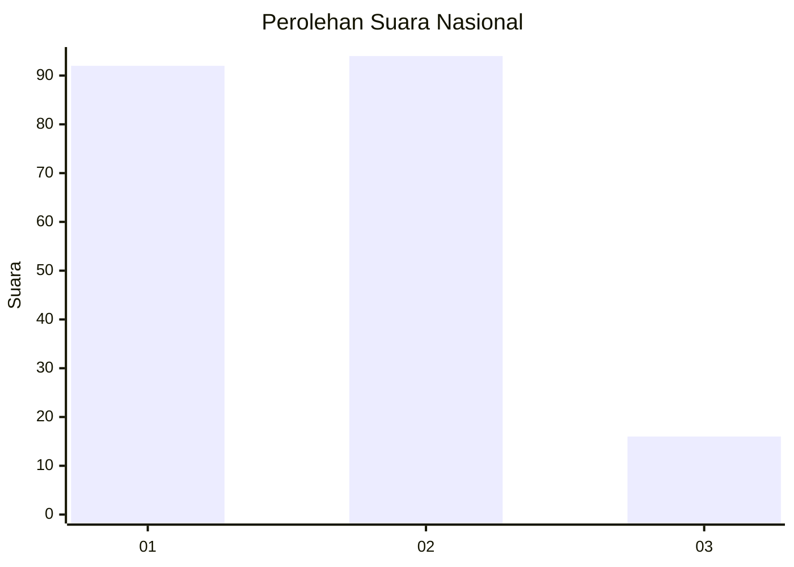
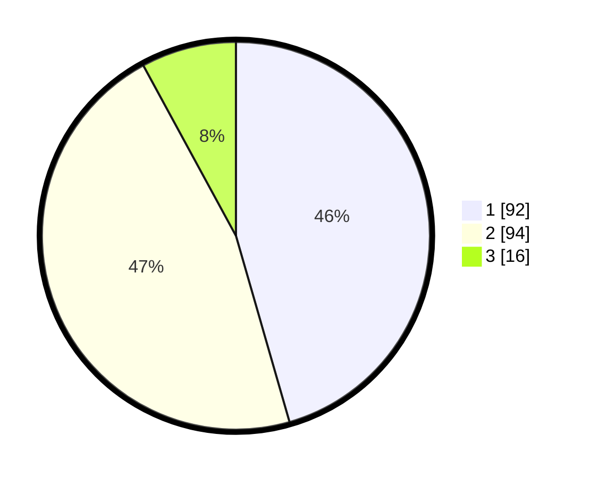

# Hasil

## Grafik

## Tabel

| No. | Nama Paslon    | Suara | Suara (raw) | Persentase |
|:--- |:-------------- | -----:| -----------:| ----------:|
| 1   | ANIES MUHAIMIN | 92    | [92][p-1]   | 45,54      |
| 2   | PRABOWO GIBRAN | 94    | [94][p-2]   | 46,53      |
| 3   | GANJAR MAHFUD  | 16    | [16][p-3]   | 7,92       |

[p-1]: https://github.com/gigit-pemilu/pemilu-2024/blob/main/pilpres/hitung-suara/sub/21-kepulauan-riau/sub/71-kota-batam/sub/09-bengkong/sub/1001-bengkong-indah/sub/017-tps/sub/paslon-1.txt
[p-2]: https://github.com/gigit-pemilu/pemilu-2024/blob/main/pilpres/hitung-suara/sub/21-kepulauan-riau/sub/71-kota-batam/sub/09-bengkong/sub/1001-bengkong-indah/sub/017-tps/sub/paslon-2.txt
[p-3]: https://github.com/gigit-pemilu/pemilu-2024/blob/main/pilpres/hitung-suara/sub/21-kepulauan-riau/sub/71-kota-batam/sub/09-bengkong/sub/1001-bengkong-indah/sub/017-tps/sub/paslon-3.txt

## Foto C Plano

https://sirekap-obj-formc.kpu.go.id/bba8/pemilu/ppwp/21/71/09/10/01/2171091001017-20240215-191013--e038e105-d226-4519-b1a4-e3639dba74b6.jpg

https://sirekap-obj-formc.kpu.go.id/bba8/pemilu/ppwp/21/71/09/10/01/2171091001017-20240215-191027--26000f83-0856-43f9-92b8-5c59ea62efa0.jpg

https://sirekap-obj-formc.kpu.go.id/bba8/pemilu/ppwp/21/71/09/10/01/2171091001017-20240215-191045--948f95ce-68e3-473e-bdfe-12f8072e4e29.jpg

## Metadata

| Key        | Value               |
| ---------- | ------------------- |
| Time Stamp | 2024-02-16 22:01:00 |

