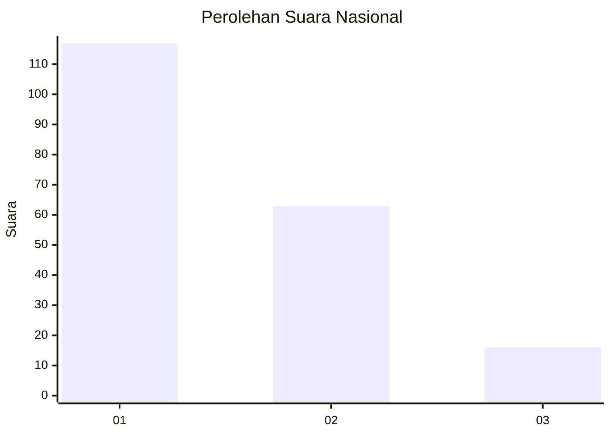
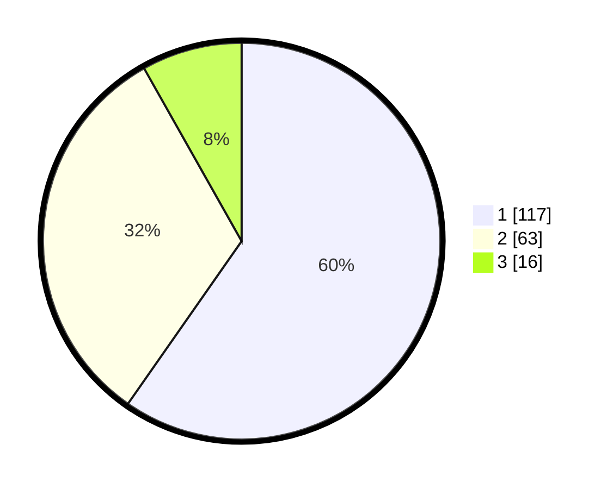

# Hasil

## Grafik

## Tabel

| No. | Nama Paslon    | Suara | Suara (raw) | Persentase |
|:--- |:-------------- | -----:| -----------:| ----------:|
| 1   | ANIES MUHAIMIN | 117   | [117][p-1]  | 59,69      |
| 2   | PRABOWO GIBRAN | 63    | [63][p-2]   | 32,14      |
| 3   | GANJAR MAHFUD  | 16    | [16][p-3]   | 8,16       |

[p-1]: https://github.com/gigit-pemilu/pemilu-2024/blob/main/pilpres/hitung-suara/sub/21-kepulauan-riau/sub/71-kota-batam/sub/09-bengkong/sub/1003-sadai/sub/002-tps/sub/paslon-1.txt
[p-2]: https://github.com/gigit-pemilu/pemilu-2024/blob/main/pilpres/hitung-suara/sub/21-kepulauan-riau/sub/71-kota-batam/sub/09-bengkong/sub/1003-sadai/sub/002-tps/sub/paslon-2.txt
[p-3]: https://github.com/gigit-pemilu/pemilu-2024/blob/main/pilpres/hitung-suara/sub/21-kepulauan-riau/sub/71-kota-batam/sub/09-bengkong/sub/1003-sadai/sub/002-tps/sub/paslon-3.txt

## Foto C Plano

https://sirekap-obj-formc.kpu.go.id/840c/pemilu/ppwp/21/71/09/10/03/2171091003002-20240214-184729--4a4aa4eb-2569-40c6-a3e6-0381891dbe62.jpg

https://sirekap-obj-formc.kpu.go.id/840c/pemilu/ppwp/21/71/09/10/03/2171091003002-20240214-185127--8d792a6d-85c1-43f9-a20b-f0203500d61e.jpg

https://sirekap-obj-formc.kpu.go.id/840c/pemilu/ppwp/21/71/09/10/03/2171091003002-20240214-185343--7b2ad3f5-7066-4072-9350-fc2a070be26d.jpg

## Metadata

| Key        | Value               |
| ---------- | ------------------- |
| Time Stamp | 2024-02-14 21:46:01 |

