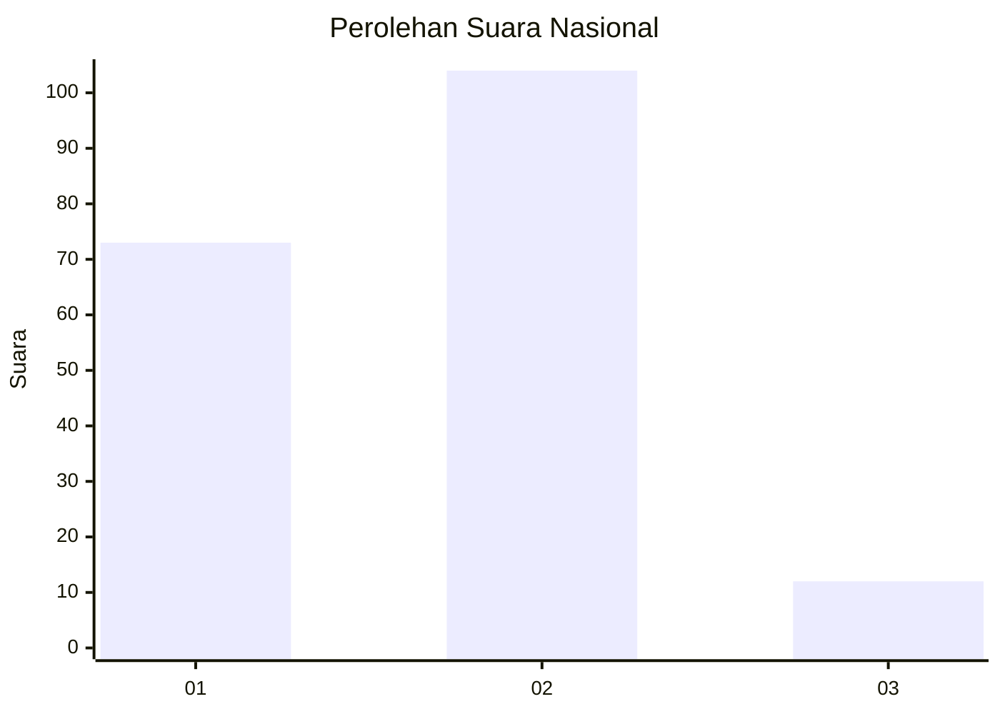

# Hasil

## Grafik

## Tabel

| No. | Nama Paslon    | Suara | Suara (raw) | Persentase |
|:--- |:-------------- | -----:| -----------:| ----------:|
| 1   | ANIES MUHAIMIN | 73    | [73][p-1]   | 38,62      |
| 2   | PRABOWO GIBRAN | 104   | [104][p-2]  | 55,03      |
| 3   | GANJAR MAHFUD  | 12    | [12][p-3]   | 6,35       |

[p-1]: https://github.com/gigit-pemilu/pemilu-2024/blob/main/pilpres/hitung-suara/sub/21-kepulauan-riau/sub/71-kota-batam/sub/09-bengkong/sub/1004-tanjung-buntung/sub/005-tps/sub/paslon-1.txt
[p-2]: https://github.com/gigit-pemilu/pemilu-2024/blob/main/pilpres/hitung-suara/sub/21-kepulauan-riau/sub/71-kota-batam/sub/09-bengkong/sub/1004-tanjung-buntung/sub/005-tps/sub/paslon-2.txt
[p-3]: https://github.com/gigit-pemilu/pemilu-2024/blob/main/pilpres/hitung-suara/sub/21-kepulauan-riau/sub/71-kota-batam/sub/09-bengkong/sub/1004-tanjung-buntung/sub/005-tps/sub/paslon-3.txt

## Foto C Plano

https://sirekap-obj-formc.kpu.go.id/52b6/pemilu/ppwp/21/71/09/10/04/2171091004005-20240214-224300--8686198f-bc6a-4c1a-b300-58bdae7ccae2.jpg

https://sirekap-obj-formc.kpu.go.id/52b6/pemilu/ppwp/21/71/09/10/04/2171091004005-20240214-224322--2d2ce9d6-2392-4bf5-a298-4049de8d8a3f.jpg

https://sirekap-obj-formc.kpu.go.id/52b6/pemilu/ppwp/21/71/09/10/04/2171091004005-20240214-224341--2a0c663e-925a-4c1f-b8f8-13d8281f56f0.jpg

## Metadata

| Key        | Value               |
| ---------- | ------------------- |
| Time Stamp | 2024-02-19 15:00:00 |

