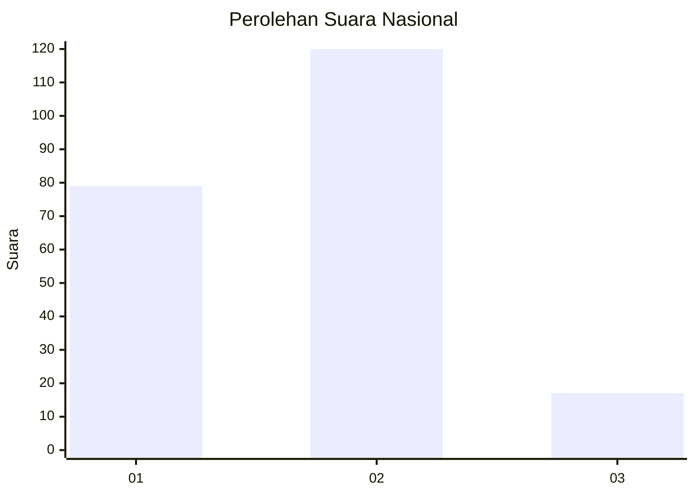

# Hasil

## Grafik

## Tabel

| No. | Nama Paslon    | Suara | Suara (raw) | Persentase |
|:--- |:-------------- | -----:| -----------:| ----------:|
| 1   | ANIES MUHAIMIN | 79    | [79][p-1]   | 36,57      |
| 2   | PRABOWO GIBRAN | 120   | [120][p-2]  | 55,56      |
| 3   | GANJAR MAHFUD  | 17    | [17][p-3]   | 7,87       |

[p-1]: https://github.com/gigit-pemilu/pemilu-2024/blob/main/pilpres/hitung-suara/sub/21-kepulauan-riau/sub/71-kota-batam/sub/09-bengkong/sub/1004-tanjung-buntung/sub/014-tps/sub/paslon-1.txt
[p-2]: https://github.com/gigit-pemilu/pemilu-2024/blob/main/pilpres/hitung-suara/sub/21-kepulauan-riau/sub/71-kota-batam/sub/09-bengkong/sub/1004-tanjung-buntung/sub/014-tps/sub/paslon-2.txt
[p-3]: https://github.com/gigit-pemilu/pemilu-2024/blob/main/pilpres/hitung-suara/sub/21-kepulauan-riau/sub/71-kota-batam/sub/09-bengkong/sub/1004-tanjung-buntung/sub/014-tps/sub/paslon-3.txt

## Foto C Plano

https://sirekap-obj-formc.kpu.go.id/0019/pemilu/ppwp/21/71/09/10/04/2171091004014-20240214-141200--6cca8de4-6726-4db6-941a-59697c602ec8.jpg

https://sirekap-obj-formc.kpu.go.id/0019/pemilu/ppwp/21/71/09/10/04/2171091004014-20240214-141258--c03aff43-73c2-46ea-aa4a-f63da7c68bd8.jpg

https://sirekap-obj-formc.kpu.go.id/0019/pemilu/ppwp/21/71/09/10/04/2171091004014-20240214-141349--8a62b872-1466-4b2f-8c35-a2dd17b79fb1.jpg

## Metadata

| Key        | Value               |
| ---------- | ------------------- |
| Time Stamp | 2024-02-17 12:00:00 |

