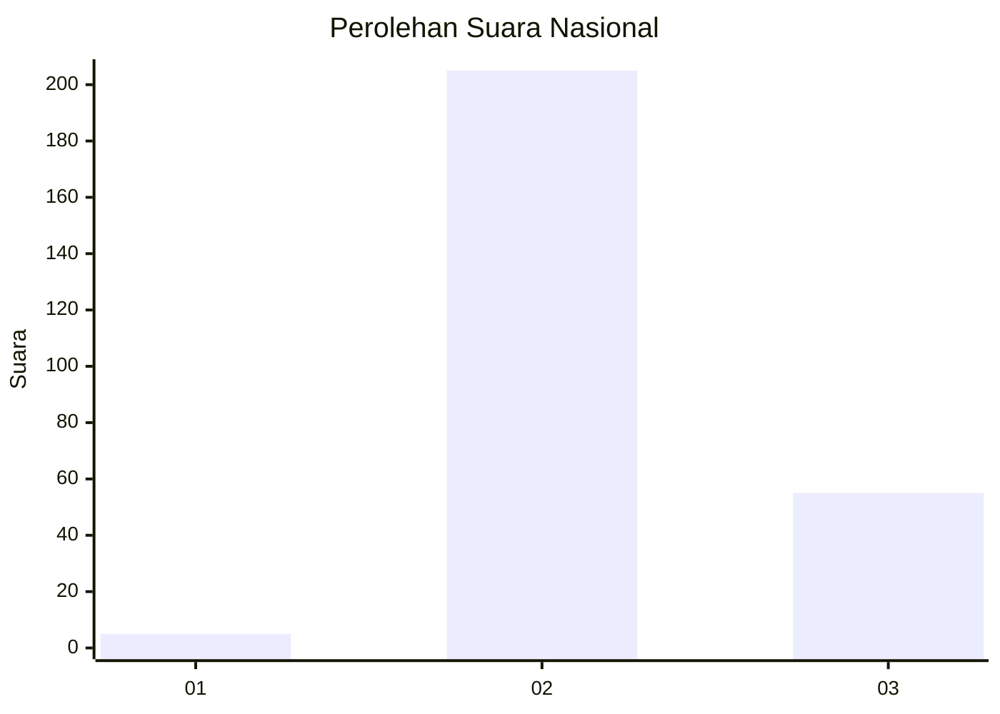

# Hasil

## Grafik

## Tabel

| No. | Nama Paslon    | Suara | Suara (raw) | Persentase |
|:--- |:-------------- | -----:| -----------:| ----------:|
| 1   | ANIES MUHAIMIN | 5     | [5][p-1]    | 1,89       |
| 2   | PRABOWO GIBRAN | 205   | [205][p-2]  | 77,36      |
| 3   | GANJAR MAHFUD  | 55    | [55][p-3]   | 20,75      |

[p-1]: https://github.com/gigit-pemilu/pemilu-2024/blob/main/pilpres/hitung-suara/sub/21-kepulauan-riau/sub/71-kota-batam/sub/09-bengkong/sub/1004-tanjung-buntung/sub/029-tps/sub/paslon-1.txt
[p-2]: https://github.com/gigit-pemilu/pemilu-2024/blob/main/pilpres/hitung-suara/sub/21-kepulauan-riau/sub/71-kota-batam/sub/09-bengkong/sub/1004-tanjung-buntung/sub/029-tps/sub/paslon-2.txt
[p-3]: https://github.com/gigit-pemilu/pemilu-2024/blob/main/pilpres/hitung-suara/sub/21-kepulauan-riau/sub/71-kota-batam/sub/09-bengkong/sub/1004-tanjung-buntung/sub/029-tps/sub/paslon-3.txt

## Foto C Plano

https://sirekap-obj-formc.kpu.go.id/ea55/pemilu/ppwp/21/71/09/10/04/2171091004029-20240214-234752--64262a72-b65f-40ab-ae0b-daaee69fd1b4.jpg

https://sirekap-obj-formc.kpu.go.id/ea55/pemilu/ppwp/21/71/09/10/04/2171091004029-20240214-234924--f2fce6b0-3e80-465a-a91e-12a1236d409b.jpg

https://sirekap-obj-formc.kpu.go.id/ea55/pemilu/ppwp/21/71/09/10/04/2171091004029-20240214-235053--88955500-9329-47a8-8c59-b0389e40e4d6.jpg

## Metadata

| Key        | Value               |
| ---------- | ------------------- |
| Time Stamp | 2024-02-17 12:00:00 |

