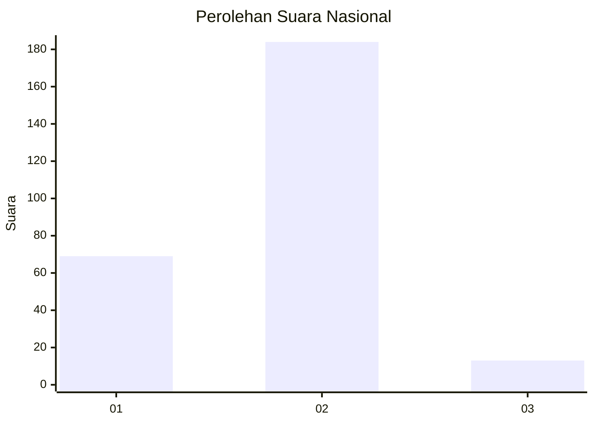
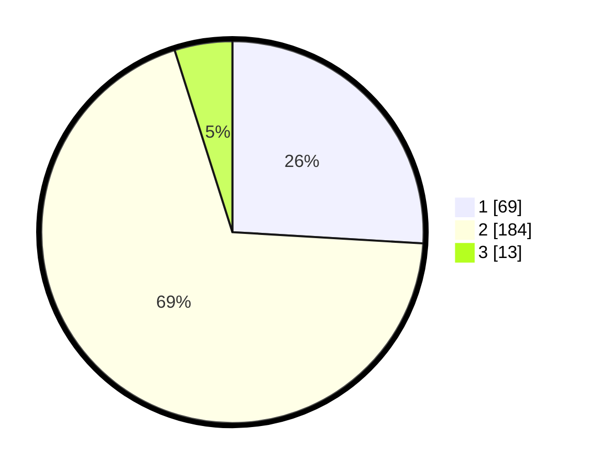

# Hasil

## Grafik

## Tabel

| No. | Nama Paslon    | Suara | Suara (raw) | Persentase |
|:--- |:-------------- | -----:| -----------:| ----------:|
| 1   | ANIES MUHAIMIN | 69    | [69][p-1]   | 25,94      |
| 2   | PRABOWO GIBRAN | 184   | [184][p-2]  | 69,17      |
| 3   | GANJAR MAHFUD  | 13    | [13][p-3]   | 4,89       |

[p-1]: https://github.com/gigit-pemilu/pemilu-2024/blob/main/pilpres/hitung-suara/sub/21-kepulauan-riau/sub/71-kota-batam/sub/09-bengkong/sub/1004-tanjung-buntung/sub/040-tps/sub/paslon-1.txt
[p-2]: https://github.com/gigit-pemilu/pemilu-2024/blob/main/pilpres/hitung-suara/sub/21-kepulauan-riau/sub/71-kota-batam/sub/09-bengkong/sub/1004-tanjung-buntung/sub/040-tps/sub/paslon-2.txt
[p-3]: https://github.com/gigit-pemilu/pemilu-2024/blob/main/pilpres/hitung-suara/sub/21-kepulauan-riau/sub/71-kota-batam/sub/09-bengkong/sub/1004-tanjung-buntung/sub/040-tps/sub/paslon-3.txt

## Foto C Plano

https://sirekap-obj-formc.kpu.go.id/7127/pemilu/ppwp/21/71/09/10/04/2171091004040-20240214-210853--74721afe-2225-4ffb-ad50-61704f42ca46.jpg

https://sirekap-obj-formc.kpu.go.id/7127/pemilu/ppwp/21/71/09/10/04/2171091004040-20240214-211414--5db809d1-b392-49bf-b8d6-27ff9ba034c9.jpg

https://sirekap-obj-formc.kpu.go.id/7127/pemilu/ppwp/21/71/09/10/04/2171091004040-20240214-211521--b23ecbe9-a537-4cd9-8aee-169e0999ba95.jpg

## Metadata

| Key        | Value               |
| ---------- | ------------------- |
| Time Stamp | 2024-02-19 15:00:00 |

