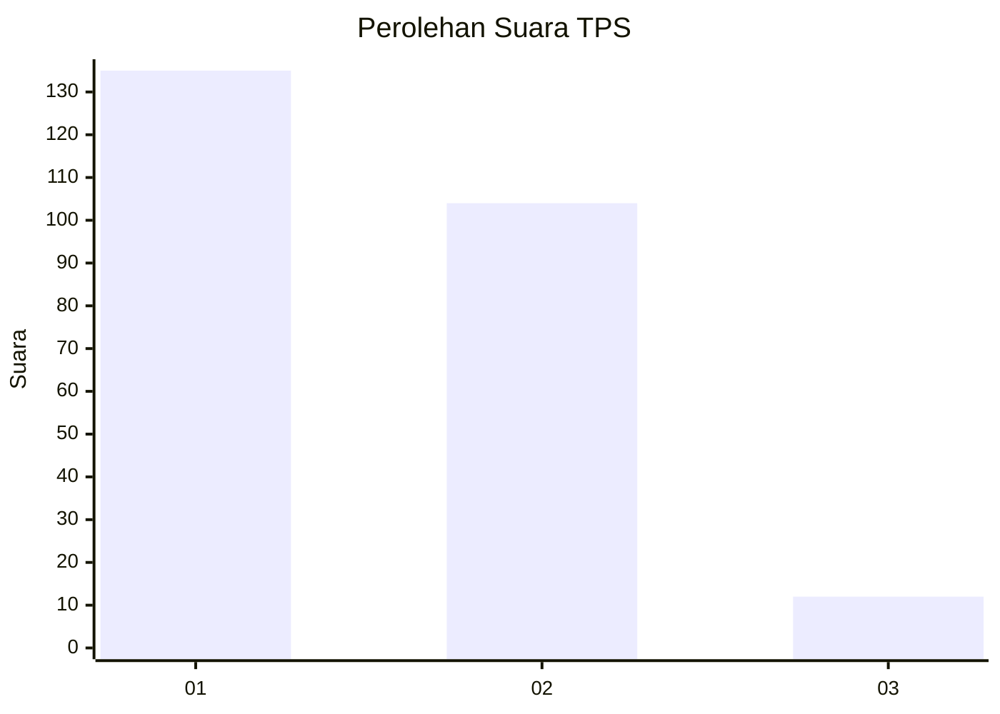
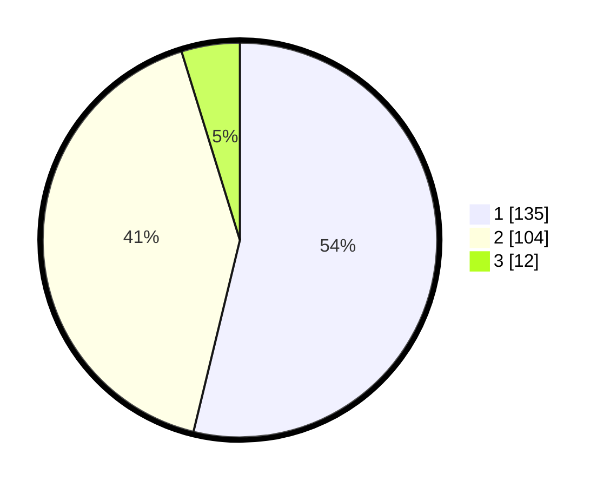

# Hasil

## Grafik

## Tabel

| No. | Nama Paslon    | Suara | Suara (raw) | Persentase |
|:--- |:-------------- | -----:| -----------:| ----------:|
| 1   | ANIES MUHAIMIN | 135   | [135][p-1]  | 53,78      |
| 2   | PRABOWO GIBRAN | 104   | [104][p-2]  | 41,43      |
| 3   | GANJAR MAHFUD  | 12    | [12][p-3]   | 4,78       |

[p-1]: https://github.com/gigit-pemilu/pemilu-2024-21-kepulauan-riau/blob/main/pilpres/hitung-suara/sub/21-kepulauan-riau/sub/71-kota-batam/sub/09-bengkong/sub/1004-tanjung-buntung/sub/087-tps/sub/paslon-1.txt
[p-2]: https://github.com/gigit-pemilu/pemilu-2024-21-kepulauan-riau/blob/main/pilpres/hitung-suara/sub/21-kepulauan-riau/sub/71-kota-batam/sub/09-bengkong/sub/1004-tanjung-buntung/sub/087-tps/sub/paslon-2.txt
[p-3]: https://github.com/gigit-pemilu/pemilu-2024-21-kepulauan-riau/blob/main/pilpres/hitung-suara/sub/21-kepulauan-riau/sub/71-kota-batam/sub/09-bengkong/sub/1004-tanjung-buntung/sub/087-tps/sub/paslon-3.txt

## Foto C Plano

https://sirekap-obj-formc.kpu.go.id/4c12/pemilu/ppwp/21/71/09/10/04/2171091004087-20240215-051110--8df51599-1b79-46e5-ae47-6e8522fdd117.jpg

https://sirekap-obj-formc.kpu.go.id/4c12/pemilu/ppwp/21/71/09/10/04/2171091004087-20240215-051230--507b7700-be23-4965-bbad-30d9cff8939d.jpg

https://sirekap-obj-formc.kpu.go.id/4c12/pemilu/ppwp/21/71/09/10/04/2171091004087-20240215-051321--d0f5c8a0-d64e-492b-b69a-2874d9535f00.jpg

## Metadata

| Key        | Value               |
| ---------- | ------------------- |
| Time Stamp | 2024-02-19 15:00:00 |

