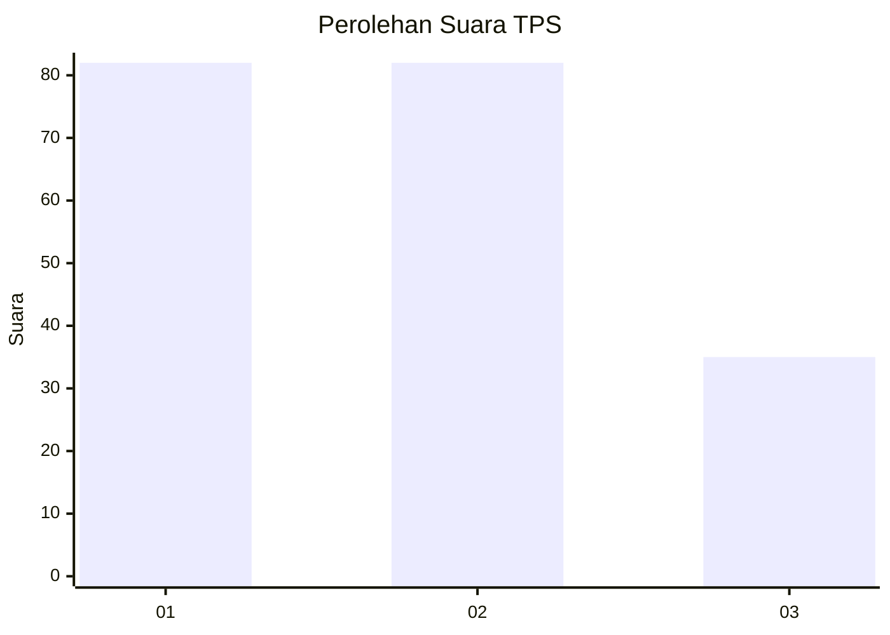
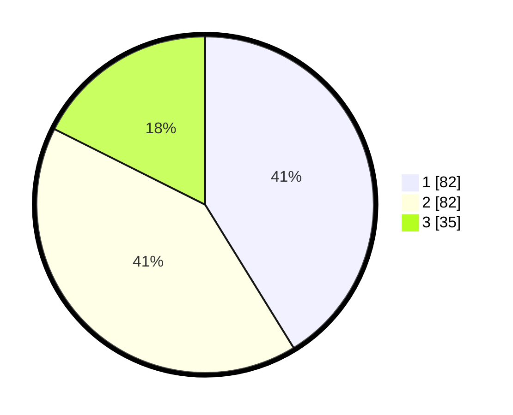

# Hasil

## Grafik

## Tabel

| No. | Nama Paslon    | Suara | Suara (raw) | Persentase |
|:--- |:-------------- | -----:| -----------:| ----------:|
| 1   | ANIES MUHAIMIN | 82    | [82][p-1]   | 41,21      |
| 2   | PRABOWO GIBRAN | 82    | [82][p-2]   | 41,21      |
| 3   | GANJAR MAHFUD  | 35    | [35][p-3]   | 17,59      |

[p-1]: https://github.com/gigit-pemilu/pemilu-2024-21-kepulauan-riau/blob/main/pilpres/hitung-suara/sub/21-kepulauan-riau/sub/71-kota-batam/sub/10-batam-kota/sub/1001-baloi-permai/sub/005-tps/sub/paslon-1.txt
[p-2]: https://github.com/gigit-pemilu/pemilu-2024-21-kepulauan-riau/blob/main/pilpres/hitung-suara/sub/21-kepulauan-riau/sub/71-kota-batam/sub/10-batam-kota/sub/1001-baloi-permai/sub/005-tps/sub/paslon-2.txt
[p-3]: https://github.com/gigit-pemilu/pemilu-2024-21-kepulauan-riau/blob/main/pilpres/hitung-suara/sub/21-kepulauan-riau/sub/71-kota-batam/sub/10-batam-kota/sub/1001-baloi-permai/sub/005-tps/sub/paslon-3.txt

## Foto C Plano

https://sirekap-obj-formc.kpu.go.id/dc02/pemilu/ppwp/21/71/10/10/01/2171101001005-20240214-232549--5cace3ce-42ba-4a14-b989-de8ed721ddc5.jpg

https://sirekap-obj-formc.kpu.go.id/dc02/pemilu/ppwp/21/71/10/10/01/2171101001005-20240214-232701--0ada0118-a417-4d78-b2e6-e8bd5731c17e.jpg

https://sirekap-obj-formc.kpu.go.id/dc02/pemilu/ppwp/21/71/10/10/01/2171101001005-20240214-232851--cdcee00d-5697-4af0-940e-0acdb352f4c1.jpg

## Metadata

| Key        | Value               |
| ---------- | ------------------- |
| Time Stamp | 2024-02-20 11:00:00 |

