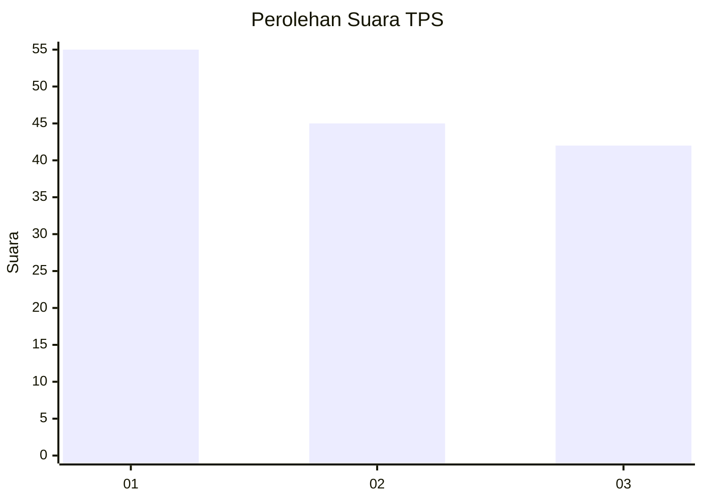
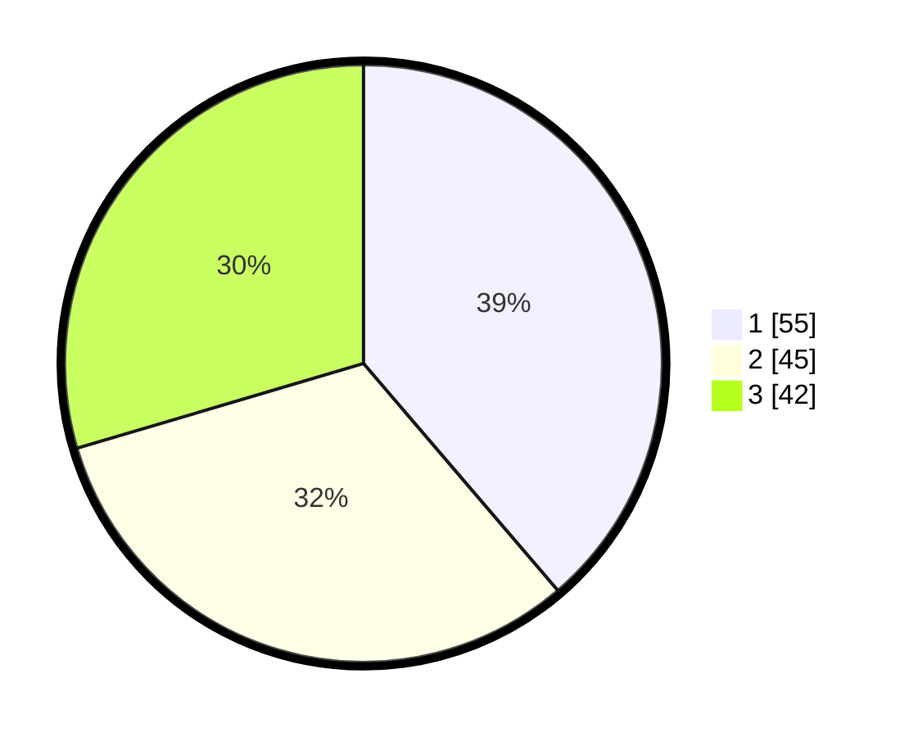

# Hasil

## Grafik

## Tabel

| No. | Nama Paslon    | Suara | Suara (raw) | Persentase |
|:--- |:-------------- | -----:| -----------:| ----------:|
| 1   | ANIES MUHAIMIN | 55    | [55][p-1]   | 38,73      |
| 2   | PRABOWO GIBRAN | 45    | [45][p-2]   | 31,69      |
| 3   | GANJAR MAHFUD  | 42    | [42][p-3]   | 29,58      |

[p-1]: https://github.com/gigit-pemilu/pemilu-2024-21-kepulauan-riau/blob/main/pilpres/hitung-suara/sub/21-kepulauan-riau/sub/71-kota-batam/sub/10-batam-kota/sub/1001-baloi-permai/sub/014-tps/sub/paslon-1.txt
[p-2]: https://github.com/gigit-pemilu/pemilu-2024-21-kepulauan-riau/blob/main/pilpres/hitung-suara/sub/21-kepulauan-riau/sub/71-kota-batam/sub/10-batam-kota/sub/1001-baloi-permai/sub/014-tps/sub/paslon-2.txt
[p-3]: https://github.com/gigit-pemilu/pemilu-2024-21-kepulauan-riau/blob/main/pilpres/hitung-suara/sub/21-kepulauan-riau/sub/71-kota-batam/sub/10-batam-kota/sub/1001-baloi-permai/sub/014-tps/sub/paslon-3.txt

## Foto C Plano

https://sirekap-obj-formc.kpu.go.id/dcbe/pemilu/ppwp/21/71/10/10/01/2171101001014-20240214-233345--8e886e18-0122-44d8-ac06-056f0a2995f4.jpg

https://sirekap-obj-formc.kpu.go.id/dcbe/pemilu/ppwp/21/71/10/10/01/2171101001014-20240214-233403--b1951636-ac81-4f26-a6c0-ee384649da71.jpg

https://sirekap-obj-formc.kpu.go.id/dcbe/pemilu/ppwp/21/71/10/10/01/2171101001014-20240214-233424--cdd6321f-9624-4a17-b573-a4269b4cea64.jpg

## Metadata

| Key        | Value               |
| ---------- | ------------------- |
| Time Stamp | 2024-02-15 15:00:29 |

## DATA PEMILIH TETAP

Jumlah pemilih dalam DPT: **392**.
 * L: **141**.
 * P: **151**.

## DATA PENGGUNA HAK PILIH

Jumlah pengguna hak pilih dalam DPT: **194**.
 * L: **924**.
 * P: **704**.

Jumlah pengguna hak pilih dalam DPTb: **77**.
 * L: **202**.
 * P: **202**.

Jumlah pengguna hak pilih dalam DPK: **52**.
 * L: **202**.
 * P: **505**.

Jumlah pengguna hak pilih: **194**.
 * L: **35**.
 * P: **704**.

## JUMLAH SUARA SAH DAN TIDAK SAH

JUMLAH SELURUH SUARA SAH: **693**.

JUMLAH SUARA TIDAK SAH: **6**.

JUMLAH SELURUH SUARA SAH DAN SUARA TIDAK SAH: **194**.

