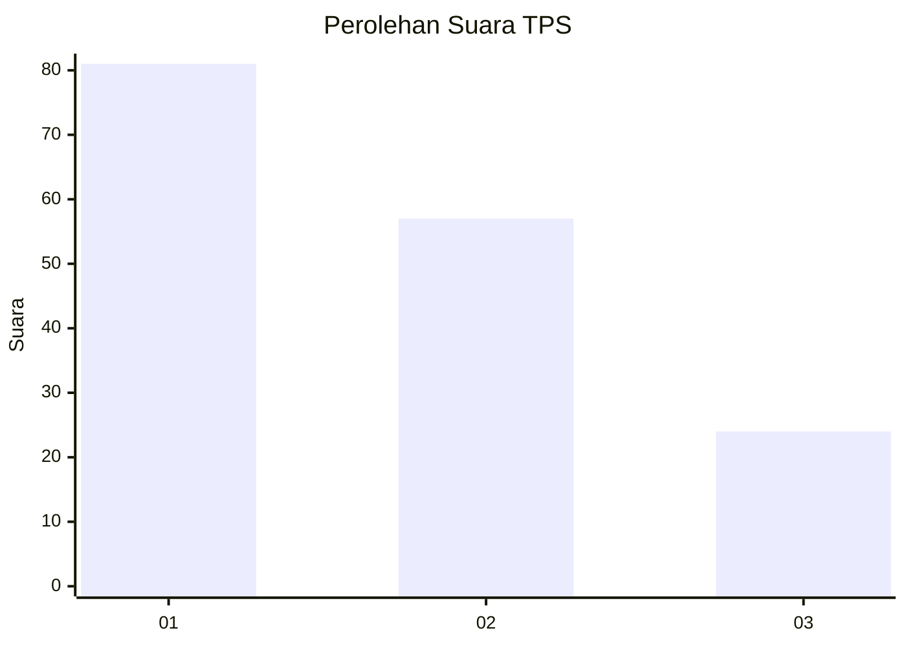
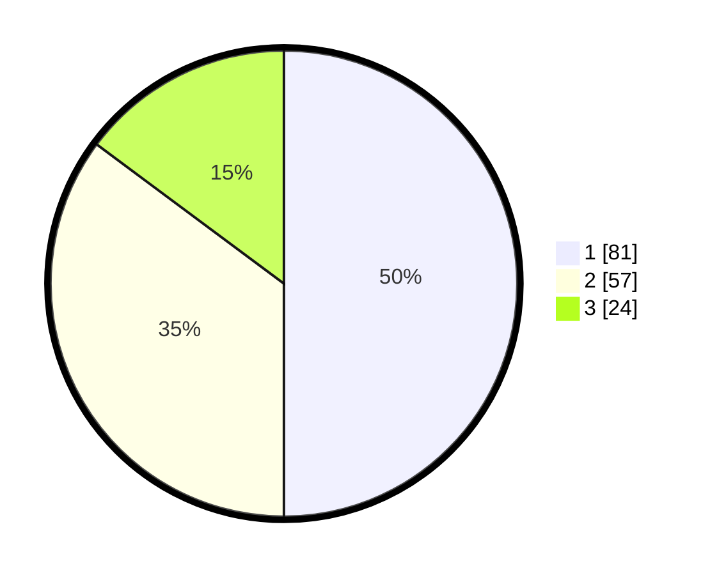

# Hasil

## Grafik

## Tabel

| No. | Nama Paslon    | Suara | Suara (raw) | Persentase |
|:--- |:-------------- | -----:| -----------:| ----------:|
| 1   | ANIES MUHAIMIN | 81    | [81][p-1]   | 50,00      |
| 2   | PRABOWO GIBRAN | 57    | [57][p-2]   | 35,19      |
| 3   | GANJAR MAHFUD  | 24    | [24][p-3]   | 14,81      |

[p-1]: https://github.com/gigit-pemilu/pemilu-2024-21-kepulauan-riau/blob/main/pilpres/hitung-suara/sub/21-kepulauan-riau/sub/71-kota-batam/sub/10-batam-kota/sub/1001-baloi-permai/sub/083-tps/sub/paslon-1.txt
[p-2]: https://github.com/gigit-pemilu/pemilu-2024-21-kepulauan-riau/blob/main/pilpres/hitung-suara/sub/21-kepulauan-riau/sub/71-kota-batam/sub/10-batam-kota/sub/1001-baloi-permai/sub/083-tps/sub/paslon-2.txt
[p-3]: https://github.com/gigit-pemilu/pemilu-2024-21-kepulauan-riau/blob/main/pilpres/hitung-suara/sub/21-kepulauan-riau/sub/71-kota-batam/sub/10-batam-kota/sub/1001-baloi-permai/sub/083-tps/sub/paslon-3.txt

## Foto C Plano

https://sirekap-obj-formc.kpu.go.id/a921/pemilu/ppwp/21/71/10/10/01/2171101001083-20240215-123011--fae593a4-a9e9-4cc5-bc37-e945c4c60133.jpg

https://sirekap-obj-formc.kpu.go.id/a921/pemilu/ppwp/21/71/10/10/01/2171101001083-20240215-095255--bb18cf36-1464-46b0-a610-3ea819a6dbf0.jpg

https://sirekap-obj-formc.kpu.go.id/a921/pemilu/ppwp/21/71/10/10/01/2171101001083-20240215-123116--c6e50fa9-cdef-474b-a7c5-c2dd08642718.jpg

## Metadata

| Key        | Value               |
| ---------- | ------------------- |
| Time Stamp | 2024-02-24 22:31:28 |

