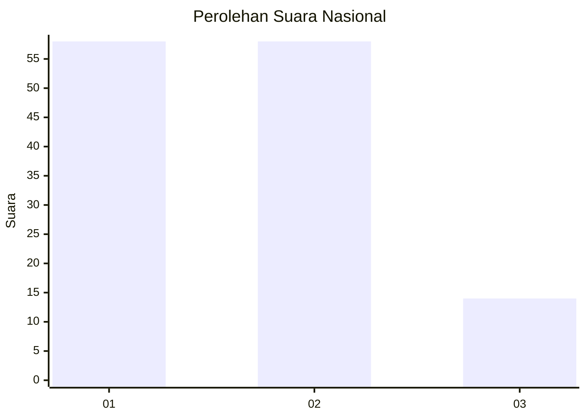
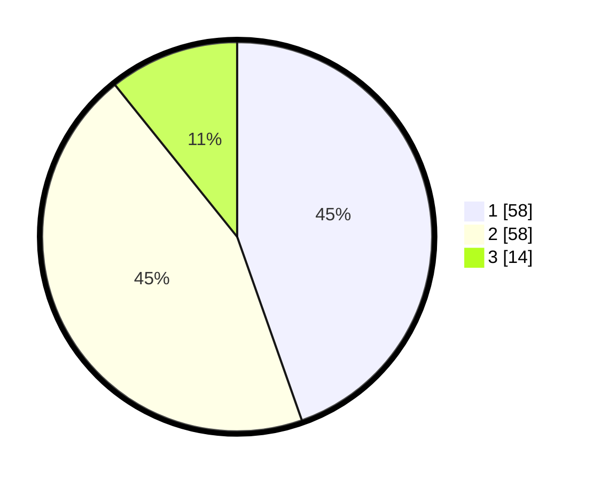

# Hasil

## Grafik

## Tabel

| No. | Nama Paslon    | Suara | Suara (raw) | Persentase |
|:--- |:-------------- | -----:| -----------:| ----------:|
| 1   | ANIES MUHAIMIN | 58    | [58][p-1]   | 44,62      |
| 2   | PRABOWO GIBRAN | 58    | [58][p-2]   | 44,62      |
| 3   | GANJAR MAHFUD  | 14    | [14][p-3]   | 10,77      |

[p-1]: https://github.com/gigit-pemilu/pemilu-2024/blob/main/pilpres/hitung-suara/sub/21-kepulauan-riau/sub/71-kota-batam/sub/10-batam-kota/sub/1001-baloi-permai/sub/088-tps/sub/paslon-1.txt
[p-2]: https://github.com/gigit-pemilu/pemilu-2024/blob/main/pilpres/hitung-suara/sub/21-kepulauan-riau/sub/71-kota-batam/sub/10-batam-kota/sub/1001-baloi-permai/sub/088-tps/sub/paslon-2.txt
[p-3]: https://github.com/gigit-pemilu/pemilu-2024/blob/main/pilpres/hitung-suara/sub/21-kepulauan-riau/sub/71-kota-batam/sub/10-batam-kota/sub/1001-baloi-permai/sub/088-tps/sub/paslon-3.txt

## Foto C Plano

https://sirekap-obj-formc.kpu.go.id/98e5/pemilu/ppwp/21/71/10/10/01/2171101001088-20240216-174712--6a19f418-8a8b-4843-9a59-2bfc85318178.jpg

https://sirekap-obj-formc.kpu.go.id/98e5/pemilu/ppwp/21/71/10/10/01/2171101001088-20240215-004749--99fb0424-cac2-4b43-b2d5-d33039f2cecc.jpg

https://sirekap-obj-formc.kpu.go.id/98e5/pemilu/ppwp/21/71/10/10/01/2171101001088-20240215-004851--7502f53f-aaed-47aa-bcf9-c2574fab69ce.jpg

## Metadata

| Key        | Value               |
| ---------- | ------------------- |
| Time Stamp | 2024-02-17 11:30:03 |

