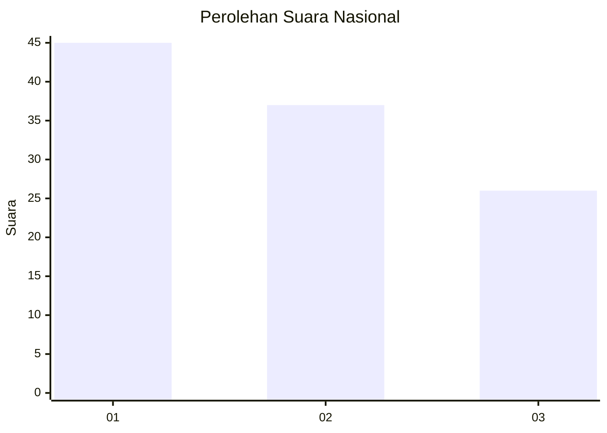
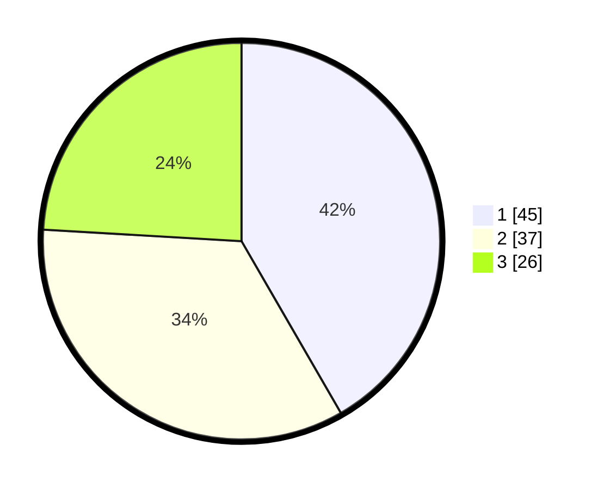

# Hasil

## Grafik

## Tabel

| No. | Nama Paslon    | Suara | Suara (raw) | Persentase |
|:--- |:-------------- | -----:| -----------:| ----------:|
| 1   | ANIES MUHAIMIN | 45    | [45][p-1]   | 41,67      |
| 2   | PRABOWO GIBRAN | 37    | [37][p-2]   | 34,26      |
| 3   | GANJAR MAHFUD  | 26    | [26][p-3]   | 24,07      |

[p-1]: https://github.com/gigit-pemilu/pemilu-2024/blob/main/pilpres/hitung-suara/sub/21-kepulauan-riau/sub/71-kota-batam/sub/10-batam-kota/sub/1003-teluk-tering/sub/057-tps/sub/paslon-1.txt
[p-2]: https://github.com/gigit-pemilu/pemilu-2024/blob/main/pilpres/hitung-suara/sub/21-kepulauan-riau/sub/71-kota-batam/sub/10-batam-kota/sub/1003-teluk-tering/sub/057-tps/sub/paslon-2.txt
[p-3]: https://github.com/gigit-pemilu/pemilu-2024/blob/main/pilpres/hitung-suara/sub/21-kepulauan-riau/sub/71-kota-batam/sub/10-batam-kota/sub/1003-teluk-tering/sub/057-tps/sub/paslon-3.txt

## Foto C Plano

https://sirekap-obj-formc.kpu.go.id/5b15/pemilu/ppwp/21/71/10/10/03/2171101003057-20240214-185839--fb16f305-8bca-4bda-9acf-dbf92da1e3c0.jpg

https://sirekap-obj-formc.kpu.go.id/5b15/pemilu/ppwp/21/71/10/10/03/2171101003057-20240214-185841--d834623a-1a4b-45b3-b3b2-d5a02a5a6c29.jpg

https://sirekap-obj-formc.kpu.go.id/5b15/pemilu/ppwp/21/71/10/10/03/2171101003057-20240214-185844--48718308-8603-4e18-bb16-324362c941fc.jpg

## Metadata

| Key        | Value               |
| ---------- | ------------------- |
| Time Stamp | 2024-02-16 05:00:26 |

