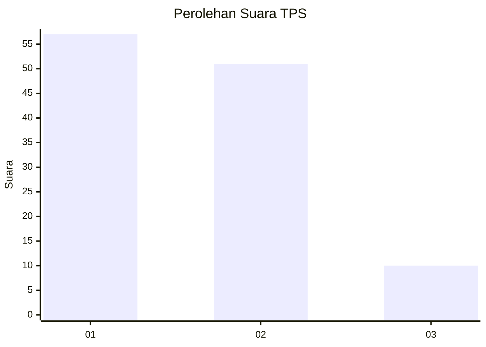
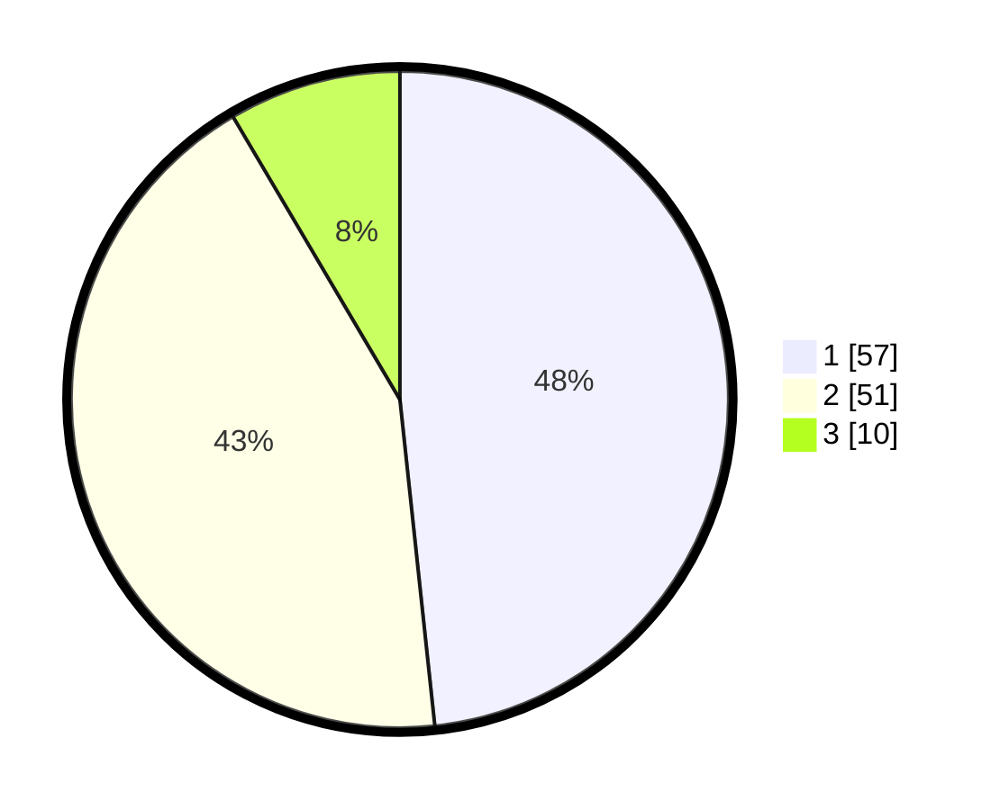

# Hasil

## Grafik

## Tabel

| No. | Nama Paslon    | Suara | Suara (raw) | Persentase |
|:--- |:-------------- | -----:| -----------:| ----------:|
| 1   | ANIES MUHAIMIN | 57    | [57][p-1]   | 48,31      |
| 2   | PRABOWO GIBRAN | 51    | [51][p-2]   | 43,22      |
| 3   | GANJAR MAHFUD  | 10    | [10][p-3]   | 8,47       |

[p-1]: https://github.com/gigit-pemilu/pemilu-2024-21-kepulauan-riau/blob/main/pilpres/hitung-suara/sub/21-kepulauan-riau/sub/71-kota-batam/sub/10-batam-kota/sub/1006-sungai-panas/sub/015-tps/sub/paslon-1.txt
[p-2]: https://github.com/gigit-pemilu/pemilu-2024-21-kepulauan-riau/blob/main/pilpres/hitung-suara/sub/21-kepulauan-riau/sub/71-kota-batam/sub/10-batam-kota/sub/1006-sungai-panas/sub/015-tps/sub/paslon-2.txt
[p-3]: https://github.com/gigit-pemilu/pemilu-2024-21-kepulauan-riau/blob/main/pilpres/hitung-suara/sub/21-kepulauan-riau/sub/71-kota-batam/sub/10-batam-kota/sub/1006-sungai-panas/sub/015-tps/sub/paslon-3.txt

## Foto C Plano

https://sirekap-obj-formc.kpu.go.id/4f0a/pemilu/ppwp/21/71/10/10/06/2171101006015-20240216-203840--e6b7cebd-a69e-41ca-99ef-e6688c43e1bf.jpg

https://sirekap-obj-formc.kpu.go.id/4f0a/pemilu/ppwp/21/71/10/10/06/2171101006015-20240216-204853--f91fc21f-ea5f-4b82-919a-e102b5dedcfe.jpg

https://sirekap-obj-formc.kpu.go.id/4f0a/pemilu/ppwp/21/71/10/10/06/2171101006015-20240216-213519--6932e62b-61bf-4811-bba0-24f891a66886.jpg

## Metadata

| Key        | Value               |
| ---------- | ------------------- |
| Time Stamp | 2024-02-16 22:01:00 |

