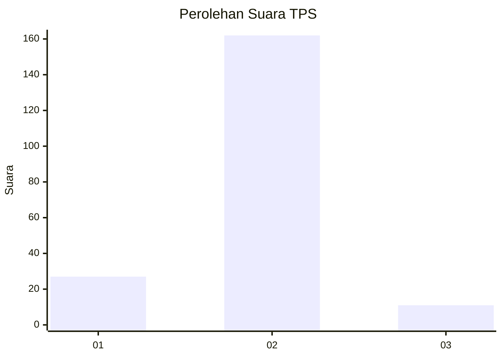
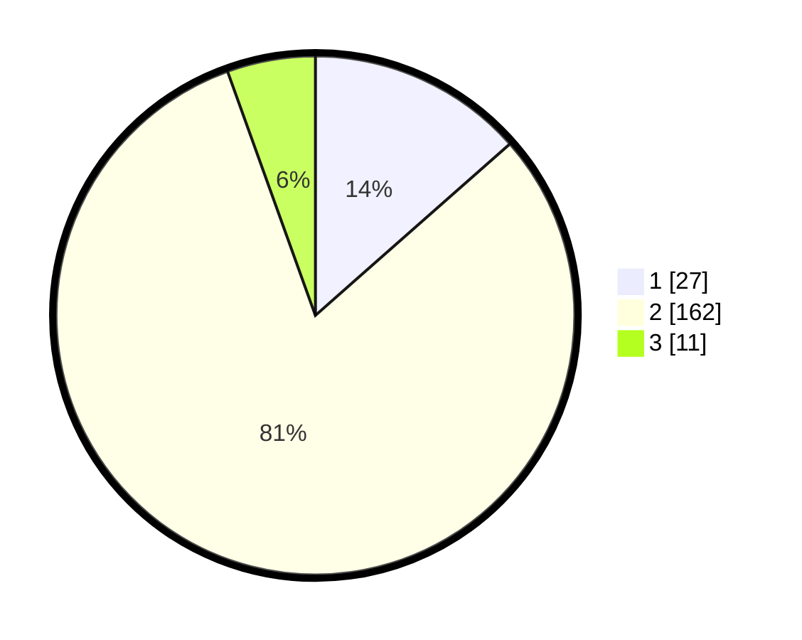

# Hasil

## Grafik

## Tabel

| No. | Nama Paslon    | Suara | Suara (raw) | Persentase |
|:--- |:-------------- | -----:| -----------:| ----------:|
| 1   | ANIES MUHAIMIN | 27    | [27][p-1]   | 13,50      |
| 2   | PRABOWO GIBRAN | 162   | [162][p-2]  | 81,00      |
| 3   | GANJAR MAHFUD  | 11    | [11][p-3]   | 5,50       |

[p-1]: https://github.com/gigit-pemilu/pemilu-2024-21-kepulauan-riau/blob/main/pilpres/hitung-suara/sub/21-kepulauan-riau/sub/71-kota-batam/sub/11-sagulung/sub/1001-tembesi/sub/003-tps/sub/paslon-1.txt
[p-2]: https://github.com/gigit-pemilu/pemilu-2024-21-kepulauan-riau/blob/main/pilpres/hitung-suara/sub/21-kepulauan-riau/sub/71-kota-batam/sub/11-sagulung/sub/1001-tembesi/sub/003-tps/sub/paslon-2.txt
[p-3]: https://github.com/gigit-pemilu/pemilu-2024-21-kepulauan-riau/blob/main/pilpres/hitung-suara/sub/21-kepulauan-riau/sub/71-kota-batam/sub/11-sagulung/sub/1001-tembesi/sub/003-tps/sub/paslon-3.txt

## Foto C Plano

https://sirekap-obj-formc.kpu.go.id/73b5/pemilu/ppwp/21/71/11/10/01/2171111001003-20240214-211020--88ac6608-ba2b-4d5d-a92b-080af5a9c225.jpg

https://sirekap-obj-formc.kpu.go.id/73b5/pemilu/ppwp/21/71/11/10/01/2171111001003-20240214-211329--9b870494-ca0b-436d-805d-3fff84db75cc.jpg

https://sirekap-obj-formc.kpu.go.id/73b5/pemilu/ppwp/21/71/11/10/01/2171111001003-20240214-211631--71737970-ab10-4ae5-9631-5b3e327431b8.jpg

## Metadata

| Key        | Value               |
| ---------- | ------------------- |
| Time Stamp | 2024-02-15 15:00:29 |

