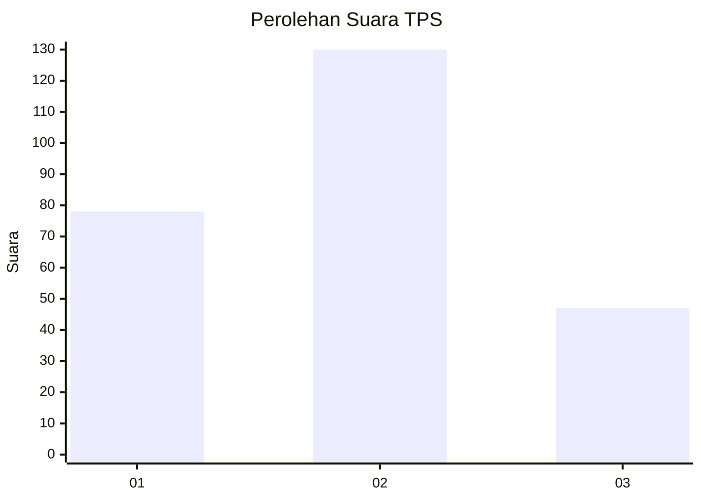
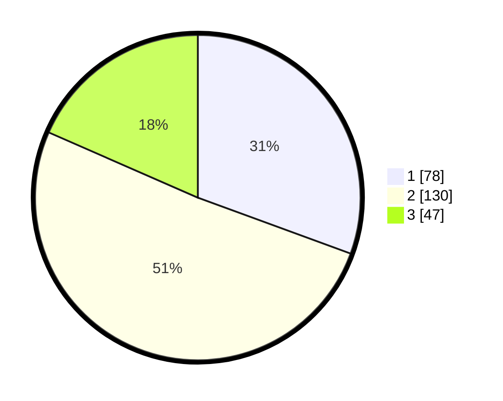

# Hasil

## Grafik

## Tabel

| No. | Nama Paslon    | Suara | Suara (raw) | Persentase |
|:--- |:-------------- | -----:| -----------:| ----------:|
| 1   | ANIES MUHAIMIN | 78    | [78][p-1]   | 30,59      |
| 2   | PRABOWO GIBRAN | 130   | [130][p-2]  | 50,98      |
| 3   | GANJAR MAHFUD  | 47    | [47][p-3]   | 18,43      |

[p-1]: https://github.com/gigit-pemilu/pemilu-2024-21-kepulauan-riau/blob/main/pilpres/hitung-suara/sub/21-kepulauan-riau/sub/71-kota-batam/sub/11-sagulung/sub/1001-tembesi/sub/008-tps/sub/paslon-1.txt
[p-2]: https://github.com/gigit-pemilu/pemilu-2024-21-kepulauan-riau/blob/main/pilpres/hitung-suara/sub/21-kepulauan-riau/sub/71-kota-batam/sub/11-sagulung/sub/1001-tembesi/sub/008-tps/sub/paslon-2.txt
[p-3]: https://github.com/gigit-pemilu/pemilu-2024-21-kepulauan-riau/blob/main/pilpres/hitung-suara/sub/21-kepulauan-riau/sub/71-kota-batam/sub/11-sagulung/sub/1001-tembesi/sub/008-tps/sub/paslon-3.txt

## Foto C Plano

https://sirekap-obj-formc.kpu.go.id/6d3b/pemilu/ppwp/21/71/11/10/01/2171111001008-20240216-222351--961ff6d9-5f7d-42ed-916f-6dda2701ca86.jpg

https://sirekap-obj-formc.kpu.go.id/6d3b/pemilu/ppwp/21/71/11/10/01/2171111001008-20240216-203456--29f1e5d8-46ba-46e6-9388-fcfe4c5d3da6.jpg

https://sirekap-obj-formc.kpu.go.id/6d3b/pemilu/ppwp/21/71/11/10/01/2171111001008-20240216-203611--d9bb25df-829f-4b19-a63a-e8820d41dccb.jpg

## Metadata

| Key        | Value               |
| ---------- | ------------------- |
| Time Stamp | 2024-02-19 10:00:00 |

