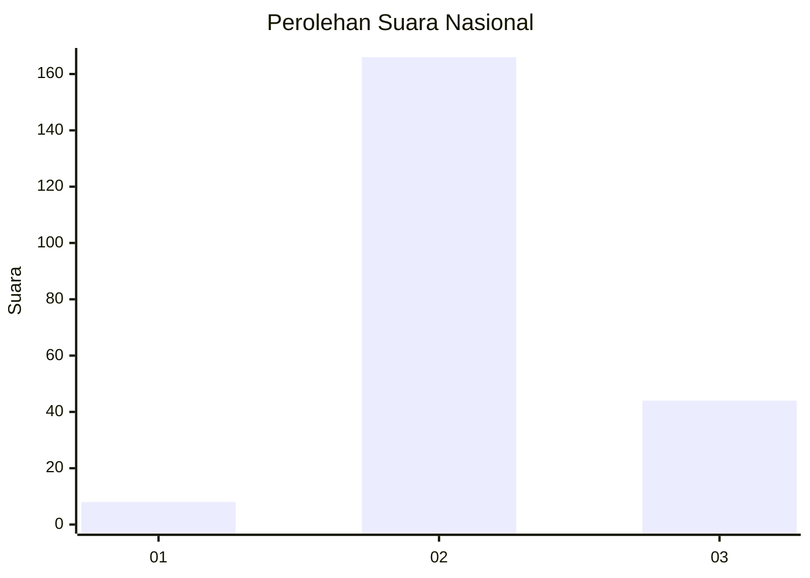

# Hasil

## Grafik

## Tabel

| No. | Nama Paslon    | Suara | Suara (raw) | Persentase |
|:--- |:-------------- | -----:| -----------:| ----------:|
| 1   | ANIES MUHAIMIN | 8     | [8][p-1]    | 3,67       |
| 2   | PRABOWO GIBRAN | 166   | [166][p-2]  | 76,15      |
| 3   | GANJAR MAHFUD  | 44    | [44][p-3]   | 20,18      |

[p-1]: https://github.com/gigit-pemilu/pemilu-2024/blob/main/pilpres/hitung-suara/sub/21-kepulauan-riau/sub/71-kota-batam/sub/11-sagulung/sub/1001-tembesi/sub/016-tps/sub/paslon-1.txt
[p-2]: https://github.com/gigit-pemilu/pemilu-2024/blob/main/pilpres/hitung-suara/sub/21-kepulauan-riau/sub/71-kota-batam/sub/11-sagulung/sub/1001-tembesi/sub/016-tps/sub/paslon-2.txt
[p-3]: https://github.com/gigit-pemilu/pemilu-2024/blob/main/pilpres/hitung-suara/sub/21-kepulauan-riau/sub/71-kota-batam/sub/11-sagulung/sub/1001-tembesi/sub/016-tps/sub/paslon-3.txt

## Foto C Plano

https://sirekap-obj-formc.kpu.go.id/24a7/pemilu/ppwp/21/71/11/10/01/2171111001016-20240215-020835--13d784b7-a565-4ffa-ba3f-c46add69d4cc.jpg

https://sirekap-obj-formc.kpu.go.id/24a7/pemilu/ppwp/21/71/11/10/01/2171111001016-20240215-014103--db4db931-ddc9-4d52-b94c-ef5df4c3f6eb.jpg

https://sirekap-obj-formc.kpu.go.id/24a7/pemilu/ppwp/21/71/11/10/01/2171111001016-20240215-014108--2358bef0-584e-434f-8b41-0c906f9826a9.jpg

## Metadata

| Key        | Value               |
| ---------- | ------------------- |
| Time Stamp | 2024-02-19 10:00:00 |

