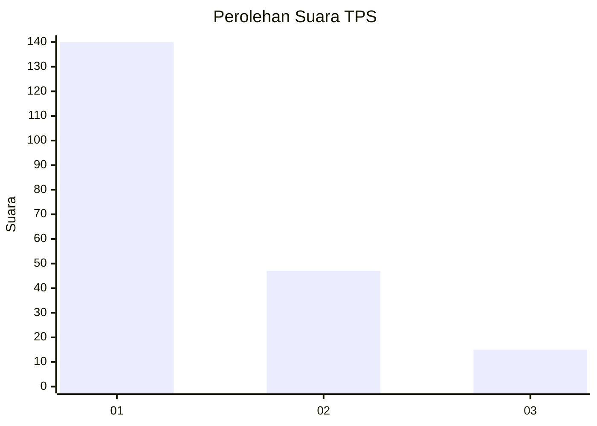
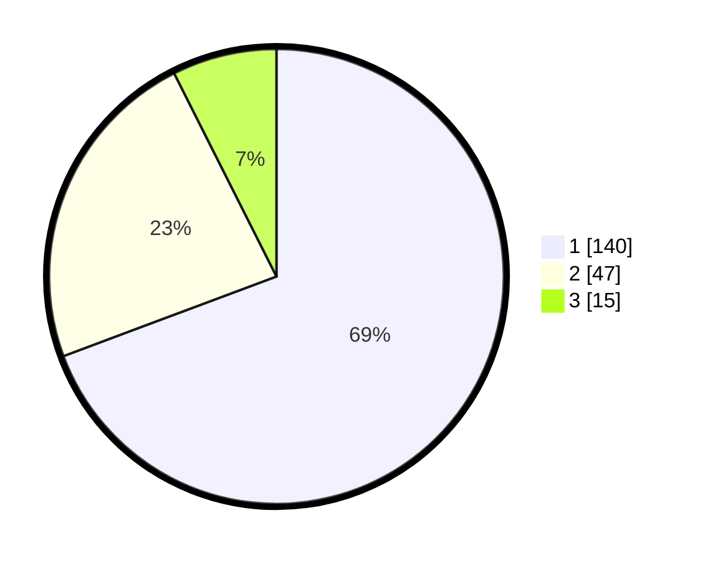

# Hasil

## Grafik

## Tabel

| No. | Nama Paslon    | Suara | Suara (raw) | Persentase |
|:--- |:-------------- | -----:| -----------:| ----------:|
| 1   | ANIES MUHAIMIN | 140   | [140][p-1]  | 69,31      |
| 2   | PRABOWO GIBRAN | 47    | [47][p-2]   | 23,27      |
| 3   | GANJAR MAHFUD  | 15    | [15][p-3]   | 7,43       |

[p-1]: https://github.com/gigit-pemilu/pemilu-2024-21-kepulauan-riau/blob/main/pilpres/hitung-suara/sub/21-kepulauan-riau/sub/71-kota-batam/sub/11-sagulung/sub/1001-tembesi/sub/043-tps/sub/paslon-1.txt
[p-2]: https://github.com/gigit-pemilu/pemilu-2024-21-kepulauan-riau/blob/main/pilpres/hitung-suara/sub/21-kepulauan-riau/sub/71-kota-batam/sub/11-sagulung/sub/1001-tembesi/sub/043-tps/sub/paslon-2.txt
[p-3]: https://github.com/gigit-pemilu/pemilu-2024-21-kepulauan-riau/blob/main/pilpres/hitung-suara/sub/21-kepulauan-riau/sub/71-kota-batam/sub/11-sagulung/sub/1001-tembesi/sub/043-tps/sub/paslon-3.txt

## Foto C Plano

https://sirekap-obj-formc.kpu.go.id/03e7/pemilu/ppwp/21/71/11/10/01/2171111001043-20240222-084639--1e0a3581-278e-4bfc-81a6-be3d2952c547.jpg

https://sirekap-obj-formc.kpu.go.id/03e7/pemilu/ppwp/21/71/11/10/01/2171111001043-20240222-084752--abf069b9-41eb-44ee-8fc9-e1c5d67a52f7.jpg

https://sirekap-obj-formc.kpu.go.id/03e7/pemilu/ppwp/21/71/11/10/01/2171111001043-20240222-084524--892c6d26-9408-4d1d-a2c9-9fd676cc1eb0.jpg

## Metadata

| Key        | Value               |
| ---------- | ------------------- |
| Time Stamp | 2024-02-25 16:00:00 |

