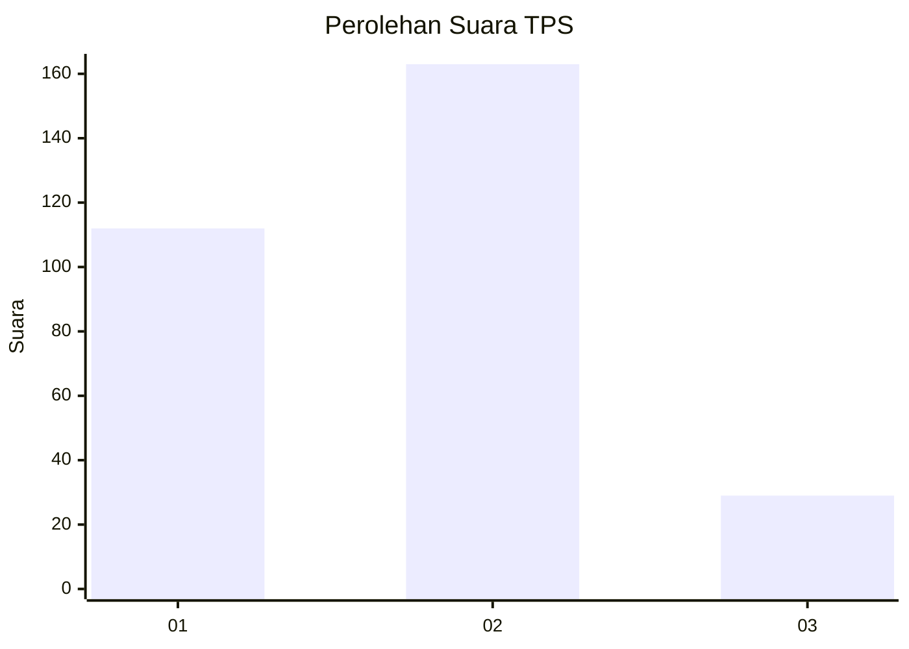

# Hasil

## Grafik

## Tabel

| No. | Nama Paslon    | Suara | Suara (raw) | Persentase |
|:--- |:-------------- | -----:| -----------:| ----------:|
| 1   | ANIES MUHAIMIN | 112   | [112][p-1]  | 36,84      |
| 2   | PRABOWO GIBRAN | 163   | [163][p-2]  | 53,62      |
| 3   | GANJAR MAHFUD  | 29    | [29][p-3]   | 9,54       |

[p-1]: https://github.com/gigit-pemilu/pemilu-2024-21-kepulauan-riau/blob/main/pilpres/hitung-suara/sub/21-kepulauan-riau/sub/71-kota-batam/sub/11-sagulung/sub/1001-tembesi/sub/046-tps/sub/paslon-1.txt
[p-2]: https://github.com/gigit-pemilu/pemilu-2024-21-kepulauan-riau/blob/main/pilpres/hitung-suara/sub/21-kepulauan-riau/sub/71-kota-batam/sub/11-sagulung/sub/1001-tembesi/sub/046-tps/sub/paslon-2.txt
[p-3]: https://github.com/gigit-pemilu/pemilu-2024-21-kepulauan-riau/blob/main/pilpres/hitung-suara/sub/21-kepulauan-riau/sub/71-kota-batam/sub/11-sagulung/sub/1001-tembesi/sub/046-tps/sub/paslon-3.txt

## Foto C Plano

https://sirekap-obj-formc.kpu.go.id/f551/pemilu/ppwp/21/71/11/10/01/2171111001046-20240215-015709--2dfb3654-d480-475d-8cdc-a9d406ac8752.jpg

https://sirekap-obj-formc.kpu.go.id/f551/pemilu/ppwp/21/71/11/10/01/2171111001046-20240215-015805--b2c7f090-369a-4245-bba7-fb04cc03733b.jpg

https://sirekap-obj-formc.kpu.go.id/f551/pemilu/ppwp/21/71/11/10/01/2171111001046-20240215-015853--248e229e-1041-4579-b0ea-4c158ac403fb.jpg

## Metadata

| Key        | Value               |
| ---------- | ------------------- |
| Time Stamp | 2024-02-15 15:00:29 |

