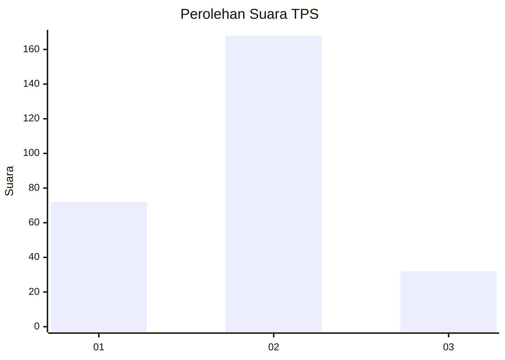
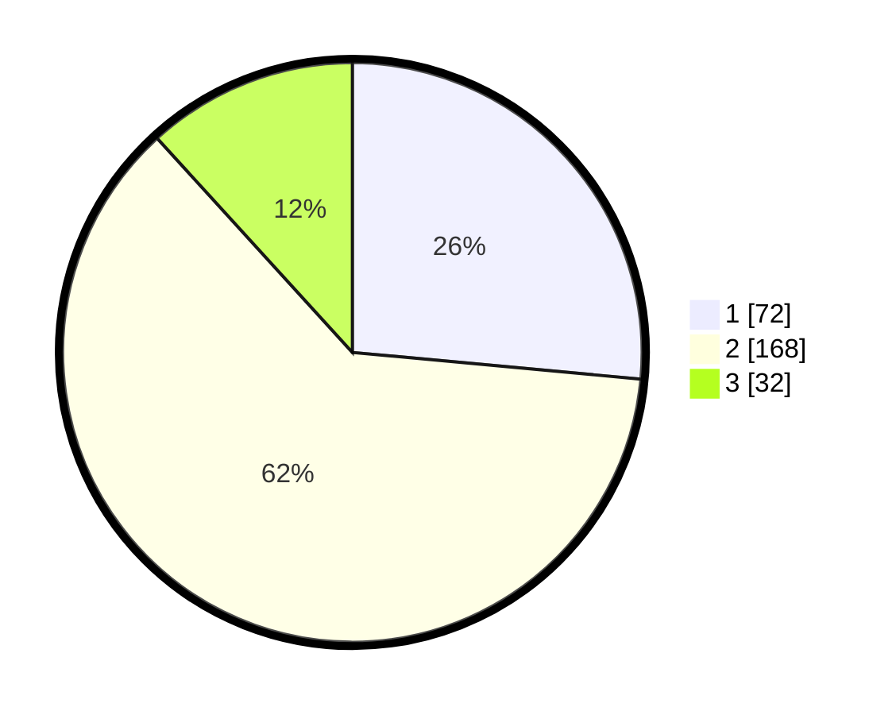

# Hasil

## Grafik

## Tabel

| No. | Nama Paslon    | Suara | Suara (raw) | Persentase |
|:--- |:-------------- | -----:| -----------:| ----------:|
| 1   | ANIES MUHAIMIN | 72    | [72][p-1]   | 26,47      |
| 2   | PRABOWO GIBRAN | 168   | [168][p-2]  | 61,76      |
| 3   | GANJAR MAHFUD  | 32    | [32][p-3]   | 11,76      |

[p-1]: https://github.com/gigit-pemilu/pemilu-2024-21-kepulauan-riau/blob/main/pilpres/hitung-suara/sub/21-kepulauan-riau/sub/71-kota-batam/sub/11-sagulung/sub/1001-tembesi/sub/096-tps/sub/paslon-1.txt
[p-2]: https://github.com/gigit-pemilu/pemilu-2024-21-kepulauan-riau/blob/main/pilpres/hitung-suara/sub/21-kepulauan-riau/sub/71-kota-batam/sub/11-sagulung/sub/1001-tembesi/sub/096-tps/sub/paslon-2.txt
[p-3]: https://github.com/gigit-pemilu/pemilu-2024-21-kepulauan-riau/blob/main/pilpres/hitung-suara/sub/21-kepulauan-riau/sub/71-kota-batam/sub/11-sagulung/sub/1001-tembesi/sub/096-tps/sub/paslon-3.txt

## Foto C Plano

https://sirekap-obj-formc.kpu.go.id/e4c0/pemilu/ppwp/21/71/11/10/01/2171111001096-20240215-003732--03d1c054-ab84-4e40-ad03-9e6efe9aa138.jpg

https://sirekap-obj-formc.kpu.go.id/e4c0/pemilu/ppwp/21/71/11/10/01/2171111001096-20240215-003952--12831020-1000-43f0-8d9b-10525b59350c.jpg

https://sirekap-obj-formc.kpu.go.id/e4c0/pemilu/ppwp/21/71/11/10/01/2171111001096-20240215-004127--b21f89ac-eb3a-4588-a594-c6f9cf3505ed.jpg

## Metadata

| Key        | Value               |
| ---------- | ------------------- |
| Time Stamp | 2024-02-19 11:00:00 |

