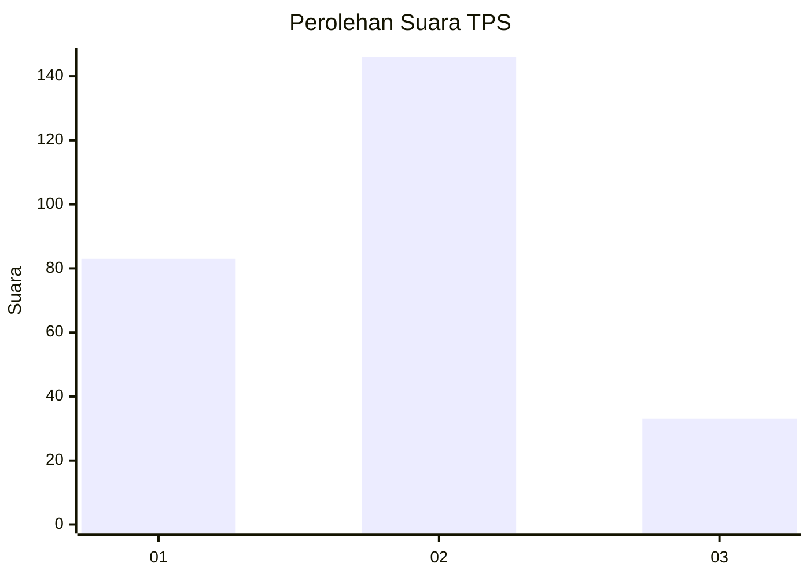
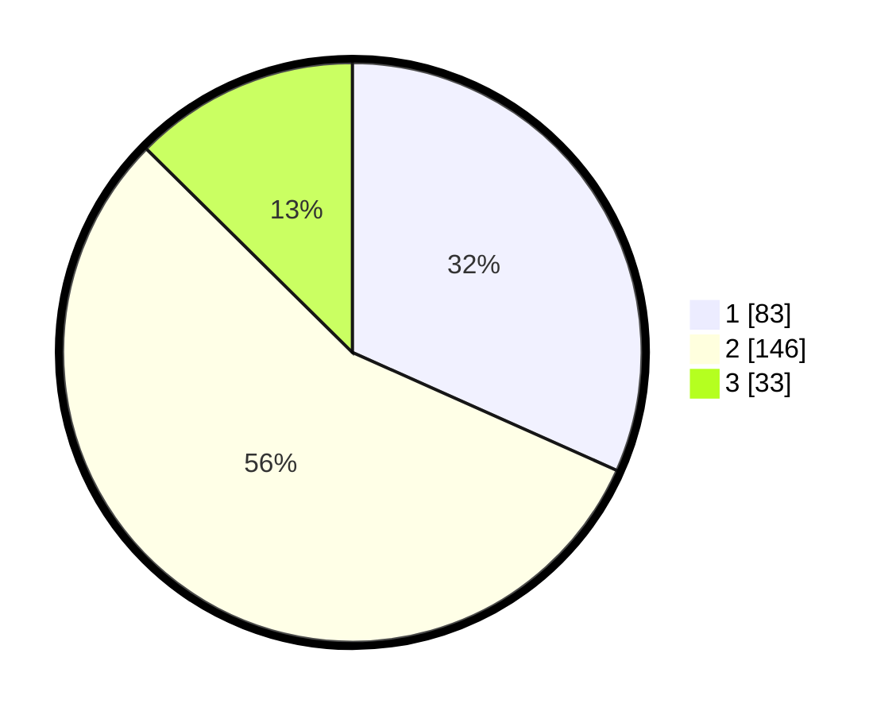

# Hasil

## Grafik

## Tabel

| No. | Nama Paslon    | Suara | Suara (raw) | Persentase |
|:--- |:-------------- | -----:| -----------:| ----------:|
| 1   | ANIES MUHAIMIN | 83    | [83][p-1]   | 31,68      |
| 2   | PRABOWO GIBRAN | 146   | [146][p-2]  | 55,73      |
| 3   | GANJAR MAHFUD  | 33    | [33][p-3]   | 12,60      |

[p-1]: https://github.com/gigit-pemilu/pemilu-2024-21-kepulauan-riau/blob/main/pilpres/hitung-suara/sub/21-kepulauan-riau/sub/71-kota-batam/sub/11-sagulung/sub/1001-tembesi/sub/100-tps/sub/paslon-1.txt
[p-2]: https://github.com/gigit-pemilu/pemilu-2024-21-kepulauan-riau/blob/main/pilpres/hitung-suara/sub/21-kepulauan-riau/sub/71-kota-batam/sub/11-sagulung/sub/1001-tembesi/sub/100-tps/sub/paslon-2.txt
[p-3]: https://github.com/gigit-pemilu/pemilu-2024-21-kepulauan-riau/blob/main/pilpres/hitung-suara/sub/21-kepulauan-riau/sub/71-kota-batam/sub/11-sagulung/sub/1001-tembesi/sub/100-tps/sub/paslon-3.txt

## Foto C Plano

https://sirekap-obj-formc.kpu.go.id/66ea/pemilu/ppwp/21/71/11/10/01/2171111001100-20240214-200712--5663380a-f5db-43b3-a839-e7458094e231.jpg

https://sirekap-obj-formc.kpu.go.id/66ea/pemilu/ppwp/21/71/11/10/01/2171111001100-20240214-200836--7b86601a-3044-4437-ba81-6657080a643a.jpg

https://sirekap-obj-formc.kpu.go.id/66ea/pemilu/ppwp/21/71/11/10/01/2171111001100-20240214-201850--11ed631d-9184-405f-a400-399fcc1a1751.jpg

## Metadata

| Key        | Value               |
| ---------- | ------------------- |
| Time Stamp | 2024-02-19 11:00:00 |

