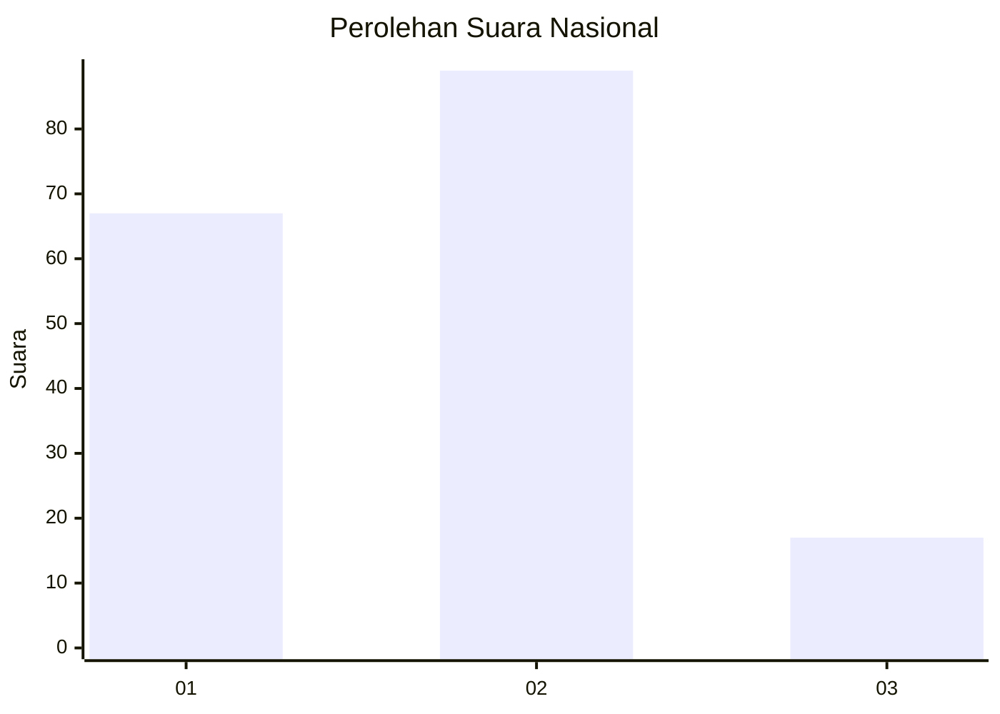
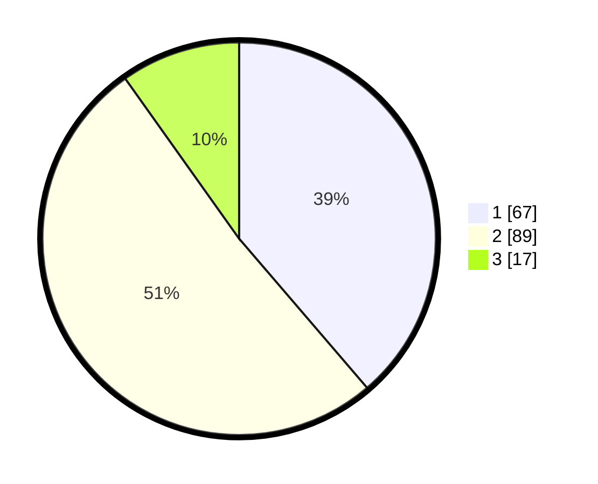

# Hasil

## Grafik

## Tabel

| No. | Nama Paslon    | Suara | Suara (raw) | Persentase |
|:--- |:-------------- | -----:| -----------:| ----------:|
| 1   | ANIES MUHAIMIN | 67    | [67][p-1]   | 38,73      |
| 2   | PRABOWO GIBRAN | 89    | [89][p-2]   | 51,45      |
| 3   | GANJAR MAHFUD  | 17    | [17][p-3]   | 9,83       |

[p-1]: https://github.com/gigit-pemilu/pemilu-2024/blob/main/pilpres/hitung-suara/sub/21-kepulauan-riau/sub/71-kota-batam/sub/11-sagulung/sub/1002-sungai-binti/sub/003-tps/sub/paslon-1.txt
[p-2]: https://github.com/gigit-pemilu/pemilu-2024/blob/main/pilpres/hitung-suara/sub/21-kepulauan-riau/sub/71-kota-batam/sub/11-sagulung/sub/1002-sungai-binti/sub/003-tps/sub/paslon-2.txt
[p-3]: https://github.com/gigit-pemilu/pemilu-2024/blob/main/pilpres/hitung-suara/sub/21-kepulauan-riau/sub/71-kota-batam/sub/11-sagulung/sub/1002-sungai-binti/sub/003-tps/sub/paslon-3.txt

## Foto C Plano

https://sirekap-obj-formc.kpu.go.id/7710/pemilu/ppwp/21/71/11/10/02/2171111002003-20240214-221229--41e2ac8c-11be-4bb3-9084-4372e3ffaf0e.jpg

https://sirekap-obj-formc.kpu.go.id/7710/pemilu/ppwp/21/71/11/10/02/2171111002003-20240214-221421--b5740e35-cb44-48f7-bf04-6a7cd3709be6.jpg

https://sirekap-obj-formc.kpu.go.id/7710/pemilu/ppwp/21/71/11/10/02/2171111002003-20240214-221548--1b36f49c-fc0a-45a9-bd33-131abda8412c.jpg

## Metadata

| Key        | Value               |
| ---------- | ------------------- |
| Time Stamp | 2024-02-15 12:00:28 |

