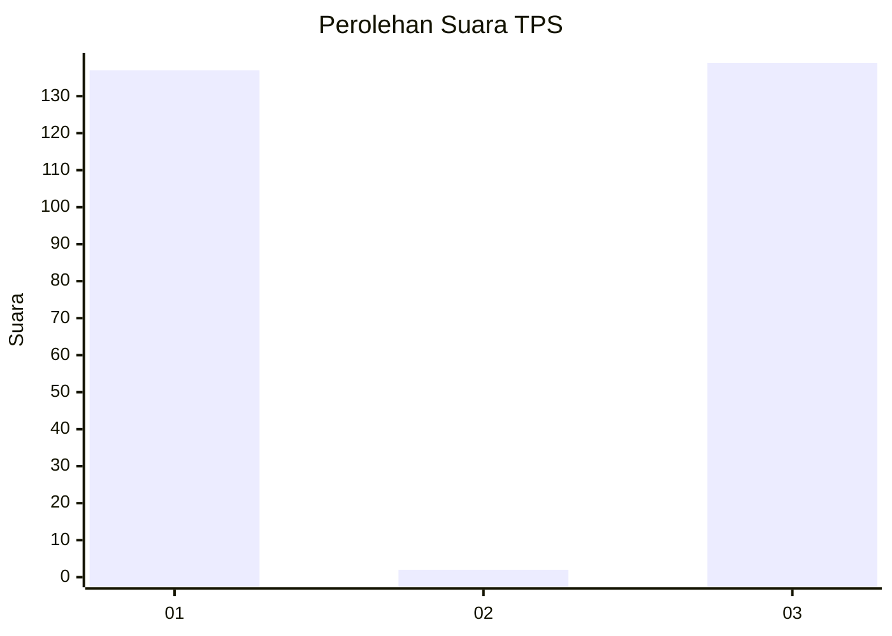
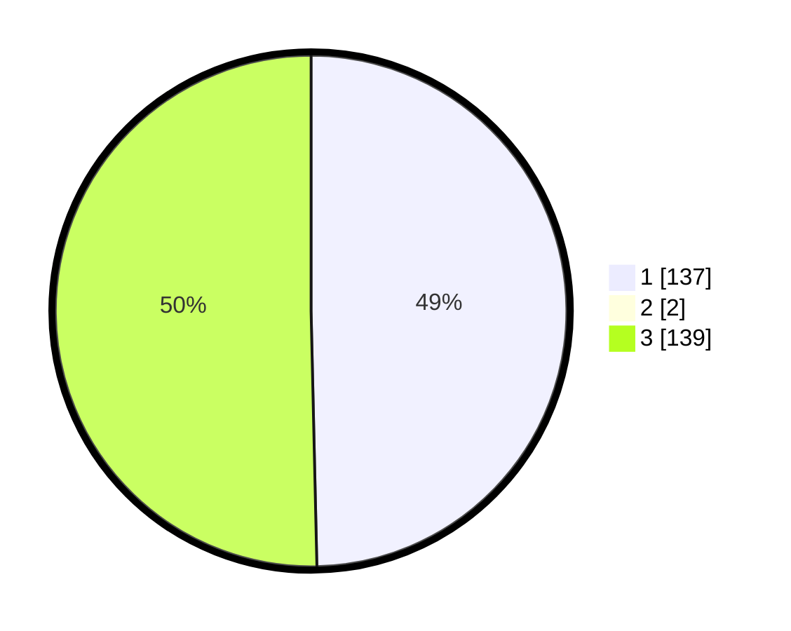

# Hasil

## Grafik

## Tabel

| No. | Nama Paslon    | Suara | Suara (raw) | Persentase |
|:--- |:-------------- | -----:| -----------:| ----------:|
| 1   | ANIES MUHAIMIN | 137   | [137][p-1]  | 49,28      |
| 2   | PRABOWO GIBRAN | 2     | [2][p-2]    | 0,72       |
| 3   | GANJAR MAHFUD  | 139   | [139][p-3]  | 50,00      |

[p-1]: https://github.com/gigit-pemilu/pemilu-2024-21-kepulauan-riau/blob/main/pilpres/hitung-suara/sub/21-kepulauan-riau/sub/71-kota-batam/sub/11-sagulung/sub/1002-sungai-binti/sub/009-tps/sub/paslon-1.txt
[p-2]: https://github.com/gigit-pemilu/pemilu-2024-21-kepulauan-riau/blob/main/pilpres/hitung-suara/sub/21-kepulauan-riau/sub/71-kota-batam/sub/11-sagulung/sub/1002-sungai-binti/sub/009-tps/sub/paslon-2.txt
[p-3]: https://github.com/gigit-pemilu/pemilu-2024-21-kepulauan-riau/blob/main/pilpres/hitung-suara/sub/21-kepulauan-riau/sub/71-kota-batam/sub/11-sagulung/sub/1002-sungai-binti/sub/009-tps/sub/paslon-3.txt

## Foto C Plano

https://sirekap-obj-formc.kpu.go.id/121c/pemilu/ppwp/21/71/11/10/02/2171111002009-20240215-001649--427cda98-2b72-4ff4-9520-1fc0bd9ca8e3.jpg

https://sirekap-obj-formc.kpu.go.id/121c/pemilu/ppwp/21/71/11/10/02/2171111002009-20240215-002038--f729245f-b088-4255-993d-0eea984de80a.jpg

https://sirekap-obj-formc.kpu.go.id/121c/pemilu/ppwp/21/71/11/10/02/2171111002009-20240215-002155--f3725177-6afc-42c8-befc-ebe8a3c60626.jpg

## Metadata

| Key        | Value               |
| ---------- | ------------------- |
| Time Stamp | 2024-02-19 11:00:00 |

