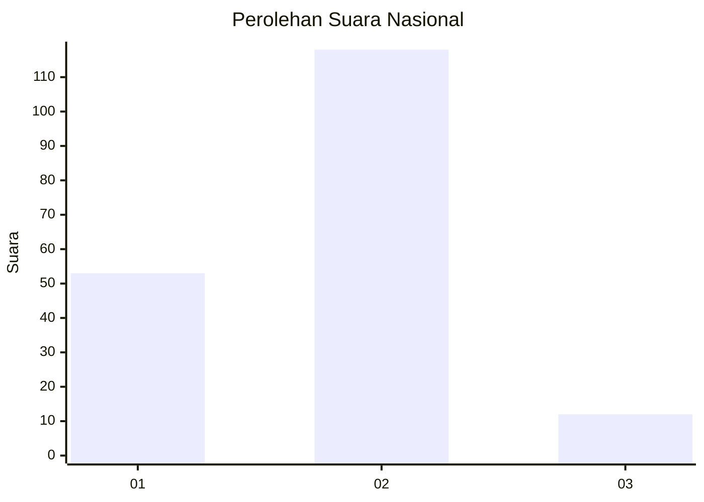
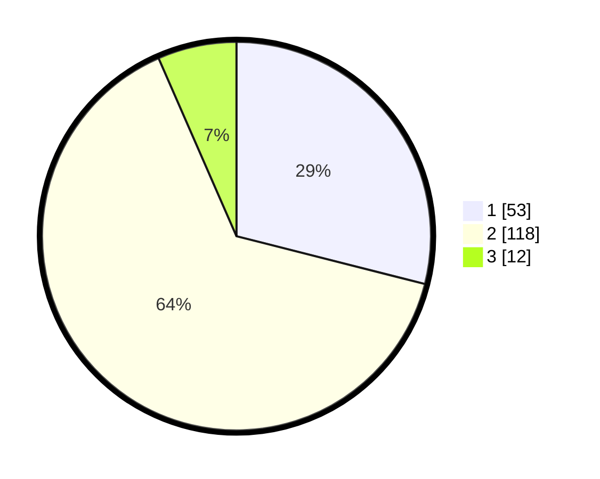

# Hasil

## Grafik

## Tabel

| No. | Nama Paslon    | Suara | Suara (raw) | Persentase |
|:--- |:-------------- | -----:| -----------:| ----------:|
| 1   | ANIES MUHAIMIN | 53    | [53][p-1]   | 28,96      |
| 2   | PRABOWO GIBRAN | 118   | [118][p-2]  | 64,48      |
| 3   | GANJAR MAHFUD  | 12    | [12][p-3]   | 6,56       |

[p-1]: https://github.com/gigit-pemilu/pemilu-2024/blob/main/pilpres/hitung-suara/sub/21-kepulauan-riau/sub/71-kota-batam/sub/11-sagulung/sub/1003-sungai-lekop/sub/001-tps/sub/paslon-1.txt
[p-2]: https://github.com/gigit-pemilu/pemilu-2024/blob/main/pilpres/hitung-suara/sub/21-kepulauan-riau/sub/71-kota-batam/sub/11-sagulung/sub/1003-sungai-lekop/sub/001-tps/sub/paslon-2.txt
[p-3]: https://github.com/gigit-pemilu/pemilu-2024/blob/main/pilpres/hitung-suara/sub/21-kepulauan-riau/sub/71-kota-batam/sub/11-sagulung/sub/1003-sungai-lekop/sub/001-tps/sub/paslon-3.txt

## Foto C Plano

https://sirekap-obj-formc.kpu.go.id/b061/pemilu/ppwp/21/71/11/10/03/2171111003001-20240215-021338--1a5de4eb-92a7-410d-ada1-a4b20de7134f.jpg

https://sirekap-obj-formc.kpu.go.id/b061/pemilu/ppwp/21/71/11/10/03/2171111003001-20240215-022032--6b98c238-7758-426d-98a0-ffc17c371fb6.jpg

https://sirekap-obj-formc.kpu.go.id/b061/pemilu/ppwp/21/71/11/10/03/2171111003001-20240215-022300--7ef941e5-09cf-4829-8ca9-fc3b0cc3792a.jpg

## Metadata

| Key        | Value               |
| ---------- | ------------------- |
| Time Stamp | 2024-02-15 12:00:28 |

