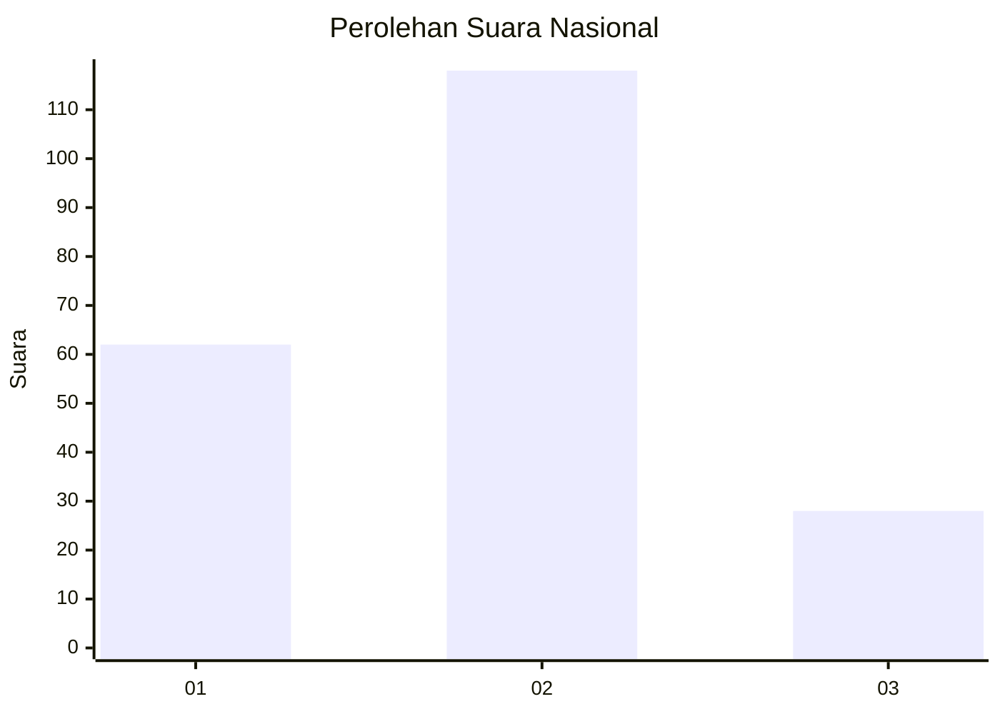
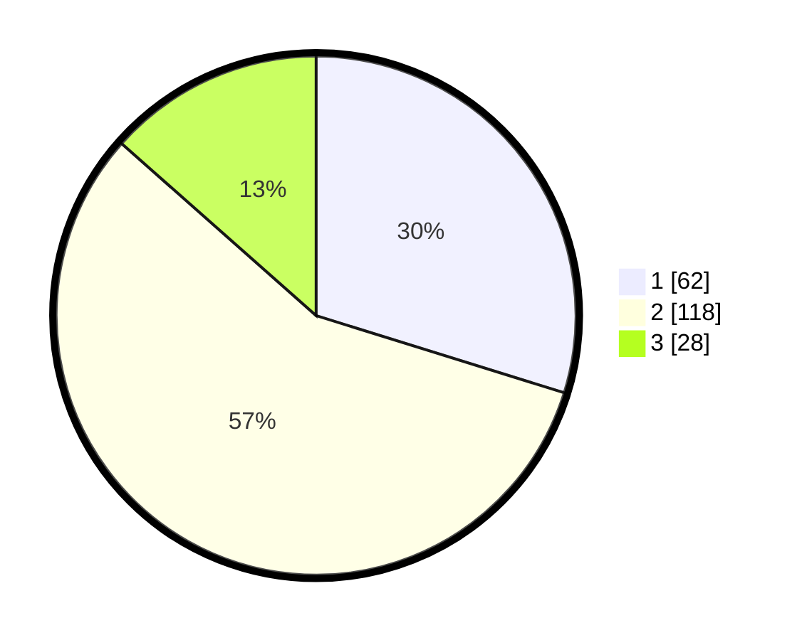

# Hasil

## Grafik

## Tabel

| No. | Nama Paslon    | Suara | Suara (raw) | Persentase |
|:--- |:-------------- | -----:| -----------:| ----------:|
| 1   | ANIES MUHAIMIN | 62    | [62][p-1]   | 29,81      |
| 2   | PRABOWO GIBRAN | 118   | [118][p-2]  | 56,73      |
| 3   | GANJAR MAHFUD  | 28    | [28][p-3]   | 13,46      |

[p-1]: https://github.com/gigit-pemilu/pemilu-2024/blob/main/pilpres/hitung-suara/sub/21-kepulauan-riau/sub/71-kota-batam/sub/11-sagulung/sub/1003-sungai-lekop/sub/005-tps/sub/paslon-1.txt
[p-2]: https://github.com/gigit-pemilu/pemilu-2024/blob/main/pilpres/hitung-suara/sub/21-kepulauan-riau/sub/71-kota-batam/sub/11-sagulung/sub/1003-sungai-lekop/sub/005-tps/sub/paslon-2.txt
[p-3]: https://github.com/gigit-pemilu/pemilu-2024/blob/main/pilpres/hitung-suara/sub/21-kepulauan-riau/sub/71-kota-batam/sub/11-sagulung/sub/1003-sungai-lekop/sub/005-tps/sub/paslon-3.txt

## Foto C Plano

https://sirekap-obj-formc.kpu.go.id/c5b9/pemilu/ppwp/21/71/11/10/03/2171111003005-20240214-203019--5ca4d034-a16f-4450-8365-458d04ba08b3.jpg

https://sirekap-obj-formc.kpu.go.id/c5b9/pemilu/ppwp/21/71/11/10/03/2171111003005-20240214-205515--d5b3601d-2cda-4c8a-953d-1997b3768b4f.jpg

https://sirekap-obj-formc.kpu.go.id/c5b9/pemilu/ppwp/21/71/11/10/03/2171111003005-20240214-203239--0c7c9486-40c1-4825-9466-ae1605da0bb9.jpg

## Metadata

| Key        | Value               |
| ---------- | ------------------- |
| Time Stamp | 2024-02-19 12:00:00 |

