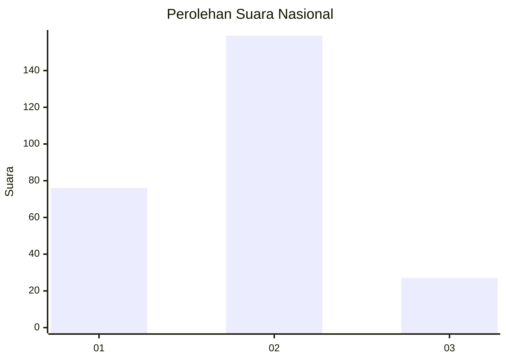
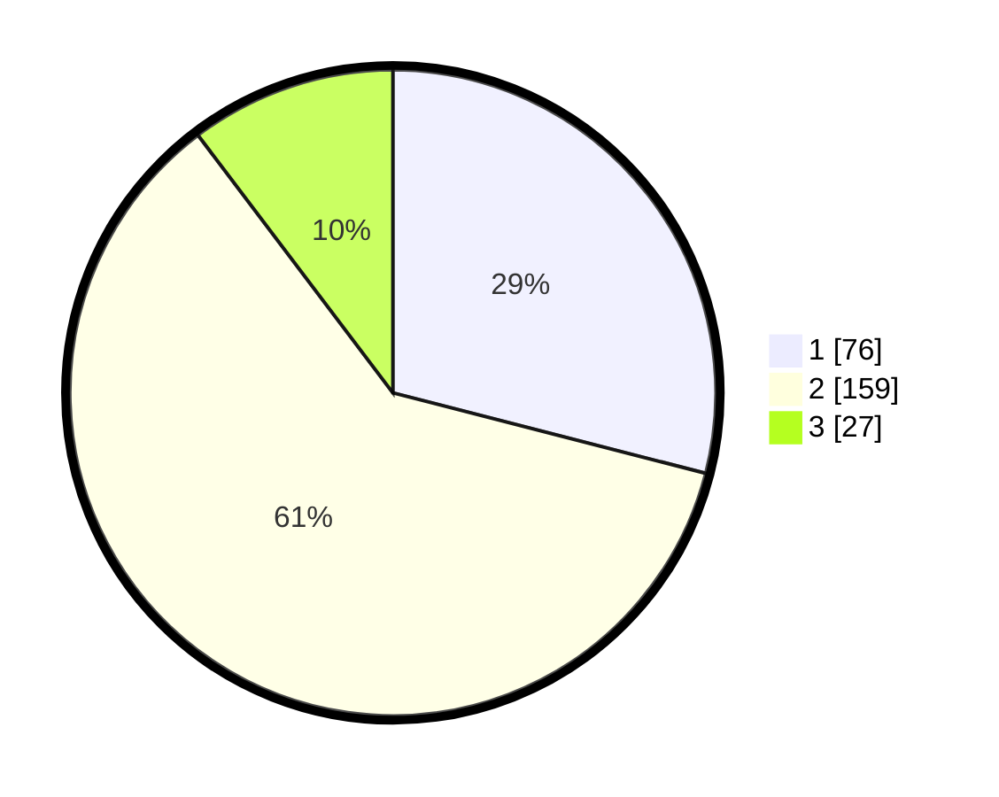

# Hasil

## Grafik

## Tabel

| No. | Nama Paslon    | Suara | Suara (raw) | Persentase |
|:--- |:-------------- | -----:| -----------:| ----------:|
| 1   | ANIES MUHAIMIN | 76    | [76][p-1]   | 29,01      |
| 2   | PRABOWO GIBRAN | 159   | [159][p-2]  | 60,69      |
| 3   | GANJAR MAHFUD  | 27    | [27][p-3]   | 10,31      |

[p-1]: https://github.com/gigit-pemilu/pemilu-2024/blob/main/pilpres/hitung-suara/sub/21-kepulauan-riau/sub/71-kota-batam/sub/11-sagulung/sub/1003-sungai-lekop/sub/060-tps/sub/paslon-1.txt
[p-2]: https://github.com/gigit-pemilu/pemilu-2024/blob/main/pilpres/hitung-suara/sub/21-kepulauan-riau/sub/71-kota-batam/sub/11-sagulung/sub/1003-sungai-lekop/sub/060-tps/sub/paslon-2.txt
[p-3]: https://github.com/gigit-pemilu/pemilu-2024/blob/main/pilpres/hitung-suara/sub/21-kepulauan-riau/sub/71-kota-batam/sub/11-sagulung/sub/1003-sungai-lekop/sub/060-tps/sub/paslon-3.txt

## Foto C Plano

https://sirekap-obj-formc.kpu.go.id/1f0a/pemilu/ppwp/21/71/11/10/03/2171111003060-20240215-235425--1836fd2c-3920-4443-97e0-9f27e3b9069c.jpg

https://sirekap-obj-formc.kpu.go.id/1f0a/pemilu/ppwp/21/71/11/10/03/2171111003060-20240216-000021--306a8fcd-3fdf-470d-9b9d-fd7139cb3507.jpg

https://sirekap-obj-formc.kpu.go.id/1f0a/pemilu/ppwp/21/71/11/10/03/2171111003060-20240216-000247--b90a5c8d-01b2-42d4-9b50-6584905aa905.jpg

## Metadata

| Key        | Value               |
| ---------- | ------------------- |
| Time Stamp | 2024-02-19 12:00:00 |

