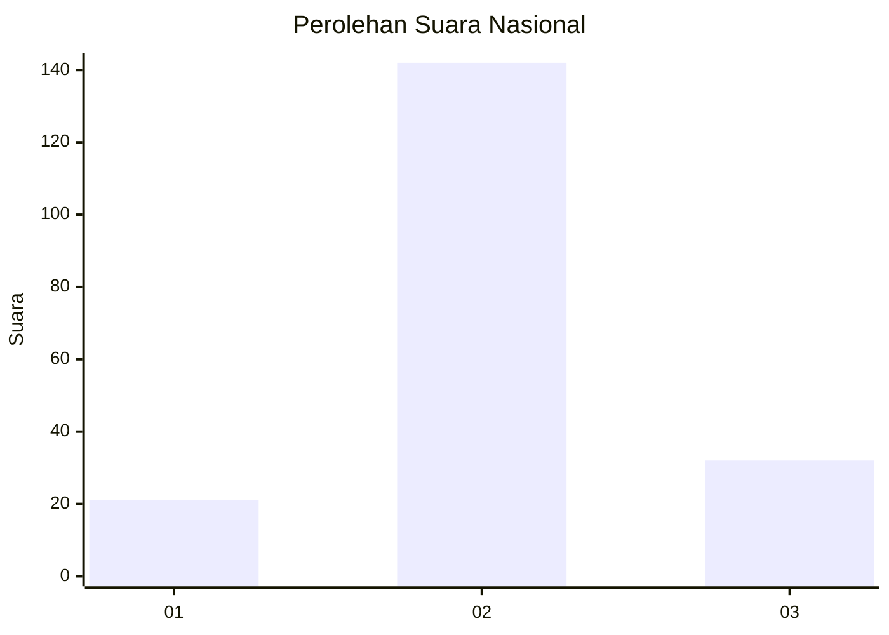
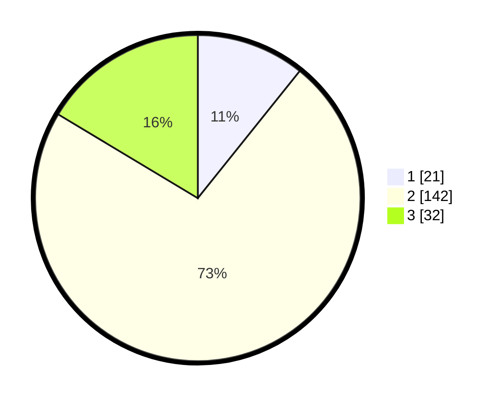

# Hasil

## Grafik

## Tabel

| No. | Nama Paslon    | Suara | Suara (raw) | Persentase |
|:--- |:-------------- | -----:| -----------:| ----------:|
| 1   | ANIES MUHAIMIN | 21    | [21][p-1]   | 10,77      |
| 2   | PRABOWO GIBRAN | 142   | [142][p-2]  | 72,82      |
| 3   | GANJAR MAHFUD  | 32    | [32][p-3]   | 16,41      |

[p-1]: https://github.com/gigit-pemilu/pemilu-2024/blob/main/pilpres/hitung-suara/sub/21-kepulauan-riau/sub/71-kota-batam/sub/11-sagulung/sub/1005-sungai-langkai/sub/017-tps/sub/paslon-1.txt
[p-2]: https://github.com/gigit-pemilu/pemilu-2024/blob/main/pilpres/hitung-suara/sub/21-kepulauan-riau/sub/71-kota-batam/sub/11-sagulung/sub/1005-sungai-langkai/sub/017-tps/sub/paslon-2.txt
[p-3]: https://github.com/gigit-pemilu/pemilu-2024/blob/main/pilpres/hitung-suara/sub/21-kepulauan-riau/sub/71-kota-batam/sub/11-sagulung/sub/1005-sungai-langkai/sub/017-tps/sub/paslon-3.txt

## Foto C Plano

https://sirekap-obj-formc.kpu.go.id/ca29/pemilu/ppwp/21/71/11/10/05/2171111005017-20240215-023022--d329b5cf-51af-4744-a2ef-c4a8b4e232a6.jpg

https://sirekap-obj-formc.kpu.go.id/ca29/pemilu/ppwp/21/71/11/10/05/2171111005017-20240215-022840--d3effb7f-a793-428f-ae2b-e2e731d41e44.jpg

https://sirekap-obj-formc.kpu.go.id/ca29/pemilu/ppwp/21/71/11/10/05/2171111005017-20240215-024732--118f3047-8473-4555-a16d-5f447eebcbb7.jpg

## Metadata

| Key        | Value               |
| ---------- | ------------------- |
| Time Stamp | 2024-02-19 12:00:00 |

