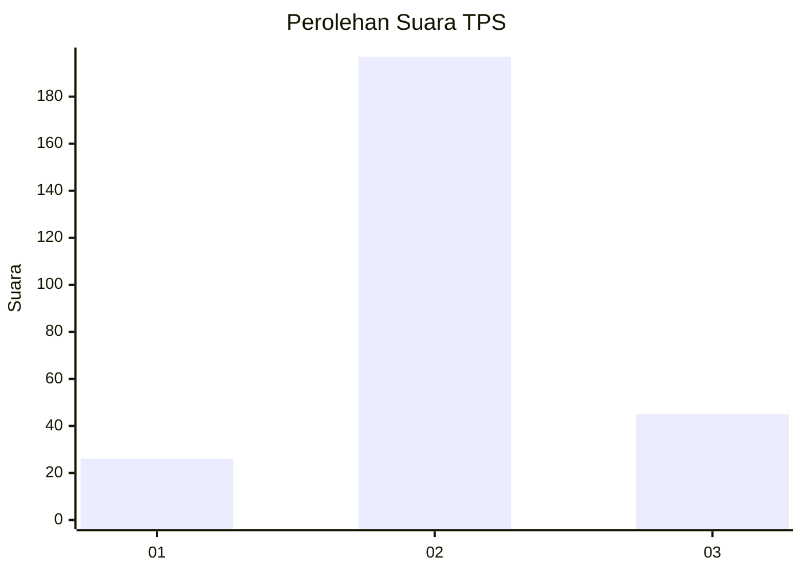
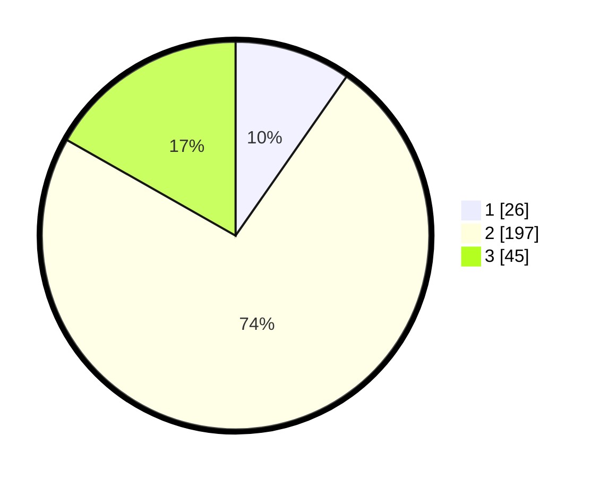

# Hasil

## Grafik

## Tabel

| No. | Nama Paslon    | Suara | Suara (raw) | Persentase |
|:--- |:-------------- | -----:| -----------:| ----------:|
| 1   | ANIES MUHAIMIN | 26    | [26][p-1]   | 9,70       |
| 2   | PRABOWO GIBRAN | 197   | [197][p-2]  | 73,51      |
| 3   | GANJAR MAHFUD  | 45    | [45][p-3]   | 16,79      |

[p-1]: https://github.com/gigit-pemilu/pemilu-2024-21-kepulauan-riau/blob/main/pilpres/hitung-suara/sub/21-kepulauan-riau/sub/71-kota-batam/sub/11-sagulung/sub/1005-sungai-langkai/sub/036-tps/sub/paslon-1.txt
[p-2]: https://github.com/gigit-pemilu/pemilu-2024-21-kepulauan-riau/blob/main/pilpres/hitung-suara/sub/21-kepulauan-riau/sub/71-kota-batam/sub/11-sagulung/sub/1005-sungai-langkai/sub/036-tps/sub/paslon-2.txt
[p-3]: https://github.com/gigit-pemilu/pemilu-2024-21-kepulauan-riau/blob/main/pilpres/hitung-suara/sub/21-kepulauan-riau/sub/71-kota-batam/sub/11-sagulung/sub/1005-sungai-langkai/sub/036-tps/sub/paslon-3.txt

## Foto C Plano

https://sirekap-obj-formc.kpu.go.id/36ac/pemilu/ppwp/21/71/11/10/05/2171111005036-20240214-210638--99e10b22-bacb-407b-aebd-8aa45428f9dd.jpg

https://sirekap-obj-formc.kpu.go.id/36ac/pemilu/ppwp/21/71/11/10/05/2171111005036-20240214-210919--885a7ae5-08ba-467f-a1b9-e803b8357d4f.jpg

https://sirekap-obj-formc.kpu.go.id/36ac/pemilu/ppwp/21/71/11/10/05/2171111005036-20240214-210938--a0046e51-cc35-4767-af3a-c9735f97eb1c.jpg

## Metadata

| Key        | Value               |
| ---------- | ------------------- |
| Time Stamp | 2024-02-15 23:29:50 |

