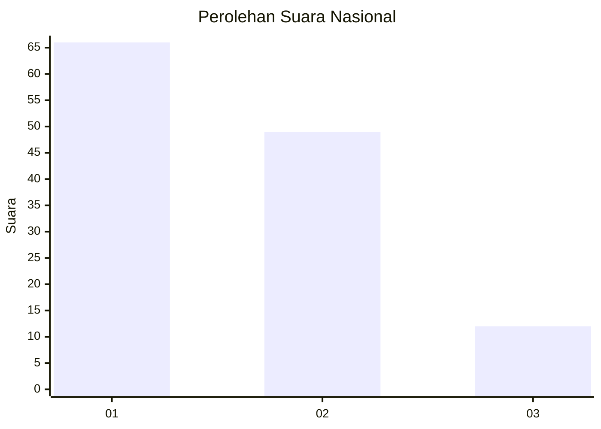
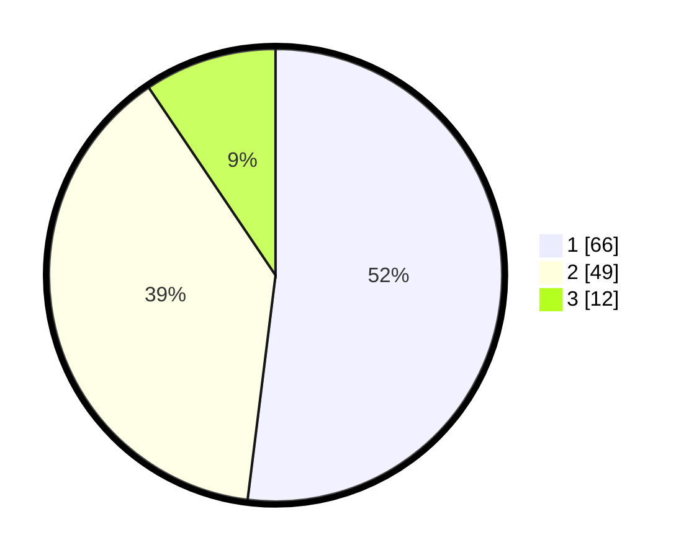

# Hasil

## Grafik

## Tabel

| No. | Nama Paslon    | Suara | Suara (raw) | Persentase |
|:--- |:-------------- | -----:| -----------:| ----------:|
| 1   | ANIES MUHAIMIN | 66    | [66][p-1]   | 51,97      |
| 2   | PRABOWO GIBRAN | 49    | [49][p-2]   | 38,58      |
| 3   | GANJAR MAHFUD  | 12    | [12][p-3]   | 9,45       |

[p-1]: https://github.com/gigit-pemilu/pemilu-2024/blob/main/pilpres/hitung-suara/sub/21-kepulauan-riau/sub/71-kota-batam/sub/11-sagulung/sub/1005-sungai-langkai/sub/055-tps/sub/paslon-1.txt
[p-2]: https://github.com/gigit-pemilu/pemilu-2024/blob/main/pilpres/hitung-suara/sub/21-kepulauan-riau/sub/71-kota-batam/sub/11-sagulung/sub/1005-sungai-langkai/sub/055-tps/sub/paslon-2.txt
[p-3]: https://github.com/gigit-pemilu/pemilu-2024/blob/main/pilpres/hitung-suara/sub/21-kepulauan-riau/sub/71-kota-batam/sub/11-sagulung/sub/1005-sungai-langkai/sub/055-tps/sub/paslon-3.txt

## Foto C Plano

https://sirekap-obj-formc.kpu.go.id/cc6f/pemilu/ppwp/21/71/11/10/05/2171111005055-20240215-011649--aed38744-a496-4c6b-81a8-e8af98ddbc7f.jpg

https://sirekap-obj-formc.kpu.go.id/cc6f/pemilu/ppwp/21/71/11/10/05/2171111005055-20240215-011758--b54c7932-953a-41d8-bae1-365dc353394b.jpg

https://sirekap-obj-formc.kpu.go.id/cc6f/pemilu/ppwp/21/71/11/10/05/2171111005055-20240215-011915--c6ff898f-e00f-48a6-9c8e-b9444305f1ec.jpg

## Metadata

| Key        | Value               |
| ---------- | ------------------- |
| Time Stamp | 2024-02-15 12:00:28 |

