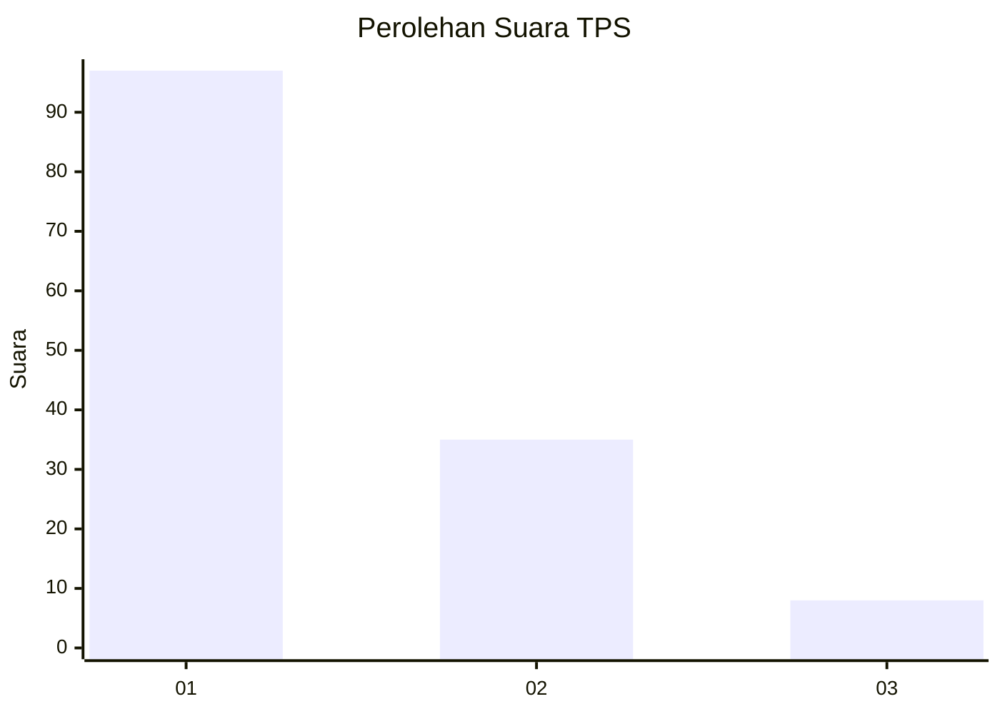
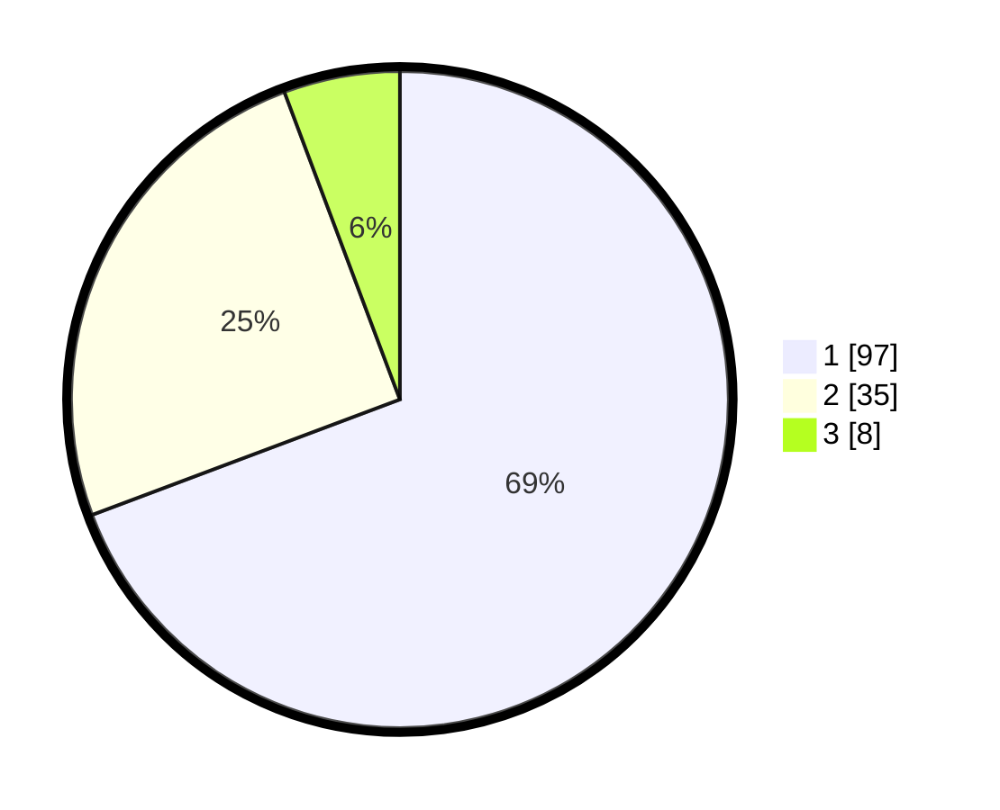

# Hasil

## Grafik

## Tabel

| No. | Nama Paslon    | Suara | Suara (raw) | Persentase |
|:--- |:-------------- | -----:| -----------:| ----------:|
| 1   | ANIES MUHAIMIN | 97    | [97][p-1]   | 69,29      |
| 2   | PRABOWO GIBRAN | 35    | [35][p-2]   | 25,00      |
| 3   | GANJAR MAHFUD  | 8     | [8][p-3]    | 5,71       |

[p-1]: https://github.com/gigit-pemilu/pemilu-2024-21-kepulauan-riau/blob/main/pilpres/hitung-suara/sub/21-kepulauan-riau/sub/71-kota-batam/sub/11-sagulung/sub/1005-sungai-langkai/sub/056-tps/sub/paslon-1.txt
[p-2]: https://github.com/gigit-pemilu/pemilu-2024-21-kepulauan-riau/blob/main/pilpres/hitung-suara/sub/21-kepulauan-riau/sub/71-kota-batam/sub/11-sagulung/sub/1005-sungai-langkai/sub/056-tps/sub/paslon-2.txt
[p-3]: https://github.com/gigit-pemilu/pemilu-2024-21-kepulauan-riau/blob/main/pilpres/hitung-suara/sub/21-kepulauan-riau/sub/71-kota-batam/sub/11-sagulung/sub/1005-sungai-langkai/sub/056-tps/sub/paslon-3.txt

## Foto C Plano

https://sirekap-obj-formc.kpu.go.id/62c1/pemilu/ppwp/21/71/11/10/05/2171111005056-20240215-015643--fd2df957-9405-4127-9ff4-84fba891522f.jpg

https://sirekap-obj-formc.kpu.go.id/62c1/pemilu/ppwp/21/71/11/10/05/2171111005056-20240215-015809--5dbaa444-1789-4088-9f54-4f00f82e6051.jpg

https://sirekap-obj-formc.kpu.go.id/62c1/pemilu/ppwp/21/71/11/10/05/2171111005056-20240215-015950--b0f482fd-7730-4c7f-87b0-363560a0b1ea.jpg

## Metadata

| Key        | Value               |
| ---------- | ------------------- |
| Time Stamp | 2024-02-19 12:00:00 |

