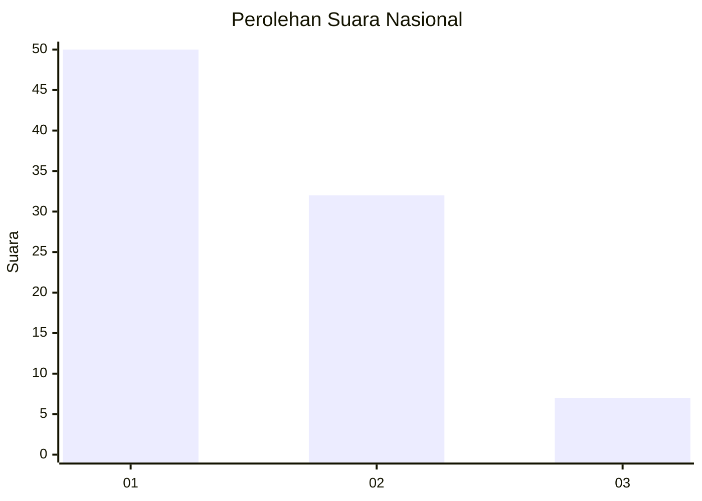
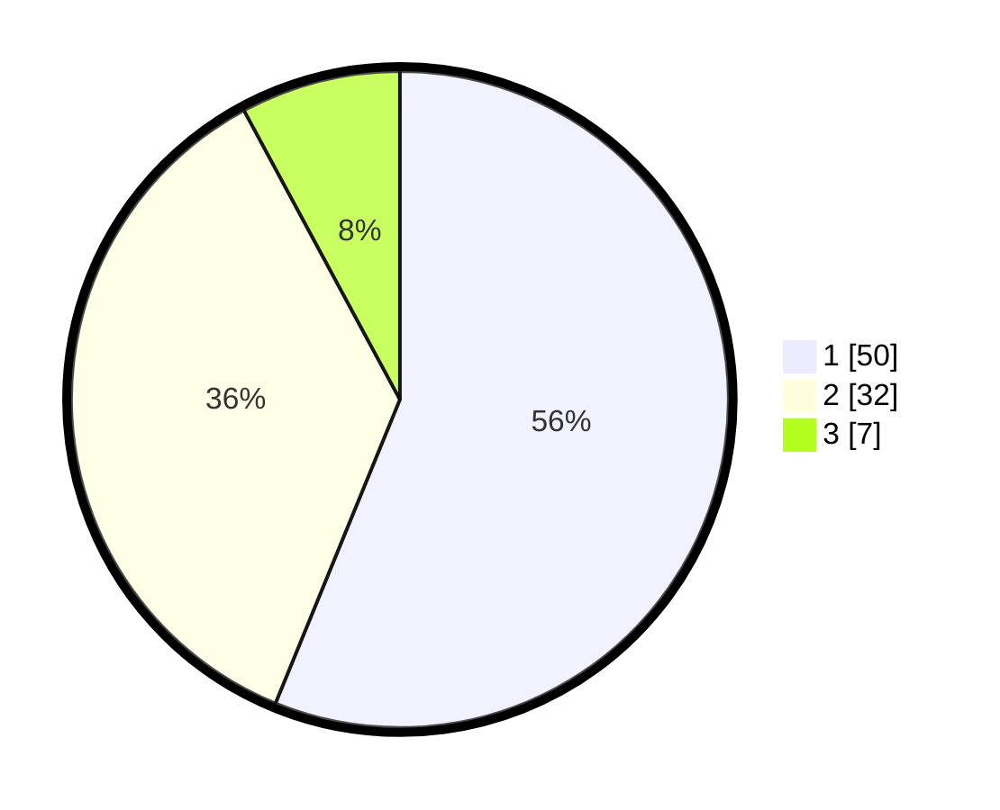

# Hasil

## Grafik

## Tabel

| No. | Nama Paslon    | Suara | Suara (raw) | Persentase |
|:--- |:-------------- | -----:| -----------:| ----------:|
| 1   | ANIES MUHAIMIN | 50    | [50][p-1]   | 56,18      |
| 2   | PRABOWO GIBRAN | 32    | [32][p-2]   | 35,96      |
| 3   | GANJAR MAHFUD  | 7     | [7][p-3]    | 7,87       |

[p-1]: https://github.com/gigit-pemilu/pemilu-2024/blob/main/pilpres/hitung-suara/sub/21-kepulauan-riau/sub/71-kota-batam/sub/11-sagulung/sub/1005-sungai-langkai/sub/086-tps/sub/paslon-1.txt
[p-2]: https://github.com/gigit-pemilu/pemilu-2024/blob/main/pilpres/hitung-suara/sub/21-kepulauan-riau/sub/71-kota-batam/sub/11-sagulung/sub/1005-sungai-langkai/sub/086-tps/sub/paslon-2.txt
[p-3]: https://github.com/gigit-pemilu/pemilu-2024/blob/main/pilpres/hitung-suara/sub/21-kepulauan-riau/sub/71-kota-batam/sub/11-sagulung/sub/1005-sungai-langkai/sub/086-tps/sub/paslon-3.txt

## Foto C Plano

https://sirekap-obj-formc.kpu.go.id/1e49/pemilu/ppwp/21/71/11/10/05/2171111005086-20240214-214823--f069076b-ca81-4a98-aca6-3bb456e5bf11.jpg

https://sirekap-obj-formc.kpu.go.id/1e49/pemilu/ppwp/21/71/11/10/05/2171111005086-20240214-213820--f65676fe-5061-4cd3-b3ca-e54a611ed93c.jpg

https://sirekap-obj-formc.kpu.go.id/1e49/pemilu/ppwp/21/71/11/10/05/2171111005086-20240214-213909--53acc2cf-a825-4734-8608-072196fbd2d4.jpg

## Metadata

| Key        | Value               |
| ---------- | ------------------- |
| Time Stamp | 2024-02-19 12:00:00 |

