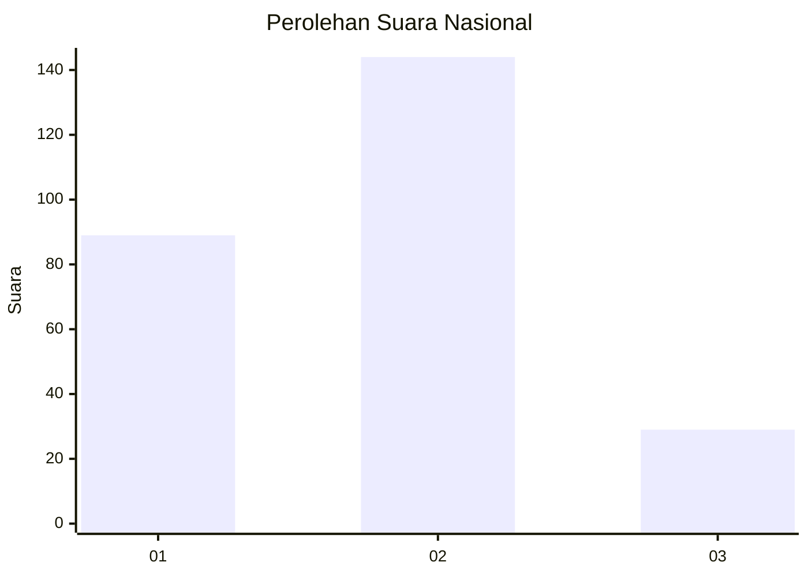
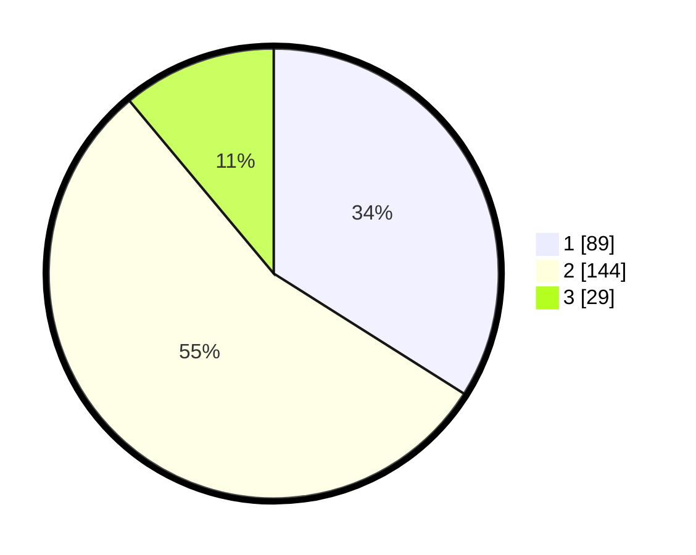

# Hasil

## Grafik

## Tabel

| No. | Nama Paslon    | Suara | Suara (raw) | Persentase |
|:--- |:-------------- | -----:| -----------:| ----------:|
| 1   | ANIES MUHAIMIN | 89    | [89][p-1]   | 33,97      |
| 2   | PRABOWO GIBRAN | 144   | [144][p-2]  | 54,96      |
| 3   | GANJAR MAHFUD  | 29    | [29][p-3]   | 11,07      |

[p-1]: https://github.com/gigit-pemilu/pemilu-2024/blob/main/pilpres/hitung-suara/sub/21-kepulauan-riau/sub/71-kota-batam/sub/11-sagulung/sub/1005-sungai-langkai/sub/122-tps/sub/paslon-1.txt
[p-2]: https://github.com/gigit-pemilu/pemilu-2024/blob/main/pilpres/hitung-suara/sub/21-kepulauan-riau/sub/71-kota-batam/sub/11-sagulung/sub/1005-sungai-langkai/sub/122-tps/sub/paslon-2.txt
[p-3]: https://github.com/gigit-pemilu/pemilu-2024/blob/main/pilpres/hitung-suara/sub/21-kepulauan-riau/sub/71-kota-batam/sub/11-sagulung/sub/1005-sungai-langkai/sub/122-tps/sub/paslon-3.txt

## Foto C Plano

https://sirekap-obj-formc.kpu.go.id/4bf7/pemilu/ppwp/21/71/11/10/05/2171111005122-20240214-192142--4ee0b17e-3f90-4191-98b9-2051b2d7262e.jpg

https://sirekap-obj-formc.kpu.go.id/4bf7/pemilu/ppwp/21/71/11/10/05/2171111005122-20240214-192214--eb7fa977-9b5d-4fe0-ac31-ef35808cc852.jpg

https://sirekap-obj-formc.kpu.go.id/4bf7/pemilu/ppwp/21/71/11/10/05/2171111005122-20240214-192241--b105298d-6abf-43ff-927f-83b615621cb9.jpg

## Metadata

| Key        | Value               |
| ---------- | ------------------- |
| Time Stamp | 2024-02-19 12:00:00 |

