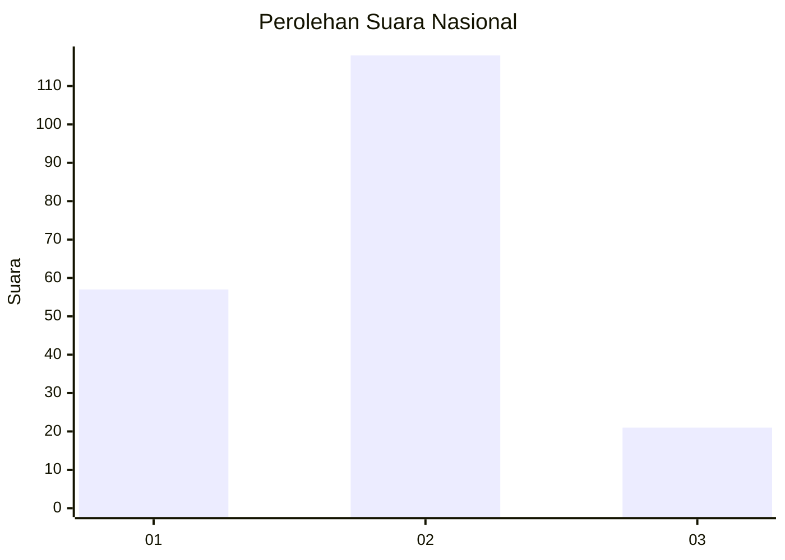
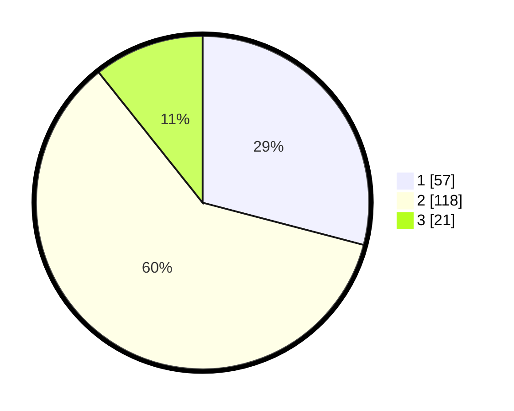

# Hasil

## Grafik

## Tabel

| No. | Nama Paslon    | Suara | Suara (raw) | Persentase |
|:--- |:-------------- | -----:| -----------:| ----------:|
| 1   | ANIES MUHAIMIN | 57    | [57][p-1]   | 29,08      |
| 2   | PRABOWO GIBRAN | 118   | [118][p-2]  | 60,20      |
| 3   | GANJAR MAHFUD  | 21    | [21][p-3]   | 10,71      |

[p-1]: https://github.com/gigit-pemilu/pemilu-2024/blob/main/pilpres/hitung-suara/sub/21-kepulauan-riau/sub/71-kota-batam/sub/11-sagulung/sub/1006-sungai-pelunggut/sub/009-tps/sub/paslon-1.txt
[p-2]: https://github.com/gigit-pemilu/pemilu-2024/blob/main/pilpres/hitung-suara/sub/21-kepulauan-riau/sub/71-kota-batam/sub/11-sagulung/sub/1006-sungai-pelunggut/sub/009-tps/sub/paslon-2.txt
[p-3]: https://github.com/gigit-pemilu/pemilu-2024/blob/main/pilpres/hitung-suara/sub/21-kepulauan-riau/sub/71-kota-batam/sub/11-sagulung/sub/1006-sungai-pelunggut/sub/009-tps/sub/paslon-3.txt

## Foto C Plano

https://sirekap-obj-formc.kpu.go.id/7259/pemilu/ppwp/21/71/11/10/06/2171111006009-20240214-214411--77c856ff-e003-4949-8728-ddcec11c8c41.jpg

https://sirekap-obj-formc.kpu.go.id/7259/pemilu/ppwp/21/71/11/10/06/2171111006009-20240214-214418--2787a235-1aed-4fc9-be47-fe462550ae97.jpg

https://sirekap-obj-formc.kpu.go.id/7259/pemilu/ppwp/21/71/11/10/06/2171111006009-20240214-214425--a48cd22c-39ee-4c85-b567-01d187996b06.jpg

## Metadata

| Key        | Value               |
| ---------- | ------------------- |
| Time Stamp | 2024-02-16 11:00:29 |

