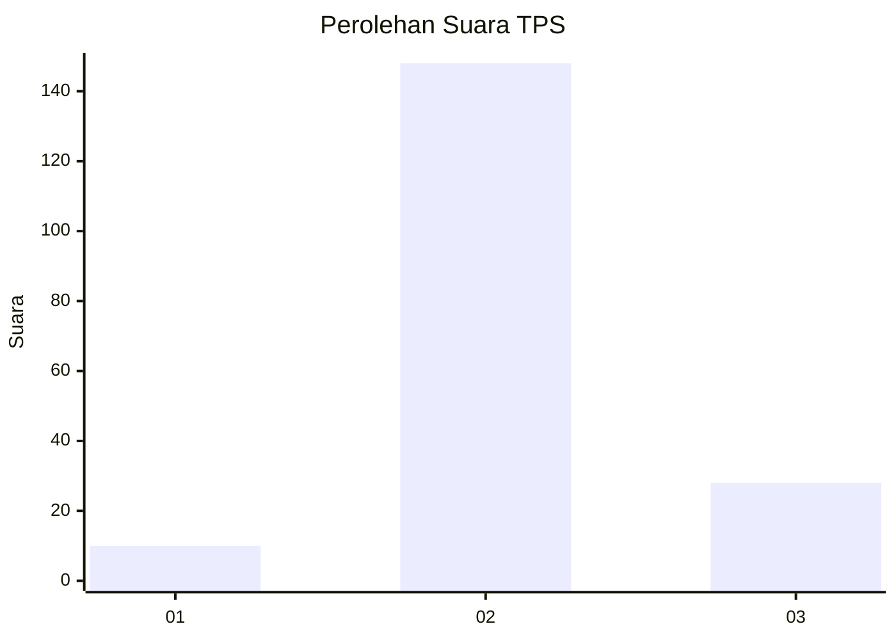

# Hasil

## Grafik

## Tabel

| No. | Nama Paslon    | Suara | Suara (raw) | Persentase |
|:--- |:-------------- | -----:| -----------:| ----------:|
| 1   | ANIES MUHAIMIN | 10    | [10][p-1]   | 5,38       |
| 2   | PRABOWO GIBRAN | 148   | [148][p-2]  | 79,57      |
| 3   | GANJAR MAHFUD  | 28    | [28][p-3]   | 15,05      |

[p-1]: https://github.com/gigit-pemilu/pemilu-2024-21-kepulauan-riau/blob/main/pilpres/hitung-suara/sub/21-kepulauan-riau/sub/71-kota-batam/sub/11-sagulung/sub/1006-sungai-pelunggut/sub/055-tps/sub/paslon-1.txt
[p-2]: https://github.com/gigit-pemilu/pemilu-2024-21-kepulauan-riau/blob/main/pilpres/hitung-suara/sub/21-kepulauan-riau/sub/71-kota-batam/sub/11-sagulung/sub/1006-sungai-pelunggut/sub/055-tps/sub/paslon-2.txt
[p-3]: https://github.com/gigit-pemilu/pemilu-2024-21-kepulauan-riau/blob/main/pilpres/hitung-suara/sub/21-kepulauan-riau/sub/71-kota-batam/sub/11-sagulung/sub/1006-sungai-pelunggut/sub/055-tps/sub/paslon-3.txt

## Foto C Plano

https://sirekap-obj-formc.kpu.go.id/1d76/pemilu/ppwp/21/71/11/10/06/2171111006055-20240214-155540--3d2cfdd8-bf29-42a8-9b02-1ff8435aacb9.jpg

https://sirekap-obj-formc.kpu.go.id/1d76/pemilu/ppwp/21/71/11/10/06/2171111006055-20240214-155702--69efb2d0-0eb1-43ff-b0d6-0dc679735129.jpg

https://sirekap-obj-formc.kpu.go.id/1d76/pemilu/ppwp/21/71/11/10/06/2171111006055-20240214-155814--b67c3682-38cf-4634-8afe-f75ed53da4a4.jpg

## Metadata

| Key        | Value               |
| ---------- | ------------------- |
| Time Stamp | 2024-02-16 12:51:22 |

## DATA PEMILIH TETAP

Jumlah pemilih dalam DPT: **223**.
 * L: **783**.
 * P: **708**.

## DATA PENGGUNA HAK PILIH

Jumlah pengguna hak pilih dalam DPT: **533**.
 * L: **825**.
 * P: **84**.

Jumlah pengguna hak pilih dalam DPTb: **222**.
 * L: **323**.
 * P: **222**.

Jumlah pengguna hak pilih dalam DPK: **222**.
 * L: **222**.
 * P: **222**.

Jumlah pengguna hak pilih: **22**.
 * L: **250**.
 * P: **222**.

## JUMLAH SUARA SAH DAN TIDAK SAH

JUMLAH SELURUH SUARA SAH: **186**.

JUMLAH SUARA TIDAK SAH: **2**.

JUMLAH SELURUH SUARA SAH DAN SUARA TIDAK SAH: **188**.

