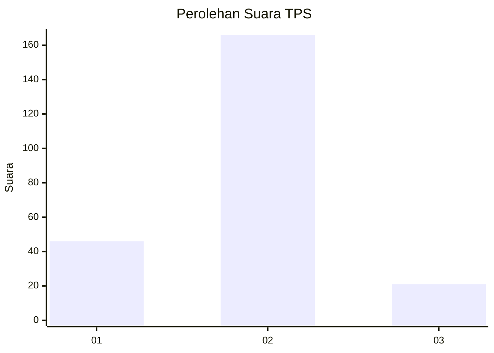

# Hasil

## Grafik

## Tabel

| No. | Nama Paslon    | Suara | Suara (raw) | Persentase |
|:--- |:-------------- | -----:| -----------:| ----------:|
| 1   | ANIES MUHAIMIN | 46    | [46][p-1]   | 19,74      |
| 2   | PRABOWO GIBRAN | 166   | [166][p-2]  | 71,24      |
| 3   | GANJAR MAHFUD  | 21    | [21][p-3]   | 9,01       |

[p-1]: https://github.com/gigit-pemilu/pemilu-2024-21-kepulauan-riau/blob/main/pilpres/hitung-suara/sub/21-kepulauan-riau/sub/71-kota-batam/sub/12-batu-aji/sub/1001-tanjung-uncang/sub/001-tps/sub/paslon-1.txt
[p-2]: https://github.com/gigit-pemilu/pemilu-2024-21-kepulauan-riau/blob/main/pilpres/hitung-suara/sub/21-kepulauan-riau/sub/71-kota-batam/sub/12-batu-aji/sub/1001-tanjung-uncang/sub/001-tps/sub/paslon-2.txt
[p-3]: https://github.com/gigit-pemilu/pemilu-2024-21-kepulauan-riau/blob/main/pilpres/hitung-suara/sub/21-kepulauan-riau/sub/71-kota-batam/sub/12-batu-aji/sub/1001-tanjung-uncang/sub/001-tps/sub/paslon-3.txt

## Foto C Plano

https://sirekap-obj-formc.kpu.go.id/9ba7/pemilu/ppwp/21/71/12/10/01/2171121001001-20240215-001518--4b495a6a-0bae-4ec4-ac3f-1820e44f1e04.jpg

https://sirekap-obj-formc.kpu.go.id/9ba7/pemilu/ppwp/21/71/12/10/01/2171121001001-20240216-142430--da3136ba-b720-41d3-bd96-80c6ec522f80.jpg

https://sirekap-obj-formc.kpu.go.id/9ba7/pemilu/ppwp/21/71/12/10/01/2171121001001-20240215-065908--7705c2b4-a467-4397-ac78-c8f845c3a875.jpg

## Metadata

| Key        | Value               |
| ---------- | ------------------- |
| Time Stamp | 2024-02-17 14:45:18 |

