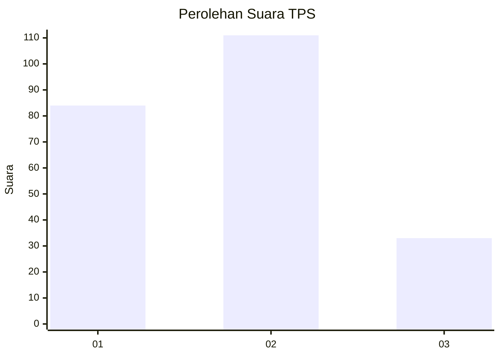
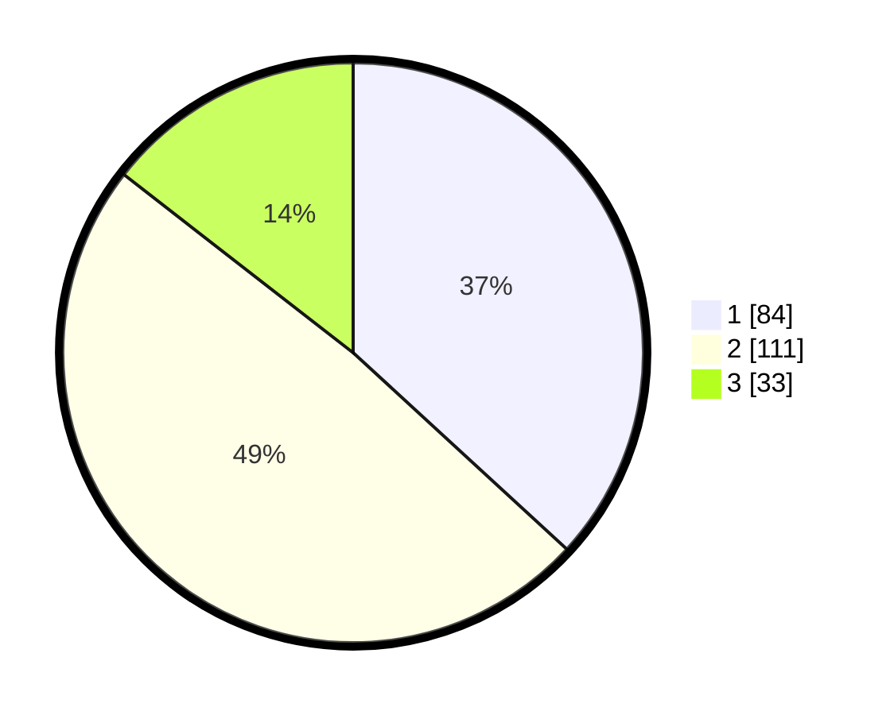

# Hasil

## Grafik

## Tabel

| No. | Nama Paslon    | Suara | Suara (raw) | Persentase |
|:--- |:-------------- | -----:| -----------:| ----------:|
| 1   | ANIES MUHAIMIN | 84    | [84][p-1]   | 36,84      |
| 2   | PRABOWO GIBRAN | 111   | [111][p-2]  | 48,68      |
| 3   | GANJAR MAHFUD  | 33    | [33][p-3]   | 14,47      |

[p-1]: https://github.com/gigit-pemilu/pemilu-2024-21-kepulauan-riau/blob/main/pilpres/hitung-suara/sub/21-kepulauan-riau/sub/71-kota-batam/sub/12-batu-aji/sub/1001-tanjung-uncang/sub/005-tps/sub/paslon-1.txt
[p-2]: https://github.com/gigit-pemilu/pemilu-2024-21-kepulauan-riau/blob/main/pilpres/hitung-suara/sub/21-kepulauan-riau/sub/71-kota-batam/sub/12-batu-aji/sub/1001-tanjung-uncang/sub/005-tps/sub/paslon-2.txt
[p-3]: https://github.com/gigit-pemilu/pemilu-2024-21-kepulauan-riau/blob/main/pilpres/hitung-suara/sub/21-kepulauan-riau/sub/71-kota-batam/sub/12-batu-aji/sub/1001-tanjung-uncang/sub/005-tps/sub/paslon-3.txt

## Foto C Plano

https://sirekap-obj-formc.kpu.go.id/5b44/pemilu/ppwp/21/71/12/10/01/2171121001005-20240214-234102--32828338-52e0-467b-960a-c290d104b2ab.jpg

https://sirekap-obj-formc.kpu.go.id/5b44/pemilu/ppwp/21/71/12/10/01/2171121001005-20240214-224403--ea3a09e0-39ea-4a69-a8d2-c890a5e6fbf5.jpg

https://sirekap-obj-formc.kpu.go.id/5b44/pemilu/ppwp/21/71/12/10/01/2171121001005-20240214-224730--87fd7710-e030-4589-ae7e-bc9f535c26c3.jpg

## Metadata

| Key        | Value               |
| ---------- | ------------------- |
| Time Stamp | 2024-02-17 14:45:18 |

