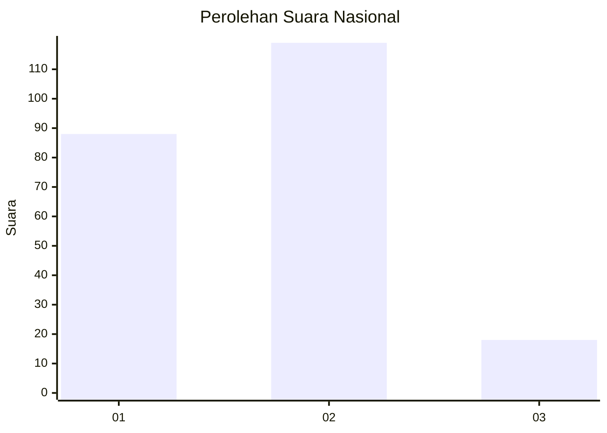
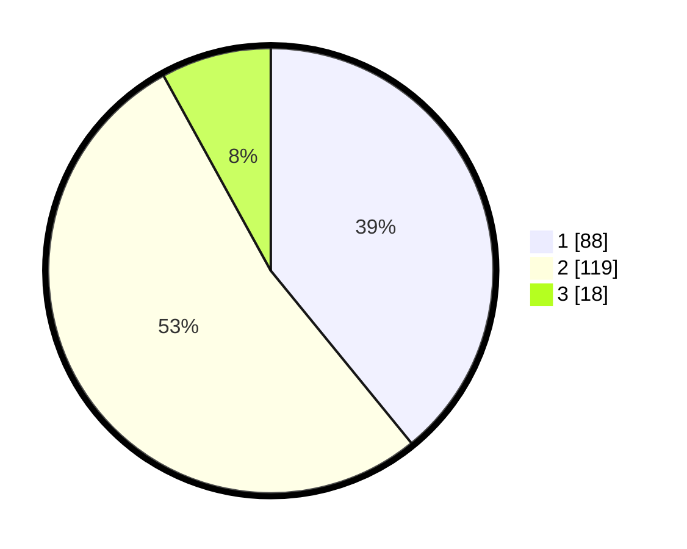

# Hasil

## Grafik

## Tabel

| No. | Nama Paslon    | Suara | Suara (raw) | Persentase |
|:--- |:-------------- | -----:| -----------:| ----------:|
| 1   | ANIES MUHAIMIN | 88    | [88][p-1]   | 39,11      |
| 2   | PRABOWO GIBRAN | 119   | [119][p-2]  | 52,89      |
| 3   | GANJAR MAHFUD  | 18    | [18][p-3]   | 8,00       |

[p-1]: https://github.com/gigit-pemilu/pemilu-2024/blob/main/pilpres/hitung-suara/sub/21-kepulauan-riau/sub/71-kota-batam/sub/12-batu-aji/sub/1001-tanjung-uncang/sub/007-tps/sub/paslon-1.txt
[p-2]: https://github.com/gigit-pemilu/pemilu-2024/blob/main/pilpres/hitung-suara/sub/21-kepulauan-riau/sub/71-kota-batam/sub/12-batu-aji/sub/1001-tanjung-uncang/sub/007-tps/sub/paslon-2.txt
[p-3]: https://github.com/gigit-pemilu/pemilu-2024/blob/main/pilpres/hitung-suara/sub/21-kepulauan-riau/sub/71-kota-batam/sub/12-batu-aji/sub/1001-tanjung-uncang/sub/007-tps/sub/paslon-3.txt

## Foto C Plano

https://sirekap-obj-formc.kpu.go.id/2ec6/pemilu/ppwp/21/71/12/10/01/2171121001007-20240215-012958--7daf5077-7f52-483e-8706-0d08f4ef0e23.jpg

https://sirekap-obj-formc.kpu.go.id/2ec6/pemilu/ppwp/21/71/12/10/01/2171121001007-20240215-013058--240d76f9-4a87-440f-949a-bd8818d36e60.jpg

https://sirekap-obj-formc.kpu.go.id/2ec6/pemilu/ppwp/21/71/12/10/01/2171121001007-20240215-013144--404d6bbd-135c-4144-ad1a-0777ab285e86.jpg

## Metadata

| Key        | Value               |
| ---------- | ------------------- |
| Time Stamp | 2024-02-15 15:30:25 |

