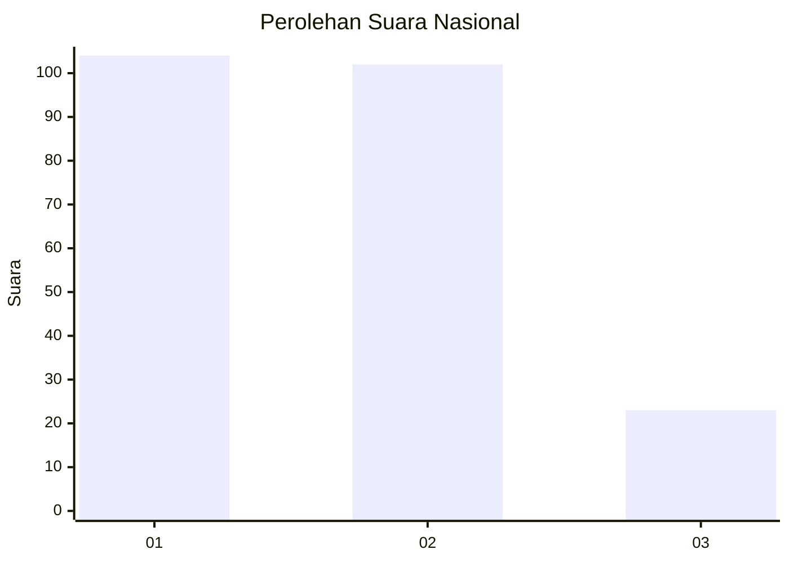
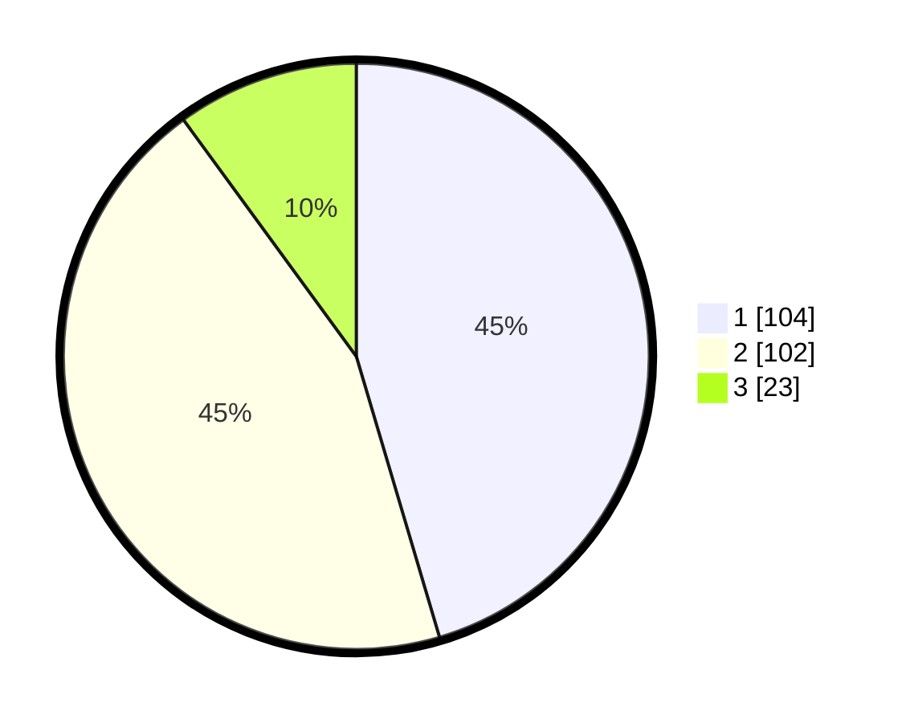

# Hasil

## Grafik

## Tabel

| No. | Nama Paslon    | Suara | Suara (raw) | Persentase |
|:--- |:-------------- | -----:| -----------:| ----------:|
| 1   | ANIES MUHAIMIN | 104   | [104][p-1]  | 45,41      |
| 2   | PRABOWO GIBRAN | 102   | [102][p-2]  | 44,54      |
| 3   | GANJAR MAHFUD  | 23    | [23][p-3]   | 10,04      |

[p-1]: https://github.com/gigit-pemilu/pemilu-2024/blob/main/pilpres/hitung-suara/sub/21-kepulauan-riau/sub/71-kota-batam/sub/12-batu-aji/sub/1001-tanjung-uncang/sub/008-tps/sub/paslon-1.txt
[p-2]: https://github.com/gigit-pemilu/pemilu-2024/blob/main/pilpres/hitung-suara/sub/21-kepulauan-riau/sub/71-kota-batam/sub/12-batu-aji/sub/1001-tanjung-uncang/sub/008-tps/sub/paslon-2.txt
[p-3]: https://github.com/gigit-pemilu/pemilu-2024/blob/main/pilpres/hitung-suara/sub/21-kepulauan-riau/sub/71-kota-batam/sub/12-batu-aji/sub/1001-tanjung-uncang/sub/008-tps/sub/paslon-3.txt

## Foto C Plano

https://sirekap-obj-formc.kpu.go.id/0e51/pemilu/ppwp/21/71/12/10/01/2171121001008-20240215-003429--23a35eac-fa56-4a17-969f-75ec73867b85.jpg

https://sirekap-obj-formc.kpu.go.id/0e51/pemilu/ppwp/21/71/12/10/01/2171121001008-20240215-003536--2351b291-ce4a-4f4b-bfa6-9e7663483e36.jpg

https://sirekap-obj-formc.kpu.go.id/0e51/pemilu/ppwp/21/71/12/10/01/2171121001008-20240215-003609--83e2d4ee-a643-47d6-b9bd-d9fe89bcf364.jpg

## Metadata

| Key        | Value               |
| ---------- | ------------------- |
| Time Stamp | 2024-02-15 15:00:29 |

