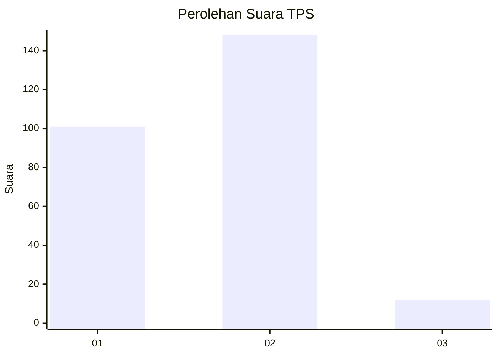
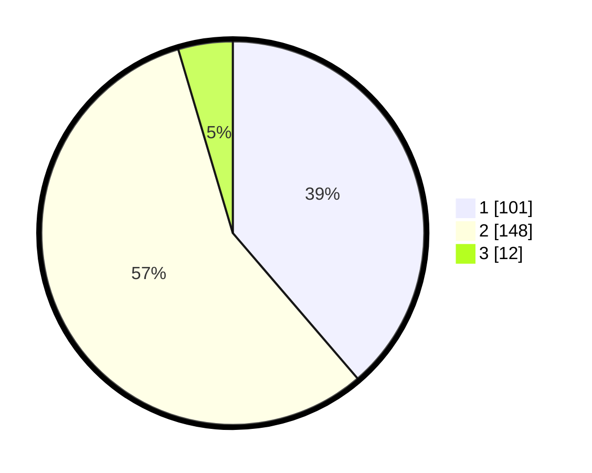

# Hasil

## Grafik

## Tabel

| No. | Nama Paslon    | Suara | Suara (raw) | Persentase |
|:--- |:-------------- | -----:| -----------:| ----------:|
| 1   | ANIES MUHAIMIN | 101   | [101][p-1]  | 38,70      |
| 2   | PRABOWO GIBRAN | 148   | [148][p-2]  | 56,70      |
| 3   | GANJAR MAHFUD  | 12    | [12][p-3]   | 4,60       |

[p-1]: https://github.com/gigit-pemilu/pemilu-2024-21-kepulauan-riau/blob/main/pilpres/hitung-suara/sub/21-kepulauan-riau/sub/71-kota-batam/sub/12-batu-aji/sub/1001-tanjung-uncang/sub/102-tps/sub/paslon-1.txt
[p-2]: https://github.com/gigit-pemilu/pemilu-2024-21-kepulauan-riau/blob/main/pilpres/hitung-suara/sub/21-kepulauan-riau/sub/71-kota-batam/sub/12-batu-aji/sub/1001-tanjung-uncang/sub/102-tps/sub/paslon-2.txt
[p-3]: https://github.com/gigit-pemilu/pemilu-2024-21-kepulauan-riau/blob/main/pilpres/hitung-suara/sub/21-kepulauan-riau/sub/71-kota-batam/sub/12-batu-aji/sub/1001-tanjung-uncang/sub/102-tps/sub/paslon-3.txt

## Foto C Plano

https://sirekap-obj-formc.kpu.go.id/dfe7/pemilu/ppwp/21/71/12/10/01/2171121001102-20240215-022812--a1f0f9fd-206e-45e6-b29e-349de5bc7547.jpg

https://sirekap-obj-formc.kpu.go.id/dfe7/pemilu/ppwp/21/71/12/10/01/2171121001102-20240214-223325--f7c7ecf9-9199-41d7-84db-6578a9eb82b6.jpg

https://sirekap-obj-formc.kpu.go.id/dfe7/pemilu/ppwp/21/71/12/10/01/2171121001102-20240214-223713--38008669-06ac-46f0-845e-a2e3080b6948.jpg

## Metadata

| Key        | Value               |
| ---------- | ------------------- |
| Time Stamp | 2024-02-16 12:51:22 |

