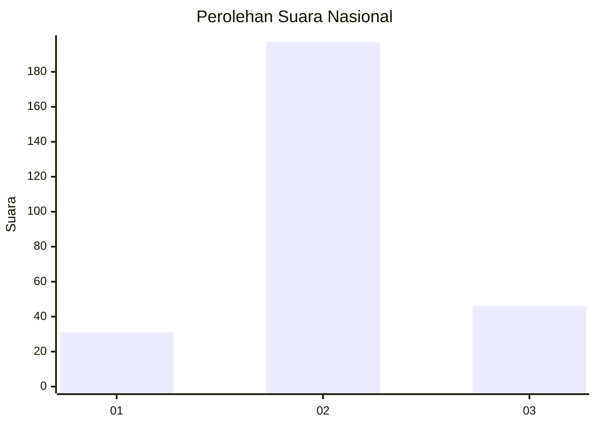
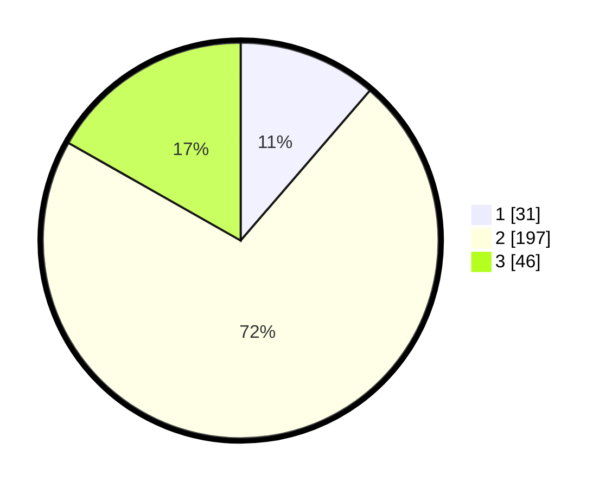

# Hasil

## Grafik

## Tabel

| No. | Nama Paslon    | Suara | Suara (raw) | Persentase |
|:--- |:-------------- | -----:| -----------:| ----------:|
| 1   | ANIES MUHAIMIN | 31    | [31][p-1]   | 11,31      |
| 2   | PRABOWO GIBRAN | 197   | [197][p-2]  | 71,90      |
| 3   | GANJAR MAHFUD  | 46    | [46][p-3]   | 16,79      |

[p-1]: https://github.com/gigit-pemilu/pemilu-2024/blob/main/pilpres/hitung-suara/sub/21-kepulauan-riau/sub/71-kota-batam/sub/12-batu-aji/sub/1002-buliang/sub/076-tps/sub/paslon-1.txt
[p-2]: https://github.com/gigit-pemilu/pemilu-2024/blob/main/pilpres/hitung-suara/sub/21-kepulauan-riau/sub/71-kota-batam/sub/12-batu-aji/sub/1002-buliang/sub/076-tps/sub/paslon-2.txt
[p-3]: https://github.com/gigit-pemilu/pemilu-2024/blob/main/pilpres/hitung-suara/sub/21-kepulauan-riau/sub/71-kota-batam/sub/12-batu-aji/sub/1002-buliang/sub/076-tps/sub/paslon-3.txt

## Foto C Plano

https://sirekap-obj-formc.kpu.go.id/f513/pemilu/ppwp/21/71/12/10/02/2171121002076-20240215-043625--4e3f95dd-f11e-4af8-88d9-213066d740a7.jpg

https://sirekap-obj-formc.kpu.go.id/f513/pemilu/ppwp/21/71/12/10/02/2171121002076-20240215-043722--3a288423-eb7c-4ac6-821b-badb43fcd968.jpg

https://sirekap-obj-formc.kpu.go.id/f513/pemilu/ppwp/21/71/12/10/02/2171121002076-20240215-043802--12296ef9-49c3-4339-900c-f80b6e29eafa.jpg

## Metadata

| Key        | Value               |
| ---------- | ------------------- |
| Time Stamp | 2024-02-19 14:00:00 |

