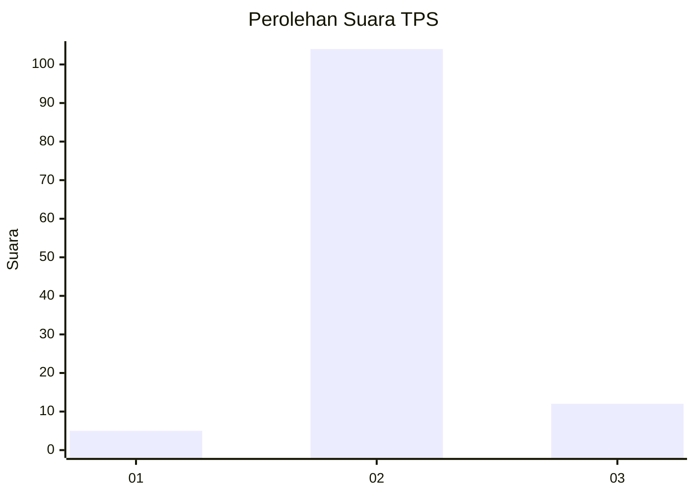
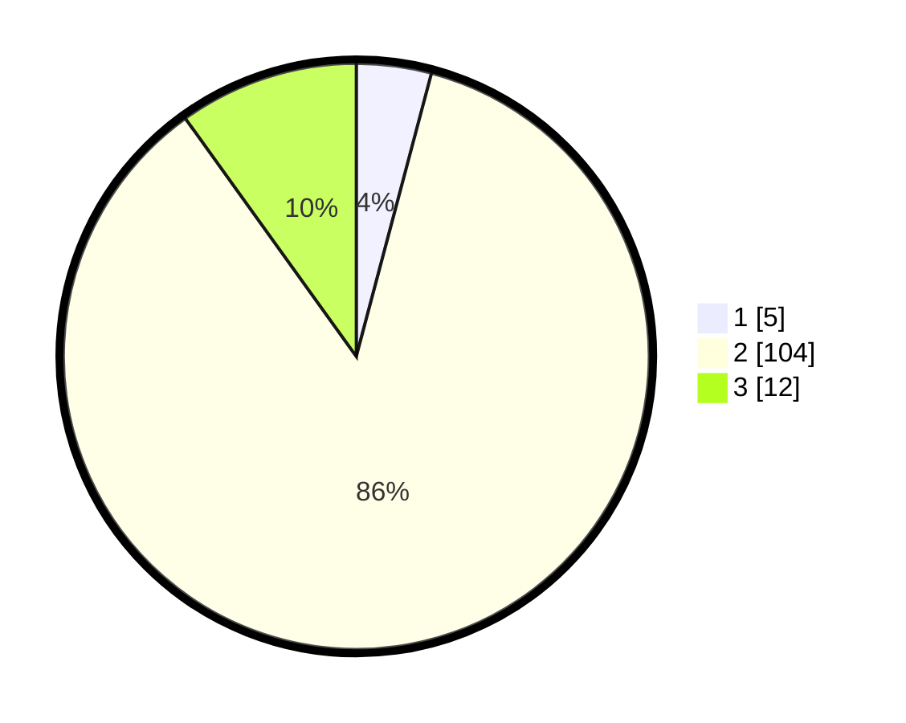

# Hasil

## Grafik

## Tabel

| No. | Nama Paslon    | Suara | Suara (raw) | Persentase |
|:--- |:-------------- | -----:| -----------:| ----------:|
| 1   | ANIES MUHAIMIN | 5     | [5][p-1]    | 4,13       |
| 2   | PRABOWO GIBRAN | 104   | [104][p-2]  | 85,95      |
| 3   | GANJAR MAHFUD  | 12    | [12][p-3]   | 9,92       |

[p-1]: https://github.com/gigit-pemilu/pemilu-2024-21-kepulauan-riau/blob/main/pilpres/hitung-suara/sub/21-kepulauan-riau/sub/71-kota-batam/sub/12-batu-aji/sub/1002-buliang/sub/084-tps/sub/paslon-1.txt
[p-2]: https://github.com/gigit-pemilu/pemilu-2024-21-kepulauan-riau/blob/main/pilpres/hitung-suara/sub/21-kepulauan-riau/sub/71-kota-batam/sub/12-batu-aji/sub/1002-buliang/sub/084-tps/sub/paslon-2.txt
[p-3]: https://github.com/gigit-pemilu/pemilu-2024-21-kepulauan-riau/blob/main/pilpres/hitung-suara/sub/21-kepulauan-riau/sub/71-kota-batam/sub/12-batu-aji/sub/1002-buliang/sub/084-tps/sub/paslon-3.txt

## Foto C Plano

https://sirekap-obj-formc.kpu.go.id/fc30/pemilu/ppwp/21/71/12/10/02/2171121002084-20240215-204609--71a7cd26-1087-4ba4-b8a4-252366986157.jpg

https://sirekap-obj-formc.kpu.go.id/fc30/pemilu/ppwp/21/71/12/10/02/2171121002084-20240215-170325--62c8dafc-6d6f-4158-b0dd-88609b236af0.jpg

https://sirekap-obj-formc.kpu.go.id/fc30/pemilu/ppwp/21/71/12/10/02/2171121002084-20240215-210555--20b49c32-ff02-45c9-8b9b-182d0195c841.jpg

## Metadata

| Key        | Value               |
| ---------- | ------------------- |
| Time Stamp | 2024-02-16 12:51:22 |

