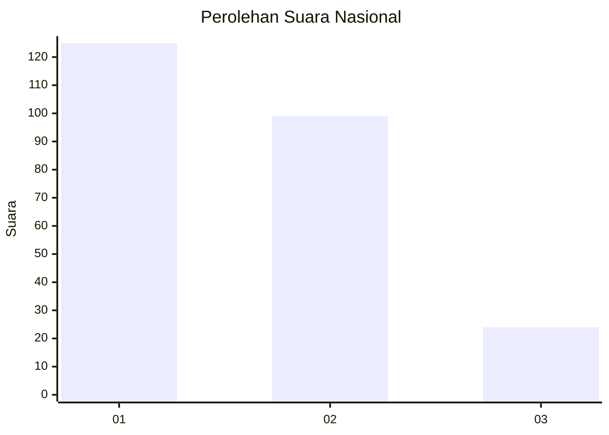
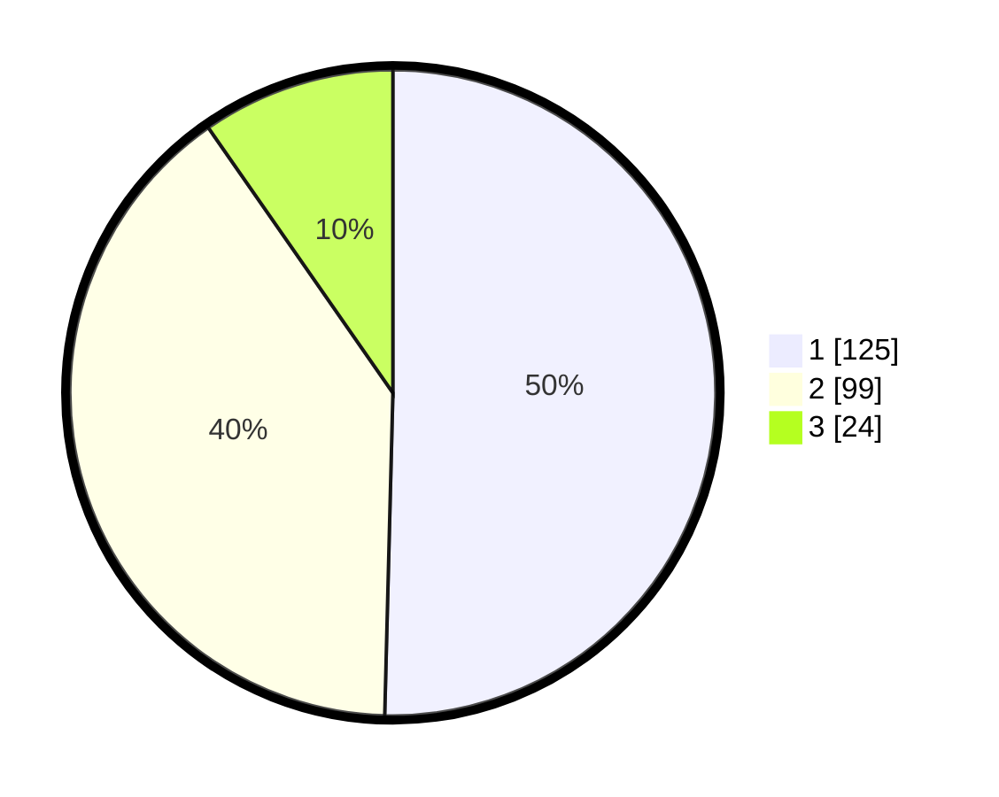

# Hasil

## Grafik

## Tabel

| No. | Nama Paslon    | Suara | Suara (raw) | Persentase |
|:--- |:-------------- | -----:| -----------:| ----------:|
| 1   | ANIES MUHAIMIN | 125   | [125][p-1]  | 50,40      |
| 2   | PRABOWO GIBRAN | 99    | [99][p-2]   | 39,92      |
| 3   | GANJAR MAHFUD  | 24    | [24][p-3]   | 9,68       |

[p-1]: https://github.com/gigit-pemilu/pemilu-2024/blob/main/pilpres/hitung-suara/sub/21-kepulauan-riau/sub/71-kota-batam/sub/12-batu-aji/sub/1003-kibing/sub/006-tps/sub/paslon-1.txt
[p-2]: https://github.com/gigit-pemilu/pemilu-2024/blob/main/pilpres/hitung-suara/sub/21-kepulauan-riau/sub/71-kota-batam/sub/12-batu-aji/sub/1003-kibing/sub/006-tps/sub/paslon-2.txt
[p-3]: https://github.com/gigit-pemilu/pemilu-2024/blob/main/pilpres/hitung-suara/sub/21-kepulauan-riau/sub/71-kota-batam/sub/12-batu-aji/sub/1003-kibing/sub/006-tps/sub/paslon-3.txt

## Foto C Plano

https://sirekap-obj-formc.kpu.go.id/7f8d/pemilu/ppwp/21/71/12/10/03/2171121003006-20240214-234314--2928cb81-9d07-4ca0-8243-2dc9869bda56.jpg

https://sirekap-obj-formc.kpu.go.id/7f8d/pemilu/ppwp/21/71/12/10/03/2171121003006-20240214-234333--3cb352b1-6b49-46c1-8025-1cac48b9cb78.jpg

https://sirekap-obj-formc.kpu.go.id/7f8d/pemilu/ppwp/21/71/12/10/03/2171121003006-20240214-234344--d7dfcd36-8ec5-4666-b399-382ead43fd38.jpg

## Metadata

| Key        | Value               |
| ---------- | ------------------- |
| Time Stamp | 2024-02-19 14:00:00 |

