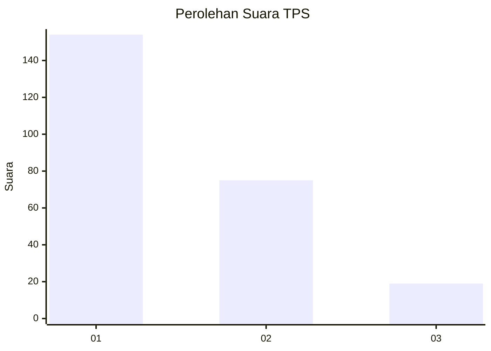
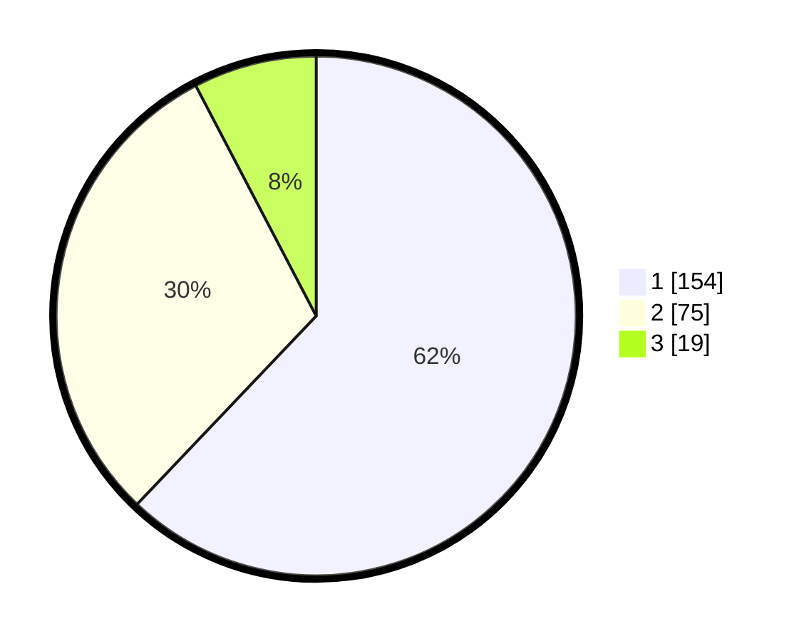

# Hasil

## Grafik

## Tabel

| No. | Nama Paslon    | Suara | Suara (raw) | Persentase |
|:--- |:-------------- | -----:| -----------:| ----------:|
| 1   | ANIES MUHAIMIN | 154   | [154][p-1]  | 62,10      |
| 2   | PRABOWO GIBRAN | 75    | [75][p-2]   | 30,24      |
| 3   | GANJAR MAHFUD  | 19    | [19][p-3]   | 7,66       |

[p-1]: https://github.com/gigit-pemilu/pemilu-2024-21-kepulauan-riau/blob/main/pilpres/hitung-suara/sub/21-kepulauan-riau/sub/71-kota-batam/sub/12-batu-aji/sub/1004-bukit-tempayan/sub/005-tps/sub/paslon-1.txt
[p-2]: https://github.com/gigit-pemilu/pemilu-2024-21-kepulauan-riau/blob/main/pilpres/hitung-suara/sub/21-kepulauan-riau/sub/71-kota-batam/sub/12-batu-aji/sub/1004-bukit-tempayan/sub/005-tps/sub/paslon-2.txt
[p-3]: https://github.com/gigit-pemilu/pemilu-2024-21-kepulauan-riau/blob/main/pilpres/hitung-suara/sub/21-kepulauan-riau/sub/71-kota-batam/sub/12-batu-aji/sub/1004-bukit-tempayan/sub/005-tps/sub/paslon-3.txt

## Foto C Plano

https://sirekap-obj-formc.kpu.go.id/a240/pemilu/ppwp/21/71/12/10/04/2171121004005-20240215-014932--57207e7b-0d9c-4564-8862-c68e08491b51.jpg

https://sirekap-obj-formc.kpu.go.id/a240/pemilu/ppwp/21/71/12/10/04/2171121004005-20240214-220259--80e075b4-dd50-4c93-b7a6-4d025d90b8ec.jpg

https://sirekap-obj-formc.kpu.go.id/a240/pemilu/ppwp/21/71/12/10/04/2171121004005-20240214-210439--bb0b0e49-a344-44ef-a36e-2ea1a7a03799.jpg

## Metadata

| Key        | Value               |
| ---------- | ------------------- |
| Time Stamp | 2024-02-19 14:00:00 |

