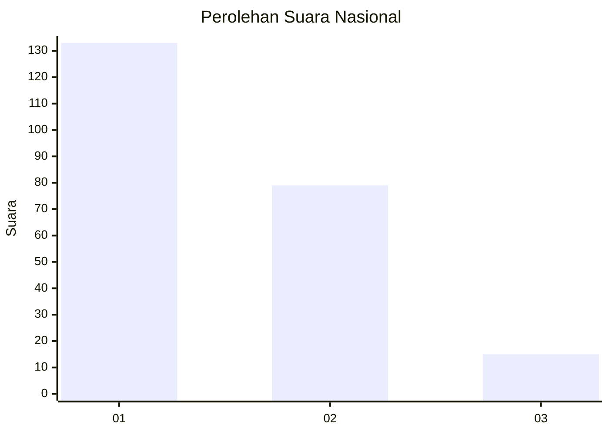
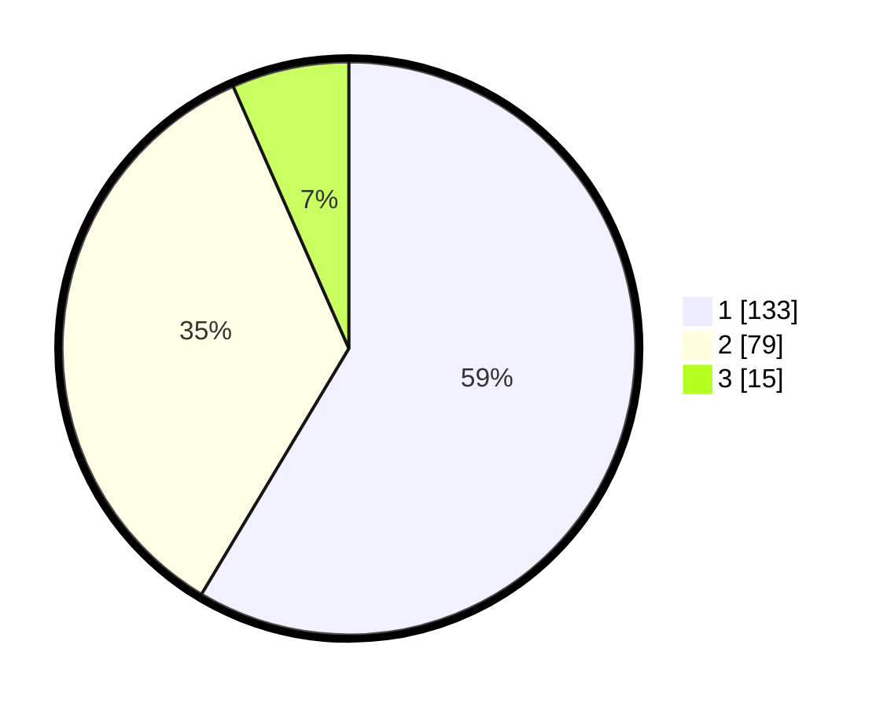

# Hasil

## Grafik

## Tabel

| No. | Nama Paslon    | Suara | Suara (raw) | Persentase |
|:--- |:-------------- | -----:| -----------:| ----------:|
| 1   | ANIES MUHAIMIN | 133   | [133][p-1]  | 58,59      |
| 2   | PRABOWO GIBRAN | 79    | [79][p-2]   | 34,80      |
| 3   | GANJAR MAHFUD  | 15    | [15][p-3]   | 6,61       |

[p-1]: https://github.com/gigit-pemilu/pemilu-2024/blob/main/pilpres/hitung-suara/sub/21-kepulauan-riau/sub/71-kota-batam/sub/12-batu-aji/sub/1004-bukit-tempayan/sub/039-tps/sub/paslon-1.txt
[p-2]: https://github.com/gigit-pemilu/pemilu-2024/blob/main/pilpres/hitung-suara/sub/21-kepulauan-riau/sub/71-kota-batam/sub/12-batu-aji/sub/1004-bukit-tempayan/sub/039-tps/sub/paslon-2.txt
[p-3]: https://github.com/gigit-pemilu/pemilu-2024/blob/main/pilpres/hitung-suara/sub/21-kepulauan-riau/sub/71-kota-batam/sub/12-batu-aji/sub/1004-bukit-tempayan/sub/039-tps/sub/paslon-3.txt

## Foto C Plano

https://sirekap-obj-formc.kpu.go.id/9dd8/pemilu/ppwp/21/71/12/10/04/2171121004039-20240215-012133--88b04d73-b1d4-4f22-99cc-24fc140603ad.jpg

https://sirekap-obj-formc.kpu.go.id/9dd8/pemilu/ppwp/21/71/12/10/04/2171121004039-20240215-012156--145eeafa-3c82-4ed4-b4f1-a3e71780176f.jpg

https://sirekap-obj-formc.kpu.go.id/9dd8/pemilu/ppwp/21/71/12/10/04/2171121004039-20240215-012218--ed4a0c88-84b3-4ecd-91ce-912e97136181.jpg

## Metadata

| Key        | Value               |
| ---------- | ------------------- |
| Time Stamp | 2024-02-17 13:37:34 |

