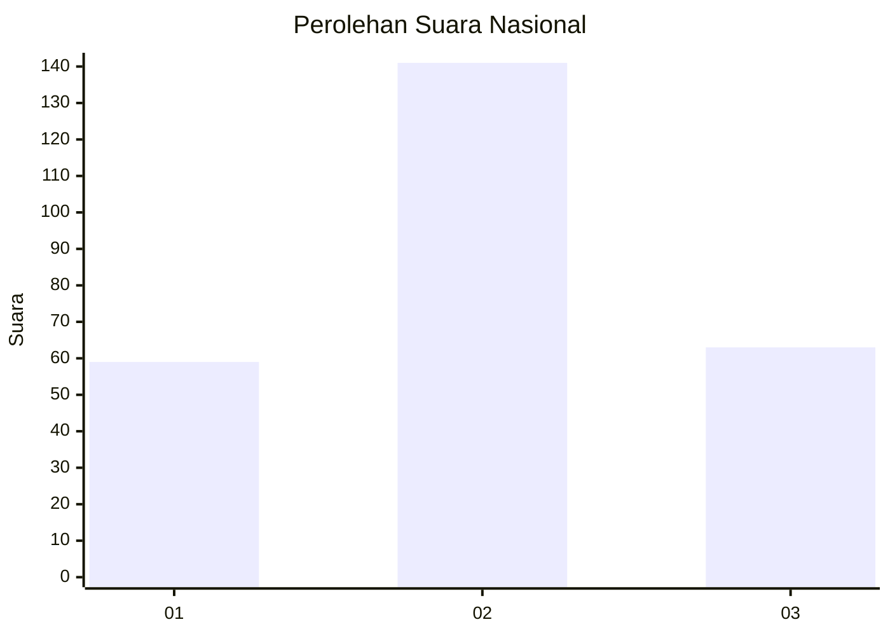
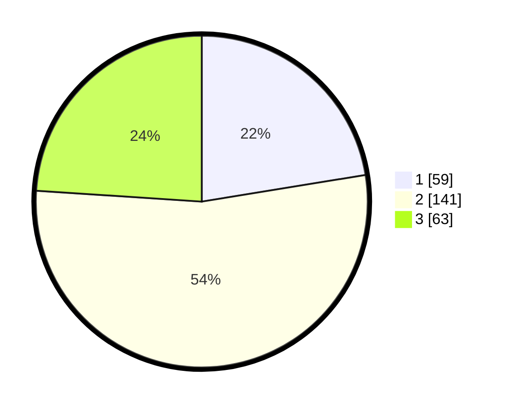

# Hasil

## Grafik

## Tabel

| No. | Nama Paslon    | Suara | Suara (raw) | Persentase |
|:--- |:-------------- | -----:| -----------:| ----------:|
| 1   | ANIES MUHAIMIN | 59    | [59][p-1]   | 22,43      |
| 2   | PRABOWO GIBRAN | 141   | [141][p-2]  | 53,61      |
| 3   | GANJAR MAHFUD  | 63    | [63][p-3]   | 23,95      |

[p-1]: https://github.com/gigit-pemilu/pemilu-2024/blob/main/pilpres/hitung-suara/sub/21-kepulauan-riau/sub/72-kota-tanjung-pinang/sub/01-tanjung-pinang-barat/sub/1001-tanjung-pinang-barat/sub/003-tps/sub/paslon-1.txt
[p-2]: https://github.com/gigit-pemilu/pemilu-2024/blob/main/pilpres/hitung-suara/sub/21-kepulauan-riau/sub/72-kota-tanjung-pinang/sub/01-tanjung-pinang-barat/sub/1001-tanjung-pinang-barat/sub/003-tps/sub/paslon-2.txt
[p-3]: https://github.com/gigit-pemilu/pemilu-2024/blob/main/pilpres/hitung-suara/sub/21-kepulauan-riau/sub/72-kota-tanjung-pinang/sub/01-tanjung-pinang-barat/sub/1001-tanjung-pinang-barat/sub/003-tps/sub/paslon-3.txt

## Foto C Plano

https://sirekap-obj-formc.kpu.go.id/6392/pemilu/ppwp/21/72/01/10/01/2172011001003-20240215-211224--ddb3c2bf-46b9-402e-8c6b-89a16b0d3ecf.jpg

https://sirekap-obj-formc.kpu.go.id/6392/pemilu/ppwp/21/72/01/10/01/2172011001003-20240215-211226--01b9fa85-6a93-4f59-8750-1875a66bc188.jpg

https://sirekap-obj-formc.kpu.go.id/6392/pemilu/ppwp/21/72/01/10/01/2172011001003-20240215-211225--3f5881ac-8a36-4727-846c-674166d543b0.jpg

## Metadata

| Key        | Value               |
| ---------- | ------------------- |
| Time Stamp | 2024-02-15 23:29:50 |

## DATA PEMILIH TETAP

Jumlah pemilih dalam DPT: **286**.
 * L: **143**.
 * P: **143**.

## DATA PENGGUNA HAK PILIH

Jumlah pengguna hak pilih dalam DPT: **237**.
 * L: **124**.
 * P: **113**.

Jumlah pengguna hak pilih dalam DPTb: **24**.
 * L: **23**.
 * P: **1**.

Jumlah pengguna hak pilih dalam DPK: **5**.
 * L: **2**.
 * P: **3**.

Jumlah pengguna hak pilih: **266**.
 * L: **149**.
 * P: **117**.

## JUMLAH SUARA SAH DAN TIDAK SAH

JUMLAH SELURUH SUARA SAH: **263**.

JUMLAH SUARA TIDAK SAH: **3**.

JUMLAH SELURUH SUARA SAH DAN SUARA TIDAK SAH: **266**.

