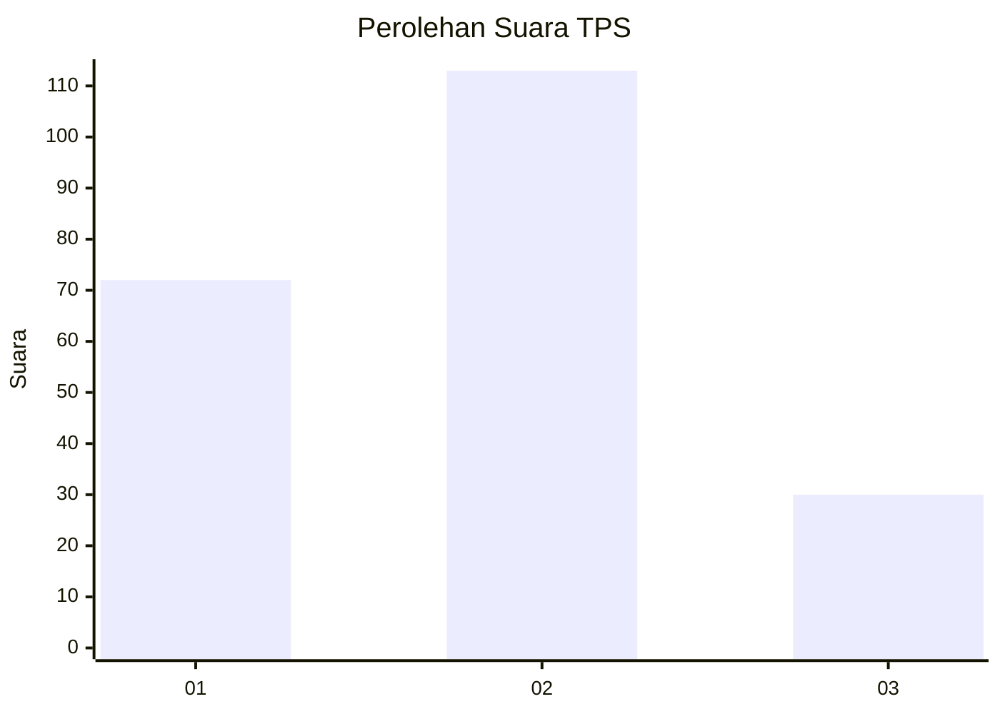
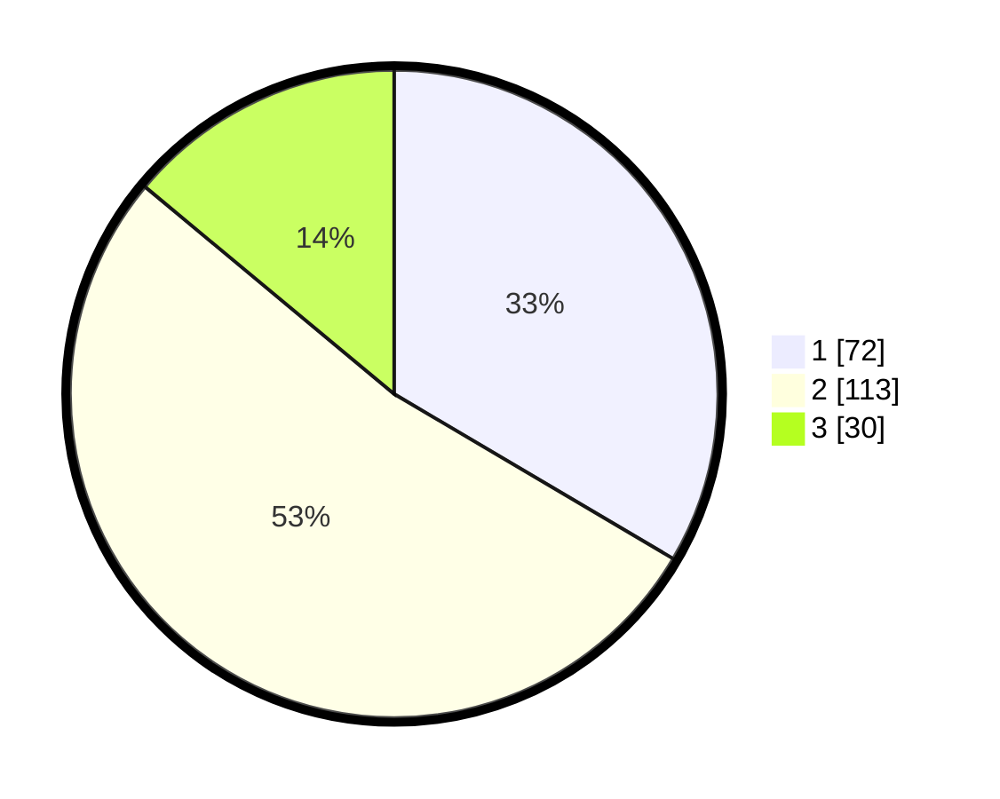

# Hasil

## Grafik

## Tabel

| No. | Nama Paslon    | Suara | Suara (raw) | Persentase |
|:--- |:-------------- | -----:| -----------:| ----------:|
| 1   | ANIES MUHAIMIN | 72    | [72][p-1]   | 33,49      |
| 2   | PRABOWO GIBRAN | 113   | [113][p-2]  | 52,56      |
| 3   | GANJAR MAHFUD  | 30    | [30][p-3]   | 13,95      |

[p-1]: https://github.com/gigit-pemilu/pemilu-2024-21-kepulauan-riau/blob/main/pilpres/hitung-suara/sub/21-kepulauan-riau/sub/72-kota-tanjung-pinang/sub/01-tanjung-pinang-barat/sub/1001-tanjung-pinang-barat/sub/006-tps/sub/paslon-1.txt
[p-2]: https://github.com/gigit-pemilu/pemilu-2024-21-kepulauan-riau/blob/main/pilpres/hitung-suara/sub/21-kepulauan-riau/sub/72-kota-tanjung-pinang/sub/01-tanjung-pinang-barat/sub/1001-tanjung-pinang-barat/sub/006-tps/sub/paslon-2.txt
[p-3]: https://github.com/gigit-pemilu/pemilu-2024-21-kepulauan-riau/blob/main/pilpres/hitung-suara/sub/21-kepulauan-riau/sub/72-kota-tanjung-pinang/sub/01-tanjung-pinang-barat/sub/1001-tanjung-pinang-barat/sub/006-tps/sub/paslon-3.txt

## Foto C Plano

https://sirekap-obj-formc.kpu.go.id/500b/pemilu/ppwp/21/72/01/10/01/2172011001006-20240214-211700--d261e3cd-88b9-4446-960e-31278063a475.jpg

https://sirekap-obj-formc.kpu.go.id/500b/pemilu/ppwp/21/72/01/10/01/2172011001006-20240214-195346--bb8e5ca0-7c63-44bd-bb3d-da962ec51614.jpg

https://sirekap-obj-formc.kpu.go.id/500b/pemilu/ppwp/21/72/01/10/01/2172011001006-20240214-195504--43f5ad27-1824-4e7f-890d-e7260d310a6d.jpg

## Metadata

| Key        | Value               |
| ---------- | ------------------- |
| Time Stamp | 2024-02-24 22:31:28 |

