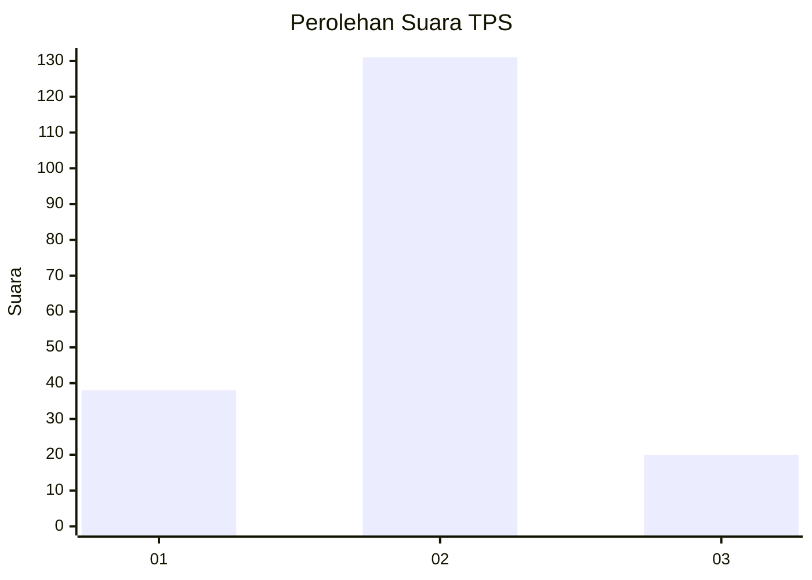
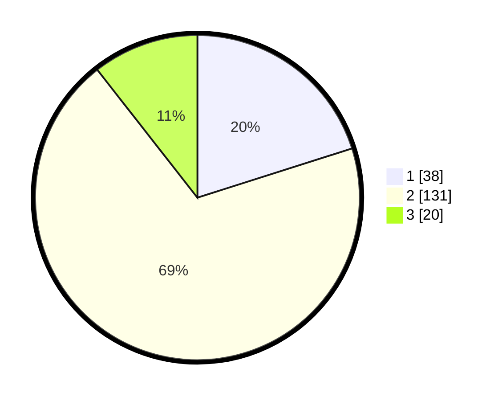

# Hasil

## Grafik

## Tabel

| No. | Nama Paslon    | Suara | Suara (raw) | Persentase |
|:--- |:-------------- | -----:| -----------:| ----------:|
| 1   | ANIES MUHAIMIN | 38    | [38][p-1]   | 20,11      |
| 2   | PRABOWO GIBRAN | 131   | [131][p-2]  | 69,31      |
| 3   | GANJAR MAHFUD  | 20    | [20][p-3]   | 10,58      |

[p-1]: https://github.com/gigit-pemilu/pemilu-2024-21-kepulauan-riau/blob/main/pilpres/hitung-suara/sub/21-kepulauan-riau/sub/72-kota-tanjung-pinang/sub/02-tanjung-pinang-timur/sub/1001-melayu-kota-piring/sub/008-tps/sub/paslon-1.txt
[p-2]: https://github.com/gigit-pemilu/pemilu-2024-21-kepulauan-riau/blob/main/pilpres/hitung-suara/sub/21-kepulauan-riau/sub/72-kota-tanjung-pinang/sub/02-tanjung-pinang-timur/sub/1001-melayu-kota-piring/sub/008-tps/sub/paslon-2.txt
[p-3]: https://github.com/gigit-pemilu/pemilu-2024-21-kepulauan-riau/blob/main/pilpres/hitung-suara/sub/21-kepulauan-riau/sub/72-kota-tanjung-pinang/sub/02-tanjung-pinang-timur/sub/1001-melayu-kota-piring/sub/008-tps/sub/paslon-3.txt

## Foto C Plano

https://sirekap-obj-formc.kpu.go.id/6c12/pemilu/ppwp/21/72/02/10/01/2172021001008-20240214-205943--d82746d4-df4b-4320-a899-46b92922a770.jpg

https://sirekap-obj-formc.kpu.go.id/6c12/pemilu/ppwp/21/72/02/10/01/2172021001008-20240214-210103--0cd78106-9e7e-488c-9fa8-3e4efb20a276.jpg

https://sirekap-obj-formc.kpu.go.id/6c12/pemilu/ppwp/21/72/02/10/01/2172021001008-20240214-210154--46ea242b-9cef-4f61-920f-ee50f58a6d43.jpg

## Metadata

| Key        | Value               |
| ---------- | ------------------- |
| Time Stamp | 2024-02-25 17:00:00 |

